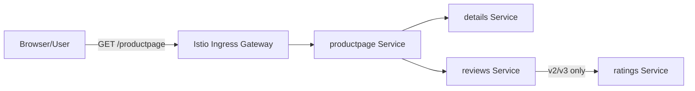

# Request Flow

Luồng truy cập của một request từ người dùng đến ứng dụng Bookinfo được thiết kế đi qua nhiều lớp và microservice. Dưới đây là giải thích chi tiết về đường đi của request khi đi qua Istio Ingress Gateway và các Kubernetes Service.

## 1. Luồng tổng quát

## 2. Luồng chi tiết với Kubernetes và sidecar

Khi áp dụng Istio, luồng kết nối bao gồm cả Envoy proxy (sidecar):

1. **Browser** gửi HTTP request `GET /productpage`.
2. Request đi vào **Istio Ingress Gateway** (Entry point từ ngoài vào mesh).
3. **Gateway** và **VirtualService** được cấu hình để định tuyến `/productpage` tới đích là service `productpage`.
4. Traffic được chuyển đến Kubernetes Service `productpage`.
5. Kubernetes Service chọn một Pod (thuộc deployment `productpage-v1`) bằng selector `app: productpage`.
6. **Envoy sidecar inbound** của Pod `productpage` nhận traffic trước, sau đó chuyển vào **application container**. (Nhiệm vụ Envoy sidecar inbound trong project này hiện tại chỉ là lưu thông tin số liệu traffic vào file prometheus)
7. Code `productpage` cần lấy thông tin chi tiết, nên gọi HTTP tới service `details`.
8. Outbound traffic của `productpage` bị chặn lại bởi **Envoy sidecar outbound**.
9. Kubernetes DNS phân giải tên `details`.
10. Kubernetes Service `details` load balance traffic tới Pod `details`.
11. **Envoy inbound** phía `details` chặn và chuyển request vào application container `details`. Kết quả được trả về theo chiều ngược lại cho `productpage`.
12. Tương tự, `productpage` gọi HTTP tới service `reviews`.
13. Tuỳ thuộc vào phiên bản `reviews` mà Kubernetes Service load balance vào:
    - Nếu là `reviews-v2` hoặc `reviews-v3`, code sẽ gọi tiếp service `ratings`.
    - Nếu là `reviews-v1`, code không gọi `ratings`.
14. Kết quả từ `reviews` (và có thể là `ratings`) quay lại `productpage`.
15. Application container `productpage` tổng hợp dữ liệu, render file HTML.
16. Response HTML đi ngược qua Envoy outbound, qua Ingress Gateway và về browser.

## 3. Flow version routing

Service `reviews` được kết nối tới 3 Pod thuộc 3 Deployments (`v1`, `v2`, `v3`). Khi bạn gửi request liên tục (hoặc refresh trang) mà không có rule của Istio, Kubernetes sẽ load balance ngẫu nhiên giữa 3 phiên bản này:

- **DestinationRule** định nghĩa các *subset* dựa trên label version (ví dụ subset `v2` map với label `version: v2`).
- **VirtualService** quyết định phần trăm (hoặc điều kiện header) traffic sẽ đi vào *subset* nào.

Đừng nhầm lẫn:
`DestinationRule` = Định nghĩa các nhóm đích đến (sau khi đã được chọn).
`VirtualService` = Luật định tuyến ban đầu để quyết định chọn đích đến nào.
