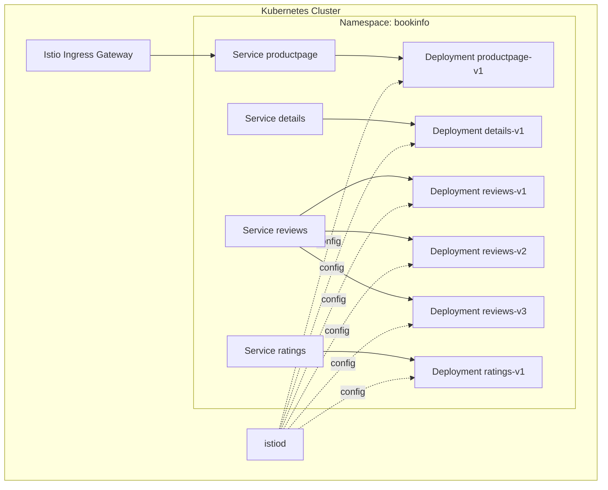

# Sơ đồ: Deployment View

```mermaid
flowchart TB
    subgraph K8S[Kubernetes Cluster]
        subgraph NS[Namespace: bookinfo]
            PPDEP[Deployment productpage-v1]
            DDEP[Deployment details-v1]
            R1DEP[Deployment reviews-v1]
            R2DEP[Deployment reviews-v2]
            R3DEP[Deployment reviews-v3]
            RTDEP[Deployment ratings-v1]

            PPSVC[Service productpage]
            DSVC[Service details]
            RSVC[Service reviews]
            RTSVC[Service ratings]
        end

        IGW[Istio Ingress Gateway]
        ISTIOD[istiod]
    end

    IGW --> PPSVC
    PPSVC --> PPDEP
    DSVC --> DDEP
    RSVC --> R1DEP
    RSVC --> R2DEP
    RSVC --> R3DEP
    RTSVC --> RTDEP

    ISTIOD -. config .-> PPDEP
    ISTIOD -. config .-> DDEP
    ISTIOD -. config .-> R1DEP
    ISTIOD -. config .-> R2DEP
    ISTIOD -. config .-> R3DEP
    ISTIOD -. config .-> RTDEP
```
