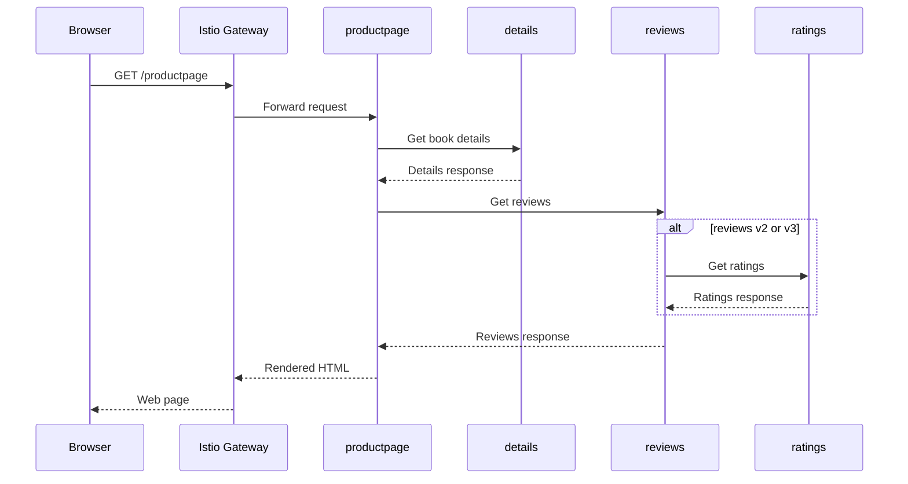

# Sơ đồ: Request Sequence Flow

```mermaid
sequenceDiagram
    participant U as Browser
    participant G as Istio Gateway
    participant P as productpage
    participant D as details
    participant R as reviews
    participant T as ratings

    U->>G: GET /productpage
    G->>P: Forward request
    P->>D: Get book details
    D-->>P: Details response
    P->>R: Get reviews
    alt reviews v2 or v3
        R->>T: Get ratings
        T-->>R: Ratings response
    end
    R-->>P: Reviews response
    P-->>G: Rendered HTML
    G-->>U: Web page
```
