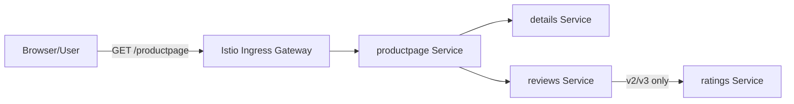
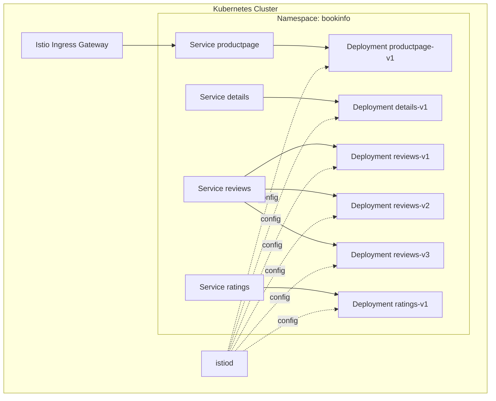
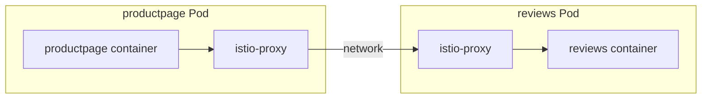
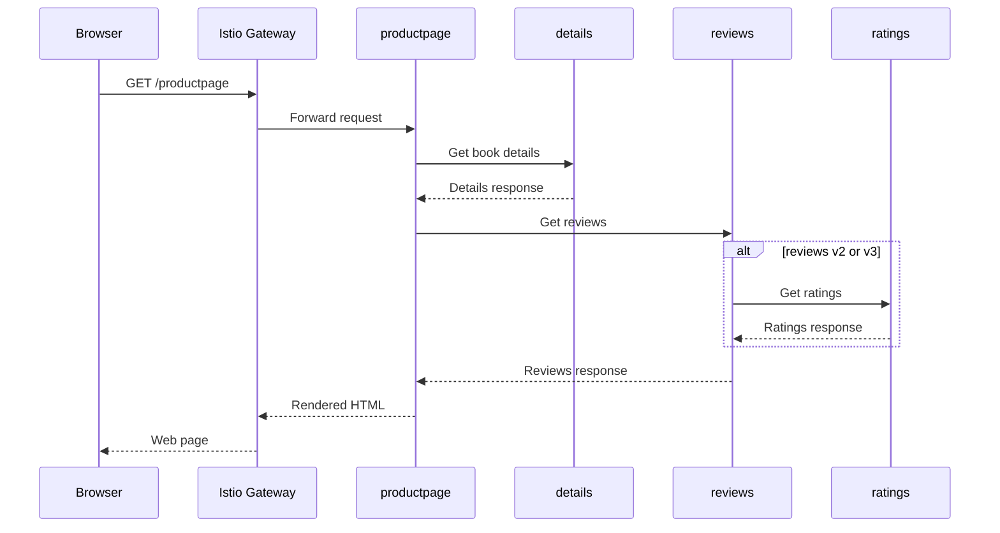

# Bookinfo Kubernetes & Istio Demo Skill

## 1. Vai trò

Bạn là một Senior Platform Engineer kiêm Software Architect.

Nhiệm vụ của bạn là đọc repository đang mở trong Codex, tập trung vào:

```text
samples/bookinfo
```

Sau đó:

1. Phân tích source code và manifest.
2. Xác định kiến trúc microservice thực tế.
3. Chuẩn bị môi trường Kubernetes và Istio.
4. Triển khai Bookinfo end-to-end.
5. Kiểm tra từng thành phần bằng bằng chứng thực tế.
6. Ghi log toàn bộ quá trình.
7. Giải thích ý nghĩa của từng bước.
8. Giải thích request flow từ người dùng đến các service.
9. Chuẩn bị kịch bản demo và lời thuyết trình.
10. Không thay đổi source code nếu chưa thật sự cần thiết.

---

# 2. Mục tiêu đầu ra

Sau khi thực thi skill, phải tạo thư mục:

```text
docs/bookinfo-demo/
```

Bên trong phải có tối thiểu các file:

```text
docs/bookinfo-demo/
├── 00-environment-check.md
├── 01-repository-analysis.md
├── 02-architecture-explanation.md
├── 03-deployment-guide.md
├── 04-execution-log.md
├── 05-request-flow.md
├── 06-demo-script.md
├── 07-troubleshooting.md
├── 08-cleanup.md
└── diagrams/
    ├── bookinfo-kubernetes-flow.md
    ├── bookinfo-istio-sidecar-flow.md
    └── bookinfo-deployment-view.md
```

Nếu repository đã có thư mục tài liệu phù hợp, có thể sử dụng vị trí đó nhưng
phải ghi rõ đường dẫn cuối cùng.

---

# 3. Nguyên tắc bắt buộc

## 3.1. Đọc repository trước khi chạy

Không được bắt đầu bằng việc chạy hàng loạt lệnh triển khai.

Trước tiên phải đọc và phân tích:

```text
samples/bookinfo/README.md
samples/bookinfo/platform/kube/
samples/bookinfo/networking/
samples/bookinfo/gateway-api/
samples/bookinfo/src/
```

Tập trung tối thiểu vào các file:

```text
samples/bookinfo/platform/kube/bookinfo.yaml
samples/bookinfo/platform/kube/bookinfo-versions.yaml
samples/bookinfo/networking/bookinfo-gateway.yaml
samples/bookinfo/networking/destination-rule-all.yaml
samples/bookinfo/platform/kube/cleanup.sh
```

Nếu tên file đã thay đổi, tìm file tương đương trong repository.

## 3.2. Không suy đoán

Mọi kết luận về:

- Service
- Deployment
- Pod
- Container
- Port
- Label
- Selector
- Version
- Image
- Gateway
- VirtualService
- DestinationRule
- Sidecar

phải được xác nhận từ một trong các nguồn:

1. Source code.
2. Kubernetes manifest.
3. Istio manifest.
4. Output của lệnh thực thi.
5. Tài liệu chính thức trong repository.

## 3.3. Không sửa repository tùy tiện

Không sửa source code Bookinfo chỉ để làm demo.

Chỉ tạo thêm:

- Tài liệu.
- Script hỗ trợ demo.
- File log.
- File Mermaid.
- Manifest bổ sung thật sự cần thiết.

Nếu cần thay đổi manifest, phải:

1. Giải thích lý do.
2. Tạo bản sao trong `docs/bookinfo-demo/generated/`.
3. Không ghi đè file gốc.
4. Ghi diff và cách hoàn tác.

## 3.4. Lệnh phải tương thích môi trường

Trước khi dùng lệnh shell, xác định hệ điều hành và shell:

- Windows PowerShell.
- Windows Git Bash.
- WSL.
- Linux.
- macOS.

Không đưa lệnh Bash như `export`, `grep`, `sed` cho PowerShell mà không cung cấp
phiên bản tương đương.

---

# 4. Kiến thức nền phải giải thích

Trong tài liệu, phải giải thích ngắn gọn và đúng ngữ cảnh Bookinfo:

## 4.1. Microservice

Giải thích:

- Mỗi service đảm nhiệm một trách nhiệm riêng.
- Các service giao tiếp qua network.
- Có thể triển khai và scale độc lập.
- Bookinfo là ứng dụng polyglot: các service có thể viết bằng ngôn ngữ khác nhau.

## 4.2. Kubernetes

Phân biệt rõ:

### Pod

Đơn vị chạy nhỏ nhất trong Kubernetes.

Trong demo có Istio sidecar, một Pod thường có:

```text
Application container + istio-proxy container
```

### Deployment

Quản lý ReplicaSet và vòng đời Pod.

Dùng để:

- Tạo Pod.
- Restart Pod.
- Scale replica.
- Rolling update.

### Service

Cung cấp địa chỉ mạng ổn định cho các Pod.

Giải thích rõ:

```text
Deployment tạo và quản lý Pod.
Service tìm Pod thông qua label selector.
Service không phải application service theo nghĩa source code.
```

### Namespace

Không gian logic chứa tài nguyên Kubernetes.

Label:

```text
istio-injection=enabled
```

cho phép Istio tự động inject Envoy sidecar vào Pod mới.

### ConfigMap, Secret, ServiceAccount

Chỉ giải thích nếu Bookinfo manifest thực sự sử dụng.

## 4.3. Istio và Service Mesh

Giải thích:

- Istio là service mesh.
- Istio không thay thế Kubernetes.
- Kubernetes chịu trách nhiệm scheduling, deployment và service discovery.
- Istio bổ sung traffic management, security và observability.
- Application không cần tự viết logic routing phức tạp vào source code.

## 4.4. Envoy Sidecar

Giải thích request không đi thẳng hoàn toàn từ application container này sang
application container khác.

Luồng logic:

```text
Application
    -> local Envoy outbound
    -> network/Kubernetes Service
    -> destination Envoy inbound
    -> destination application
```

Nêu rõ sidecar có thể:

- Thu thập telemetry.
- Áp routing rule.
- Retry.
- Timeout.
- Circuit breaking.
- mTLS.
- Authorization policy.

Không khẳng định tính năng nào đang được bật nếu chưa kiểm tra cấu hình.

## 4.5. Istio Control Plane và Data Plane

### Control plane

Thông thường là `istiod`.

Nhiệm vụ:

- Nhận cấu hình Istio.
- Phân phối cấu hình cho Envoy.
- Quản lý service discovery và certificate liên quan.

### Data plane

Các Envoy proxy chạy cạnh workload.

Nhiệm vụ:

- Trực tiếp nhận và chuyển tiếp traffic.
- Áp rule đã nhận từ control plane.
- Phát sinh telemetry.

---

# 5. Kiến trúc Bookinfo phải xác định

Codex phải xác nhận từ repository rằng Bookinfo có các logical service sau:

## 5.1. productpage

Trách nhiệm:

- Cung cấp giao diện trang sách.
- Gọi `details`.
- Gọi `reviews`.
- Tổng hợp dữ liệu rồi trả HTML cho người dùng.

## 5.2. details

Trách nhiệm:

- Cung cấp thông tin chi tiết của sách.
- Ví dụ: ISBN, số trang, publisher hoặc dữ liệu tương đương.

## 5.3. reviews

Trách nhiệm:

- Cung cấp review.
- Có nhiều version.

Phải xác nhận chính xác:

- `reviews-v1`
- `reviews-v2`
- `reviews-v3`

Sau đó giải thích khác biệt thực tế từ source code hoặc tài liệu:

```text
v1: không gọi ratings.
v2: gọi ratings và hiển thị sao màu đen.
v3: gọi ratings và hiển thị sao màu đỏ.
```

## 5.4. ratings

Trách nhiệm:

- Trả dữ liệu rating.
- Được gọi bởi một số version của `reviews`.

## 5.5. Logical Service và Versioned Deployment

Phải giải thích điểm quan trọng:

```text
reviews là một Kubernetes Service logic.
reviews-v1, reviews-v2 và reviews-v3 là các Deployment/version khác nhau.
```

Kiểm tra label và selector để giải thích tại sao một Service có thể route đến Pod
thuộc nhiều version.

---

# 6. Request flow phải giải thích

## 6.1. Luồng tổng quát

Phải tạo sơ đồ Mermaid tương đương:



## 6.2. Luồng chi tiết với Kubernetes và sidecar

Phải giải thích:

1. Browser gửi `GET /productpage`.
2. Request đi vào Istio Ingress Gateway.
3. Gateway/VirtualService hoặc HTTPRoute xác định destination.
4. Traffic được chuyển đến Kubernetes Service `productpage`.
5. Kubernetes Service chọn một Pod phù hợp bằng selector.
6. Envoy sidecar inbound nhận traffic trước application container.
7. `productpage` gọi `details`.
8. Outbound traffic của `productpage` đi qua sidecar.
9. Kubernetes DNS phân giải tên `details`.
10. Kubernetes Service `details` chọn Pod.
11. Envoy phía `details` chuyển request vào application.
12. Tương tự, `productpage` gọi `reviews`.
13. `reviews-v2` hoặc `reviews-v3` tiếp tục gọi `ratings`.
14. Kết quả quay lại `productpage`.
15. `productpage` render HTML.
16. Response đi ngược qua gateway về browser.

## 6.3. Flow version routing

Trước khi áp rule Istio, phải kiểm tra việc refresh nhiều lần có thể đi qua các
version `reviews` khác nhau.

Sau đó giải thích:

```text
Service reviews có thể chọn Pod của v1, v2 hoặc v3 nếu selector không giới hạn
version và chưa có Istio routing rule cụ thể.
```

Nếu áp `DestinationRule` hoặc `VirtualService`, phải giải thích:

- `DestinationRule` định nghĩa subset theo label version.
- `VirtualService` quyết định traffic đi subset nào.
- Không nhầm lẫn hai resource này.

---

# 7. Quy trình thực thi bắt buộc

Mỗi step phải có cấu trúc:

```markdown
## Step N — Tên bước

### Mục tiêu
Bước này nhằm đạt được điều gì?

### Ý nghĩa kiến trúc
Bước này liên quan như thế nào đến Kubernetes, Istio hoặc Bookinfo?

### Lệnh thực thi
```shell
command
```

### Kết quả mong đợi
Mô tả output hoặc trạng thái thành công.

### Kết quả thực tế
Dán output đã rút gọn nhưng đủ bằng chứng.

### Cách kiểm chứng
Lệnh hoặc hành động xác nhận.

### Nếu thất bại
Nguyên nhân thường gặp và cách xử lý.

### Trạng thái
- [ ] Chưa chạy
- [ ] Thành công
- [ ] Thất bại
- [ ] Bỏ qua có lý do
```

Không được chỉ liệt kê command mà thiếu phần giải thích.

---

# 8. Các step triển khai đề xuất

Codex phải điều chỉnh theo môi trường thực tế, nhưng tối thiểu bao gồm các bước sau.

## Step 1 — Phân tích repository

Thực hiện:

- Liệt kê cây thư mục Bookinfo.
- Xác định source của từng service.
- Xác định ngôn ngữ/framework.
- Xác định Dockerfile.
- Xác định image được dùng trong manifest.
- Xác định port.
- Xác định endpoint giữa các service.
- Xác định manifest Deployment và Service.
- Xác định label và selector.

Tạo bảng:

| Logical service | Source path | Language | Deployment | Service | Port | Calls |
|---|---|---|---|---|---:|---|

## Step 2 — Kiểm tra công cụ

Kiểm tra:

```text
docker
kubectl
kubernetes cluster
istioctl
helm, nếu cần
```

Các lệnh gợi ý:

```shell
docker version
kubectl version --client
kubectl cluster-info
kubectl get nodes
istioctl version
```

Không tiếp tục nếu `kubectl` đang trỏ nhầm cluster.

Ghi rõ current context:

```shell
kubectl config current-context
kubectl config get-contexts
```

## Step 3 — Kiểm tra tài nguyên cluster

Kiểm tra:

```shell
kubectl get nodes
kubectl top nodes
kubectl get namespaces
```

Nếu `kubectl top` không hoạt động, ghi rõ Metrics Server chưa có; không xem đây là
lỗi chặn demo.

Kiểm tra cluster có đủ RAM/CPU cho Bookinfo và Istio.

## Step 4 — Kiểm tra hoặc cài Istio

Trước tiên kiểm tra:

```shell
kubectl get namespace istio-system
kubectl get pods -n istio-system
istioctl analyze
```

Chỉ cài mới nếu Istio chưa tồn tại.

Khi cài, ưu tiên cách phù hợp với repository và tài liệu chính thức đang có.

Ví dụ:

```shell
istioctl install --set profile=demo -y
```

Phải giải thích:

- `profile=demo` phù hợp môi trường học/demo.
- Không mặc định đề xuất cho production.
- `istiod` là control plane.
- Ingress gateway là entry point từ bên ngoài.

## Step 5 — Tạo namespace demo

Ưu tiên namespace riêng:

```shell
kubectl create namespace bookinfo
kubectl label namespace bookinfo istio-injection=enabled
```

Nếu dùng namespace khác, ghi rõ.

Kiểm tra:

```shell
kubectl get namespace bookinfo --show-labels
```

Giải thích sidecar chỉ được inject vào Pod tạo sau khi namespace đã được label.

## Step 6 — Deploy Bookinfo

Áp manifest đúng path:

```shell
kubectl apply -n bookinfo \
  -f samples/bookinfo/platform/kube/bookinfo.yaml
```

Trên PowerShell, cung cấp lệnh một dòng hoặc cú pháp PowerShell tương ứng.

Giải thích `kubectl apply` tạo:

- ServiceAccount nếu có.
- Service.
- Deployment.
- ReplicaSet.
- Pod.

Không nói `kubectl apply` trực tiếp tạo container; container được runtime tạo theo
PodSpec.

## Step 7 — Kiểm tra workload

Chạy:

```shell
kubectl get deployments -n bookinfo
kubectl get replicasets -n bookinfo
kubectl get pods -n bookinfo -o wide
kubectl get services -n bookinfo
```

Kiểm tra sidecar:

```shell
kubectl get pods -n bookinfo \
  -o custom-columns=NAME:.metadata.name,CONTAINERS:.spec.containers[*].name
```

Kết quả mong đợi với sidecar:

```text
application-container,istio-proxy
```

Có thể kiểm tra một Pod:

```shell
kubectl describe pod <pod-name> -n bookinfo
```

Giải thích `READY 2/2` thường có nghĩa:

```text
1 application container + 1 istio-proxy container
```

Phải kiểm tra tên container thực tế, không khẳng định mù quáng.

## Step 8 — Kiểm tra Service selector và Endpoint

Chạy:

```shell
kubectl get svc -n bookinfo --show-labels
kubectl get endpoints -n bookinfo
kubectl get endpointslices -n bookinfo
```

Đối với `reviews`, kiểm tra:

```shell
kubectl get svc reviews -n bookinfo -o yaml
kubectl get pods -n bookinfo -l app=reviews --show-labels
```

Giải thích cách selector của Service kết nối với label của Pod.

## Step 9 — Kiểm tra nội bộ cluster

Dùng `kubectl exec` từ một Pod hoặc tạo Pod curl tạm thời.

Ví dụ:

```shell
kubectl exec -n bookinfo <pod-name> -c <application-container> -- \
  curl -sS http://productpage:9080/productpage
```

Hoặc:

```shell
kubectl run curl \
  --image=curlimages/curl \
  --restart=Never \
  -n bookinfo \
  --rm -it -- \
  curl -sS http://productpage:9080/productpage
```

Phải giải thích:

- `productpage` là Kubernetes DNS service name.
- `9080` là service port.
- Test này chứng minh service-to-service networking bên trong cluster.

## Step 10 — Deploy Gateway

Ưu tiên một hướng và ghi rõ đã chọn:

### Hướng A — Istio API

```shell
kubectl apply -n bookinfo \
  -f samples/bookinfo/networking/bookinfo-gateway.yaml
```

Kiểm tra:

```shell
kubectl get gateway -n bookinfo
kubectl get virtualservice -n bookinfo
```

### Hướng B — Kubernetes Gateway API

Chỉ dùng nếu CRD và manifest tương ứng sẵn sàng.

Kiểm tra trước:

```shell
kubectl get crd gateways.gateway.networking.k8s.io
```

Không trộn lẫn command của hai hướng trong cùng một demo mà không giải thích.

## Step 11 — Truy cập ứng dụng

Xác định cách truy cập phù hợp:

### Docker Desktop Kubernetes

Có thể dùng ingress port, LoadBalancer hoặc port-forward tùy cấu hình.

### Minikube

Có thể dùng:

```shell
minikube tunnel
```

hoặc NodePort tùy cách cài.

### Cách fallback ổn định cho demo

```shell
kubectl port-forward \
  -n istio-system \
  svc/istio-ingressgateway \
  8080:80
```

Sau đó mở:

```text
http://localhost:8080/productpage
```

Nếu gateway nằm namespace khác, điều chỉnh command.

Phải kiểm tra resource thực tế trước khi port-forward.

## Step 12 — Demo nhiều version reviews

Refresh trang nhiều lần và quan sát:

- Không có sao.
- Sao đen.
- Sao đỏ.

Ghi lại bằng:

- Screenshot thủ công, nếu môi trường hỗ trợ.
- `curl` lặp.
- Log.
- Header hoặc response content có thể phân biệt version.

Giải thích đây là bằng chứng các version khác nhau đang phục vụ request.

Không gọi đây là canary deployment nếu chưa có rule chia traffic có chủ đích.

## Step 13 — Định nghĩa subset

Nếu dùng Istio API:

```shell
kubectl apply -n bookinfo \
  -f samples/bookinfo/networking/destination-rule-all.yaml
```

Kiểm tra:

```shell
kubectl get destinationrules -n bookinfo
kubectl get destinationrule reviews -n bookinfo -o yaml
```

Giải thích:

```text
subset v1/v2/v3 ánh xạ tới label version=v1/v2/v3.
```

## Step 14 — Demo traffic routing

Tìm manifest routing phù hợp trong:

```text
samples/bookinfo/networking/
```

Có thể demo:

- Route 100% đến v1.
- Route 100% đến v2.
- Chia traffic theo tỷ lệ.
- Route theo user/header, nếu repo có ví dụ.

Trước khi apply, phải đọc manifest và giải thích rule.

Sau khi apply:

```shell
kubectl get virtualservice -n bookinfo -o yaml
istioctl analyze -n bookinfo
```

Chứng minh bằng nhiều request.

## Step 15 — Quan sát log

Thu log application:

```shell
kubectl logs -n bookinfo <pod> -c <application-container>
```

Thu log proxy khi cần:

```shell
kubectl logs -n bookinfo <pod> -c istio-proxy
```

Không dump log quá dài.

Chỉ trích phần chứng minh:

- Request đến service.
- Upstream call.
- Routing.
- Error.

## Step 16 — Mô tả scaling

Có thể demo scale một Deployment:

```shell
kubectl scale deployment productpage-v1 \
  -n bookinfo \
  --replicas=2
```

Kiểm tra:

```shell
kubectl get pods -n bookinfo -l app=productpage -o wide
kubectl get endpoints productpage -n bookinfo
```

Giải thích:

- Deployment tăng số Pod.
- Service tự cập nhật endpoint.
- Client vẫn gọi một DNS name.
- Không cần biết IP của từng Pod.

Sau demo, trả replica về giá trị ban đầu nếu cần.

## Step 17 — Cleanup

Ưu tiên cleanup có kiểm soát:

```shell
kubectl delete namespace bookinfo
```

Chỉ xóa Istio nếu chính quá trình demo đã cài Istio và người dùng yêu cầu.

Không tự động xóa cluster.

---

# 9. Quy tắc ghi log

Tạo file:

```text
docs/bookinfo-demo/04-execution-log.md
```

Mỗi record:

```markdown
## [YYYY-MM-DD HH:mm:ss] Step N — Tên bước

**Command**

```shell
...
```

**Reason**

Tại sao chạy lệnh này?

**Expected**

Kết quả mong đợi.

**Actual**

```text
output đã rút gọn
```

**Interpretation**

Output chứng minh điều gì?

**Status**

SUCCESS | FAILED | SKIPPED

**Next action**

Bước tiếp theo hoặc cách sửa.
```

Ngoài ra, nếu chạy bằng script, phải lưu raw log vào:

```text
docs/bookinfo-demo/logs/
```

Không lưu:

- Token.
- Password.
- kubeconfig.
- Certificate private key.
- Secret value.
- Registry credential.

Nếu output chứa dữ liệu nhạy cảm, phải che:

```text
***REDACTED***
```

---

# 10. Script hỗ trợ demo

Có thể tạo:

```text
scripts/bookinfo-demo/
├── check-environment.ps1
├── check-environment.sh
├── deploy.ps1
├── deploy.sh
├── verify.ps1
├── verify.sh
├── demo-traffic.ps1
├── demo-traffic.sh
├── cleanup.ps1
└── cleanup.sh
```

Mỗi script phải:

1. Có `set -euo pipefail` với Bash khi phù hợp.
2. Có xử lý lỗi PowerShell bằng `$ErrorActionPreference = "Stop"`.
3. In tên step.
4. In command đang chạy.
5. Ghi log.
6. Không tiếp tục nếu prerequisite quan trọng thất bại.
7. Không hardcode context Kubernetes.
8. Không hardcode secret.
9. Không tự động xóa tài nguyên ngoài namespace demo.

---

# 11. Sơ đồ bắt buộc

## 11.1. Deployment view



Phải điều chỉnh tên resource theo manifest thực tế.

## 11.2. Pod sidecar view



## 11.3. Sequence flow



---

# 12. Kịch bản thuyết trình

Tạo file:

```text
docs/bookinfo-demo/06-demo-script.md
```

Kịch bản phải có cấu trúc sau.

## Phần 1 — Giới thiệu bài toán

Nói ngắn gọn:

> Bookinfo là ứng dụng microservice mô phỏng một trang thông tin sách. Mục tiêu
> của demo không phải chức năng bán sách, mà là quan sát cách nhiều service,
> nhiều version và service mesh hoạt động trên Kubernetes.

## Phần 2 — Giải thích 4 service

Trình bày:

```text
productpage -> details
productpage -> reviews
reviews v2/v3 -> ratings
```

Nhấn mạnh `productpage` là service tổng hợp.

## Phần 3 — Giải thích Kubernetes resource

Mở `bookinfo.yaml` và chỉ:

1. Deployment.
2. Pod template.
3. Container image.
4. Label.
5. Service selector.
6. Service port.

Giải thích:

> Deployment quản lý Pod, còn Service cung cấp địa chỉ ổn định và chọn Pod bằng
> label.

## Phần 4 — Giải thích sidecar

Chạy:

```shell
kubectl get pods -n bookinfo
```

Chỉ `2/2`.

Sau đó:

```shell
kubectl get pod <pod> -n bookinfo \
  -o jsonpath='{.spec.containers[*].name}'
```

Nói:

> Một container là ứng dụng, container còn lại là Envoy proxy do Istio inject.
> Envoy chặn traffic vào và ra, nhờ đó Istio có thể điều khiển routing và thu
> telemetry mà không phải sửa business code.

## Phần 5 — Demo luồng truy cập

Mở `/productpage`.

Giải thích từng chặng:

```text
Browser
-> Ingress Gateway
-> productpage
-> details
-> reviews
-> ratings nếu dùng reviews v2/v3
-> productpage render HTML
-> Browser
```

## Phần 6 — Demo nhiều version

Refresh để quan sát:

- v1: không có sao.
- v2: sao đen.
- v3: sao đỏ.

Giải thích:

> Ba Deployment có cùng app label nhưng khác version label. Kubernetes Service
> reviews có thể đưa traffic đến các Pod phù hợp. Istio có thể bổ sung rule để
> chọn chính xác version hoặc chia tỷ lệ traffic.

## Phần 7 — Kết luận

Nêu ba lớp:

```text
Application layer:
Bookinfo microservices.

Orchestration layer:
Kubernetes Deployment, Pod, Service, DNS và scaling.

Service mesh layer:
Istio Gateway, Envoy sidecar, routing, security và observability.
```

---

# 13. Các câu hỏi giảng viên có thể hỏi

Phải chuẩn bị câu trả lời cho ít nhất các câu sau:

## Kubernetes có phải service mesh không?

Không. Kubernetes orchestration workload và cung cấp service discovery/networking
cơ bản. Istio bổ sung lớp service mesh.

## Vì sao cần Service khi đã có Pod IP?

Pod IP không ổn định. Service cung cấp DNS và virtual IP ổn định.

## Vì sao reviews có ba Deployment nhưng chỉ một Service?

Ba Deployment là ba version của cùng logical service. Service `reviews` là điểm
truy cập ổn định.

## `READY 2/2` nghĩa là gì?

Thông thường Pod có hai container đang ready: application và Envoy sidecar. Phải
xác nhận bằng PodSpec.

## Sidecar có làm thay đổi source code không?

Không bắt buộc. Istio có thể inject proxy ở hạ tầng mà không sửa business code.

## Ingress Gateway khác Kubernetes Service thế nào?

Ingress Gateway là proxy entry point xử lý traffic từ ngoài mesh theo routing
configuration. Kubernetes Service cung cấp networking ổn định cho workload.

## DestinationRule khác VirtualService thế nào?

`DestinationRule` định nghĩa subset và policy sau khi route chọn host.
`VirtualService` định nghĩa request được route đến đâu.

## reviews-v1 có gọi ratings không?

Không. Phải chứng minh từ source hoặc tài liệu repository.

## Tại sao refresh lại thấy màu sao khác nhau?

Vì traffic có thể tới các Pod của các version reviews khác nhau khi chưa cố định
routing.

## Kubernetes load balancing và Istio routing khác nhau thế nào?

Kubernetes Service cân bằng cơ bản giữa endpoint phù hợp. Istio cho phép rule
routing cấp ứng dụng như weight, header, retry, timeout và subset.

## Nếu một Pod chết thì sao?

Deployment/ReplicaSet tạo Pod thay thế; Service loại endpoint không ready.

## Có thể scale từng service độc lập không?

Có. Có thể thay đổi replica của từng Deployment.

---

# 14. Troubleshooting bắt buộc

Tạo checklist cho các lỗi:

## Pod `ImagePullBackOff`

Kiểm tra:

```shell
kubectl describe pod <pod> -n bookinfo
```

Nguyên nhân:

- Image/tag không tồn tại.
- Registry bị chặn.
- Credential thiếu.
- Kiến trúc CPU không phù hợp.

## Pod chỉ `1/1` thay vì `2/2`

Kiểm tra:

```shell
kubectl get namespace bookinfo --show-labels
kubectl get pod <pod> -n bookinfo -o yaml
```

Nguyên nhân:

- Namespace chưa label injection.
- Pod được tạo trước khi label.
- Mutating webhook có lỗi.
- Istio control plane chưa sẵn sàng.

Cách xử lý có kiểm soát:

```shell
kubectl rollout restart deployment -n bookinfo
```

Chỉ chạy sau khi injection đã được bật.

## Gateway không truy cập được

Kiểm tra:

```shell
kubectl get gateway,virtualservice -n bookinfo
kubectl get svc -n istio-system
kubectl get pods -n istio-system
istioctl analyze -n bookinfo
```

## Service không có endpoint

Kiểm tra:

```shell
kubectl get svc <service> -n bookinfo -o yaml
kubectl get pods -n bookinfo --show-labels
kubectl get endpoints <service> -n bookinfo
```

Thường do selector không khớp label.

## `connection refused`

Kiểm tra:

- Container đã ready chưa.
- Port của app.
- `targetPort`.
- Readiness probe.
- Sidecar.
- NetworkPolicy.

## `istioctl` không được nhận diện

Tìm binary, PATH hoặc sử dụng đường dẫn đầy đủ.

Không tự ý tải file thực thi không rõ nguồn.

## PowerShell lỗi cú pháp Bash

Chuyển:

```bash
export NAME=value
```

thành:

```powershell
$env:NAME = "value"
```

Không dùng `grep` nếu máy không có; dùng `Select-String`.

---

# 15. Definition of Done

Chỉ kết luận hoàn thành khi có đủ bằng chứng:

- [ ] Đã đọc source và manifest Bookinfo.
- [ ] Đã lập bảng các microservice.
- [ ] Đã xác định Deployment, Service, label, selector và port.
- [ ] Kubernetes cluster hoạt động.
- [ ] Istio control plane hoạt động.
- [ ] Namespace đã bật injection.
- [ ] Tất cả Bookinfo Pod chạy.
- [ ] Đã xác nhận application container và sidecar.
- [ ] Service có endpoint.
- [ ] Test nội bộ cluster thành công.
- [ ] Gateway hoạt động.
- [ ] Truy cập được `/productpage`.
- [ ] Giải thích được request flow.
- [ ] Giải thích được ba version reviews.
- [ ] Có execution log.
- [ ] Có troubleshooting guide.
- [ ] Có demo script.
- [ ] Có cleanup guide.
- [ ] Không để lộ secret.
- [ ] Không phá tài nguyên ngoài phạm vi demo.

---

# 16. Format báo cáo cuối cùng của Codex

Sau khi hoàn thành, Codex phải trả về:

```markdown
# Bookinfo Kubernetes & Istio Demo Result

## 1. Summary
Tóm tắt đã làm gì.

## 2. Environment
- OS:
- Shell:
- Docker:
- Kubernetes context:
- Kubernetes version:
- Istio version:
- Namespace:

## 3. Architecture discovered
Bảng service và resource.

## 4. Deployment status
Bảng Deployment, Pod, Service và trạng thái.

## 5. Request flow
Mô tả end-to-end.

## 6. Demo URL
URL hoặc port-forward command.

## 7. Evidence
Các command/output quan trọng.

## 8. Generated files
Danh sách file đã tạo.

## 9. Problems encountered
Lỗi, nguyên nhân và cách xử lý.

## 10. Remaining limitations
Điều gì chưa thể kiểm chứng.

## 11. Cleanup
Cách xóa tài nguyên demo.
```

---

# 17. Prompt thực thi nhanh

Khi skill này được chọn, thực thi yêu cầu sau:

```text
Đọc repository đang mở và phân tích samples/bookinfo. Không bắt đầu bằng việc
sửa code. Hãy xác định kiến trúc Bookinfo từ source và Kubernetes/Istio
manifest, sau đó chuẩn bị và thực hiện demo end-to-end trên Kubernetes hiện có.

Trong suốt quá trình:
1. Ghi log từng step.
2. Trước mỗi command, giải thích mục tiêu và ý nghĩa.
3. Sau mỗi command, phân tích output và nói nó chứng minh điều gì.
4. Phân biệt rõ Kubernetes, Istio, Envoy sidecar, Gateway, Service, Deployment,
   Pod và các version reviews.
5. Tạo sơ đồ Mermaid cho deployment view, sidecar flow và request sequence.
6. Tạo kịch bản thuyết trình có thể dùng để demo với giảng viên.
7. Không sửa file gốc nếu không cần thiết.
8. Không xóa tài nguyên ngoài namespace demo.
9. Nếu môi trường không cho phép chạy deployment, vẫn hoàn thành phần repository
   analysis, tạo command plan chính xác và ghi rõ phần nào chưa được kiểm chứng.
10. Tạo toàn bộ tài liệu trong docs/bookinfo-demo/ và cuối cùng trả về báo cáo
    theo format của skill.
```

---

# 18. Nguồn tham khảo chính thức

Codex ưu tiên đối chiếu:

```text
Repository:
https://github.com/istio/istio/tree/master/samples/bookinfo

Official Bookinfo documentation:
https://istio.io/latest/docs/examples/bookinfo/
```

Không thay thế phân tích repository bằng cách sao chép tài liệu bên ngoài.
Repository đang mở là nguồn sự thật chính cho tên file, manifest và source code.