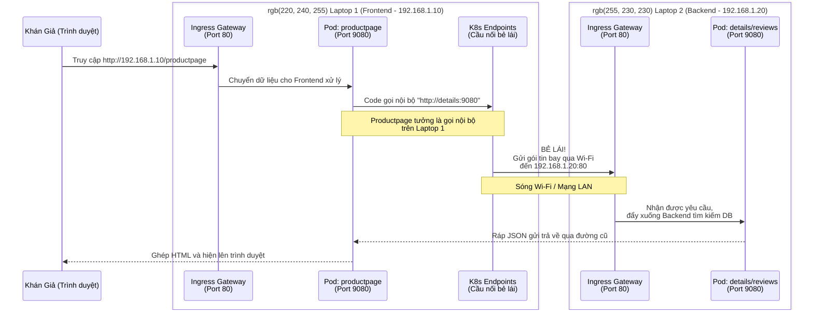

# Hướng dẫn Toàn tập: Demo Phân Tán Ứng Dụng Bookinfo Trên 2 Máy Tính (Laptop)

Kịch bản demo này chứng minh một trong những sức mạnh cốt lõi nhất của kiến trúc Microservices và Service Mesh: **Khả năng triển khai phân tán hoàn toàn trong suốt với mã nguồn**. 

Bằng cách sử dụng các đối tượng Service, Endpoints và Gateway, ta sẽ tách rời Frontend và Backend chạy trên 2 chiếc máy tính khác nhau đặt chung một phòng (cùng kết nối chung mạng Wi-Fi/LAN), và chúng sẽ giao tiếp với nhau mà **không cần phải sửa bất cứ một dòng code (source code) nào của ứng dụng.**

---

## 🌍 Chuẩn Bị: Mô hình Triển Khai
Bạn cần 2 máy tính (laptop) đã cài sẵn Kubernetes và Istio (sử dụng gói `demo`). Hai máy phải kết nối **cùng một mạng Wi-Fi**.

- **Laptop 1 (Frontend - Máy Khách):** Sẽ chỉ chạy giao diện người dùng (`productpage`).
- **Laptop 2 (Backend - Máy Chủ Lõi):** Sẽ chạy các dịch vụ xử lý nghiệp vụ (`details`, `reviews`, `ratings`).

**Việc đầu tiên cần làm:** Lấy địa chỉ IP LAN của cả 2 máy (trên máy Mac dùng lệnh `ipconfig getifaddr en0`). 
*Ví dụ trong bài này:*
- **Laptop 1 (Frontend):** `192.168.1.10`
- **Laptop 2 (Backend):** `192.168.1.20` (Đây là IP quan trọng nhất để Laptop 1 có thể trỏ tới).

---

## 💻 PHẦN 1: Setup trên LAPTOP 2 (Máy Backend)
*Mục tiêu: Chạy các dịch vụ lõi và mở "Cổng" (Gateway) đón nhận request từ mạng Wi-Fi gửi tới.*

**Bước 1: Kích hoạt Istio tự động tiêm Proxy**
```bash
kubectl label namespace default istio-injection=enabled
```

**Bước 2: Triển khai các dịch vụ Backend**
- Mở file `platform/kube/bookinfo.yaml`.
- **Xóa (hoặc comment lại)** phần khai báo của `productpage` (gồm Service và Deployment).
- Triển khai ứng dụng:
  ```bash
  kubectl apply -f platform/kube/bookinfo.yaml
  ```
  *Lúc này Laptop 2 sẽ chạy: `details`, `reviews-v1`, `reviews-v2`, `reviews-v3`, và `ratings`.*

**Bước 3: Mở Cổng Gateway**
```bash
kubectl apply -f networking/bookinfo-gateway.yaml
```

**Bước 4: Thiết lập Định Tuyến (VirtualService) để xử lý Request**
Tạo file `backend-routing.yaml` và áp dụng bằng lệnh `kubectl apply -f backend-routing.yaml`:
```yaml
apiVersion: networking.istio.io/v1
kind: VirtualService
metadata:
  name: backend-routing
spec:
  hosts:
  - "*"
  gateways:
  - bookinfo-gateway
  http:
  - match:
    - uri:
        prefix: /details
    route:
    - destination:
        host: details
        port:
          number: 9080
  - match:
    - uri:
        prefix: /reviews
    route:
    - destination:
        host: reviews
        port:
          number: 9080
```
> **Giải thích:** Gateway nhận request từ mạng vào cổng 80. File này đảm bảo nếu URL chứa `/details` thì nhét vào pod `details` ở cổng 9080.

---

## 💻 PHẦN 2: Setup trên LAPTOP 1 (Máy Frontend)
*Mục tiêu: Chạy giao diện Web và dùng "Cú lừa" của K8s để bẻ lái mọi lời gọi nội bộ bay thẳng sang mạng LAN đến Laptop 2.*

**Bước 1: Kích hoạt Istio**
```bash
kubectl label namespace default istio-injection=enabled
```

**Bước 2: Triển khai giao diện Frontend**
- Mở file `platform/kube/bookinfo.yaml`.
- Lần này làm ngược lại: **XÓA HẾT** các dịch vụ details, reviews, ratings. Chỉ giữ lại duy nhất phần `productpage`.
- Triển khai ứng dụng:
  ```bash
  kubectl apply -f platform/kube/bookinfo.yaml
  ```

**Bước 3: Áp dụng mưu kế "Bẻ lái" (Endpoints)**
Tạo file `bridge-to-laptop2.yaml` và thay đổi IP `192.168.1.20` thành IP thực tế của Laptop 2. Sau đó chạy `kubectl apply -f bridge-to-laptop2.yaml`.
```yaml
# Bẻ lái cho Details
apiVersion: v1
kind: Service
metadata:
  name: details
spec:
  ports:
    - protocol: TCP
      port: 9080
      targetPort: 80 # Đâm vào cổng 80 (Gateway) của Laptop 2
---
apiVersion: v1
kind: Endpoints
metadata:
  name: details
subsets:
  - addresses:
      - ip: 192.168.1.20 # ĐỊA CHỈ IP LAN CỦA LAPTOP 2
    ports:
      - port: 80
---
# Bẻ lái cho Reviews
apiVersion: v1
kind: Service
metadata:
  name: reviews
spec:
  ports:
    - protocol: TCP
      port: 9080
      targetPort: 80 # Đâm vào cổng 80 (Gateway) của Laptop 2
---
apiVersion: v1
kind: Endpoints
metadata:
  name: reviews
subsets:
  - addresses:
      - ip: 192.168.1.20 # ĐỊA CHỈ IP LAN CỦA LAPTOP 2
    ports:
      - port: 80
```
> **Giải thích:** Ứng dụng `productpage` vẫn ngây thơ nghĩ rằng nó đang gọi service tên là `details` trong nội bộ. Nhưng Endpoints đã phục kích sẵn, đóng gói request đó lại và quăng sang IP `192.168.1.20` ở port 80.

**Bước 4: Mở cửa đón khách**
```bash
kubectl apply -f networking/bookinfo-gateway.yaml
```

---

## 🚀 PHẦN 3: Trình Diễn & Khán Giả Hưởng Thụ

Lúc này, từ điện thoại hoặc một thiết bị trình chiếu, bạn mở trình duyệt và gõ:
```text
http://192.168.1.10/productpage
```
*(Đây là IP của Laptop 1).*

Trang bán sách hiện lên đầy đủ sao đánh giá, thông tin chi tiết! Bạn hoàn thành một ví dụ kinh điển về **Distributed Systems (Hệ thống phân tán)**.

### Sơ Đồ Khán Giả Dễ Hiểu Để Thuyết Trình
Đây là sơ đồ giải thích chính xác đường đi của dữ liệu qua không gian phòng học:



**Kết luận cho bài báo cáo:** Chúng ta đạt được mức phân chia tải (Load Balancing) ở mức độ phần cứng vật lý nhưng hoàn toàn che giấu độ phức tạp đó đi. Code Python, Java, NodeJS vẫn hoạt động mà không hề hay biết chúng bị tách rời. Đó là ưu điểm tối thượng của Service Mesh và Kubernetes.
