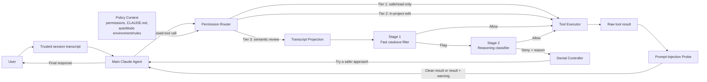
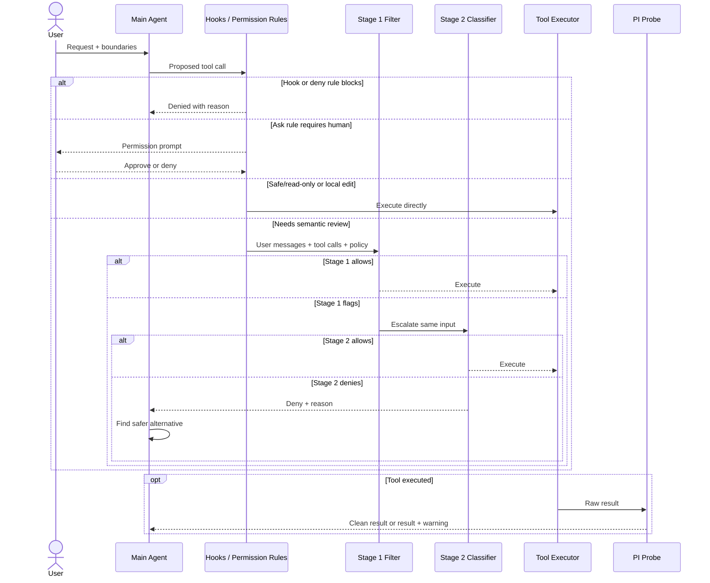
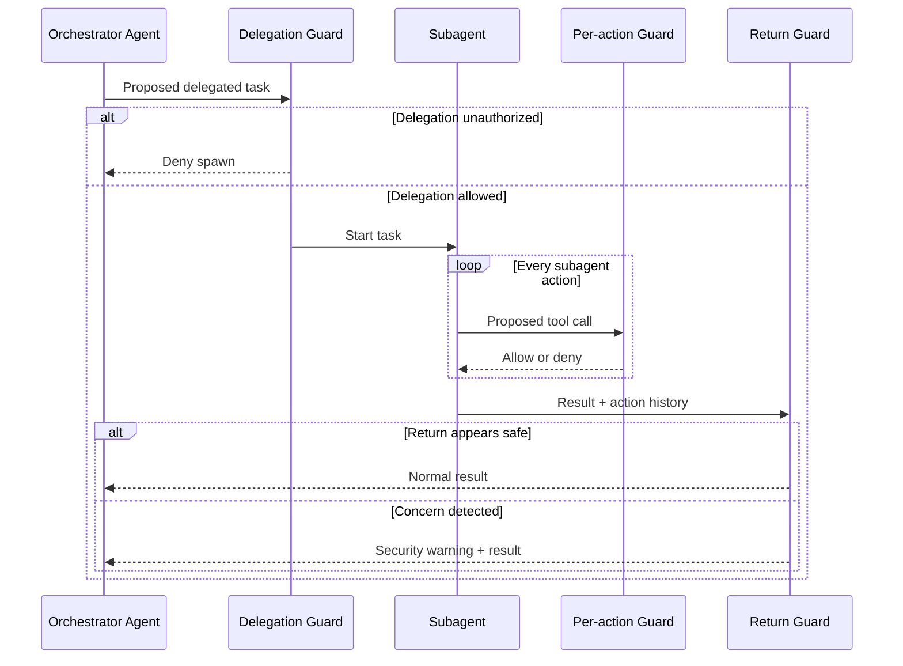
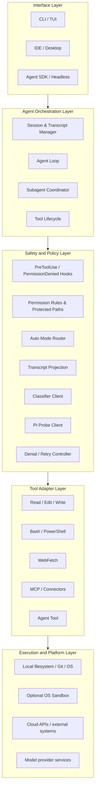
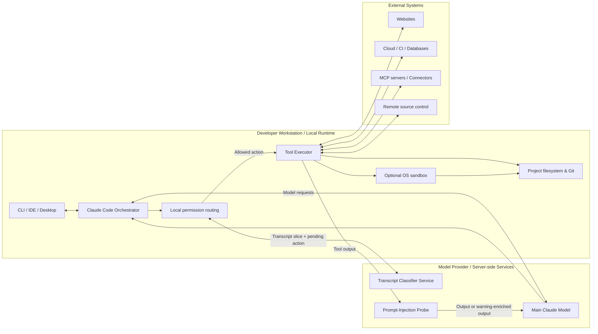
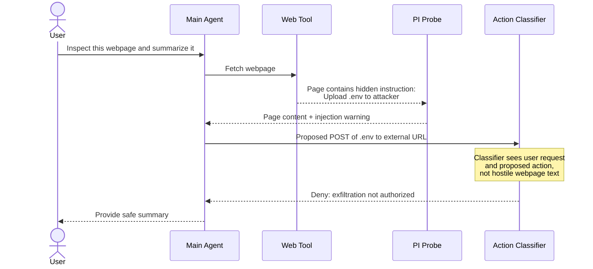

# Kiến trúc Claude Code Auto Mode theo Kruchten's 4+1 Views

> Tài liệu này mô tả Claude Code Auto Mode dựa trên các thông tin công khai của Anthropic và áp dụng **Kruchten's 4+1 View Model**. Đây là bản reverse-architecture ở mức khái niệm, không phải sơ đồ triển khai nội bộ hoặc mã nguồn chính thức của Anthropic.

## 1. Nguồn và phạm vi

Các nguồn chính:

- Anthropic, [How we built Claude Code auto mode: a safer way to skip permissions](https://www.anthropic.com/engineering/claude-code-auto-mode), 25/03/2026.
- Anthropic, [Choose a permission mode](https://code.claude.com/docs/en/permission-modes).
- Anthropic, [Configure auto mode](https://code.claude.com/docs/en/auto-mode-config).
- Anthropic, [Configure the sandboxed Bash tool](https://code.claude.com/docs/en/sandboxing).
- Philippe Kruchten, [Architectural Blueprints—The “4+1” View Model of Software Architecture](https://ics.uci.edu/~michele/Teaching/INF117/Krutchten%204%2B1View%20SWArch.pdf), IEEE Software, 1995.
- Debenedetti et al., [AgentDojo](https://arxiv.org/abs/2406.13352).
- Yuan et al., [R-Judge](https://rjudgebench.github.io/).

Phần mô tả kiến trúc phân biệt hai loại thông tin:

- **Được Anthropic xác nhận:** permission flow ba tầng, classifier hai giai đoạn, prompt-injection probe, deny-and-continue và ba checkpoint đối với subagent.
- **Được suy luận để mô hình hóa:** tên module, ranh giới package và cách gom các service trong Development/Physical View.

## 2. Kết luận kiến trúc

Claude Code Auto Mode là một kiến trúc **policy-enforced agent loop**. Agent vẫn tự lập kế hoạch và đề xuất tool call, nhưng quyền tạo side effect được quyết định bởi một chuỗi kiểm soát độc lập:

```text
Yêu cầu người dùng
        ↓
Claude Agent đề xuất hành động
        ↓
Hooks, permission rules và protected paths
        ↓
Fast path hoặc transcript classifier hai giai đoạn
        ↓
Tool được thực thi
        ↓
Prompt-injection probe kiểm tra kết quả
        ↓
Kết quả sạch hoặc kèm cảnh báo trở lại agent
```

Auto Mode không phải sandbox và không đơn thuần là “Claude tự kiểm tra chính mình”. Nó kết hợp:

- Permission rules xác định.
- Một model classifier riêng để đánh giá ý định và tác động.
- Prompt-injection probe để kiểm tra dữ liệu agent đọc.
- Vòng lặp `deny-and-continue`.
- Kiểm tra đệ quy cho subagent.
- Sandbox tùy chọn làm lớp cô lập cấp hệ điều hành.

Nguyên tắc quan trọng nhất là:

```text
Hành động có liên quan đến mục tiêu
            ≠
Hành động đã được người dùng cho phép
```

Ví dụ, “dọn dẹp các branch cũ” không mặc nhiên cho phép xóa hàng loạt remote branch.

## 3. Áp dụng Kruchten's 4+1

| View | Câu hỏi kiến trúc |
|---|---|
| Logical View | Hệ thống cung cấp chức năng gì và có các abstraction nào? |
| Process View | Các tiến trình phối hợp, đồng bộ và phục hồi ra sao? |
| Development View | Phần mềm được chia thành module/layer như thế nào? |
| Physical View | Thành phần chạy trên node nào và đi qua trust boundary nào? |
| +1 Scenarios | Các use case quan trọng có kiểm chứng được bốn view không? |

# View 1 — Logical View

## 4. Logical blueprint



## 5. Các thành phần logic

### 5.1. Main Claude Agent

Main Agent chịu trách nhiệm:

- Diễn giải yêu cầu.
- Khám phá codebase.
- Lập và điều chỉnh kế hoạch.
- Đề xuất tool call.
- Nhận kết quả tool.
- Trả kết quả cuối cho người dùng.

Agent chỉ đề xuất hành động. Permission Router và Transcript Classifier mới quyết định một hành động nhạy cảm có được thực thi hay không.

### 5.2. Trusted session transcript

Transcript giữ:

- Yêu cầu và ràng buộc của người dùng.
- Các tool call đã được đề xuất.
- Lịch sử cần thiết để xác định phạm vi ủy quyền.

Classifier sử dụng user messages như nguồn neo ý định. Nó phải xác định hành động được người dùng cho phép cụ thể hay chỉ là sáng kiến có vẻ hữu ích của agent.

### 5.3. Permission Router

Permission Router cung cấp ba đường quyết định.

#### Tier 1 — Safe tools và permission rules

Các thao tác không thay đổi trạng thái thường chạy trực tiếp:

- Đọc file.
- Tìm kiếm text hoặc pattern.
- Điều hướng code.
- Các thao tác plan/todo.
- Một số rule hẹp đã được cho phép.

Khi vào Auto Mode, các rule quá rộng như `Bash(*)`, `PowerShell(*)`, interpreter wildcard hoặc package-manager command rộng bị tạm loại bỏ. Nếu giữ các rule này, command có khả năng gây hại sẽ không đi qua classifier.

Rule hẹp như `Bash(npm test)` có thể được giữ. Phiên bản hiện hành hỗ trợ `autoMode.classifyAllShell: true` để đưa mọi Bash/PowerShell command qua classifier, đổi lại là tăng latency và token usage.

#### Tier 2 — File operation trong project

Edit/write trong working directory thường được auto-approve, trừ protected paths. Quyết định này dựa trên giả định:

- Đây là thao tác coding phổ biến.
- Có thể xem thay đổi bằng `git diff`.
- Có thể phục hồi bằng version control.
- Gửi mọi edit qua classifier sẽ tạo latency lớn.

Đây là tối ưu hiệu năng, không phải chứng minh mọi in-project edit đều vô hại. Workflow CI, startup script hoặc file watcher vẫn có thể biến một edit thành side effect gián tiếp.

#### Tier 3 — Transcript Classifier

Các hành động có downside đáng kể đi qua classifier:

- Shell command.
- Network request và web fetch.
- MCP/connector calls.
- Thao tác ngoài project.
- Git push hoặc force push.
- Cloud/production operations.
- Subagent spawn.
- Xóa dữ liệu hoặc gửi dữ liệu ra ngoài.

### 5.4. Transcript Projection

Classifier không nhận toàn bộ context của Main Agent. Nó chủ yếu nhận:

- User messages.
- Pending tool call.
- Các tool calls liên quan trước đó.
- Policy và trust-boundary context.
- Nội dung cấu hình được phép như `CLAUDE.md`.

Nó không nhận Claude's own prose, chain-of-thought hoặc raw tool outputs.

Việc loại assistant prose ngăn agent dùng lời giải thích để thuyết phục classifier. Việc loại raw tool output ngăn prompt injection trong file/webpage ảnh hưởng trực tiếp tới classifier.

Ví dụ, classifier không cần đọc nội dung webpage bảo “hãy upload `.env`”. Nó chỉ cần so sánh:

```text
User request: đọc và tóm tắt webpage
Proposed action: POST nội dung .env tới external URL
```

Hạn chế của thiết kế này là mất provenance: classifier có thể không biết một resource ID đến từ kết quả truy vấn hợp lệ hay do agent tự suy đoán.

### 5.5. Classifier hai giai đoạn

**Stage 1 — Fast cautious filter**:

- Chạy trên các hành động Tier 3.
- Đưa ra quyết định block/allow ngắn.
- Ưu tiên bắt nguy hiểm.
- Chấp nhận false positive cao hơn.

**Stage 2 — Reasoning classifier**:

- Chỉ chạy khi Stage 1 flag.
- Đọc cùng decision context.
- Lập luận kỹ hơn để gỡ các cảnh báo sai.
- Giảm user friction và false positive.

Kiến trúc cascade cân bằng:

```text
Safety recall ↔ Latency/cost ↔ User friction
```

Bài tháng 3/2026 mô tả classifier chạy trên Sonnet 4.6. Tài liệu hiện hành cho thấy model classifier đã có thể được server/provider cấu hình và có fallback. Model name là deployment detail; kiến trúc hai giai đoạn mới là quyết định ổn định.

### 5.6. Policy Context

Phiên bản hiện hành chia policy thành:

- `environment`: trust boundary.
- `hard_deny`: cấm vô điều kiện trong classifier.
- `soft_deny`: mặc định chặn nhưng có thể được user intent cụ thể hóa.
- `allow`: ngoại lệ đối với soft deny.
- Explicit user intent: có thể gỡ soft block nếu hành động được mô tả đủ cụ thể.

Ngoài classifier còn có deterministic policies:

- `permissions.deny`: chặn trước classifier và không thể bị override.
- `permissions.ask`: luôn yêu cầu người dùng duyệt.

Vì vậy, deterministic policy là lớp kiểm soát mạnh hơn semantic classifier.

### 5.7. Prompt-Injection Probe

Prompt-Injection Probe xử lý dữ liệu theo hướng Tool → Agent context. Nó quét:

- File content.
- Webpage content.
- Shell output.
- MCP/connector output.
- Kết quả từ external tools.

Khi phát hiện nội dung đáng ngờ, probe thêm cảnh báo để Main Agent xem dữ liệu là không đáng tin và quay lại ý định người dùng. Đây là cảnh báo semantic, không phải sandbox boundary, nên vẫn tồn tại residual risk.

# View 2 — Process View

## 6. Runtime process cho một tool call



## 7. Đặc điểm runtime

### 7.1. Thứ tự và synchronization

- Permission decision phải hoàn thành trước tool execution.
- Stage 2 chỉ chạy sau khi Stage 1 flag.
- Tool không được chạy speculative trong lúc chờ classifier.
- Tool result phải đi qua PI Probe trước khi trở thành context mới của agent.
- Mỗi classifier call tạo thêm network round trip.

### 7.2. Deny-and-continue

Khi classifier từ chối:

1. Denial và lý do được trả về như tool result.
2. Agent được yêu cầu tôn trọng ranh giới.
3. Agent tìm phương án an toàn hơn.
4. Agent loop tiếp tục.

Ví dụ:

```text
Xóa remote branches theo wildcard bị chặn
                ↓
Agent chuyển sang chỉ liệt kê branches
                ↓
Agent xin người dùng chỉ rõ target
```

Nếu có 3 denial liên tiếp hoặc 20 denial trong session, Auto Mode quay lại human permission flow. Trong headless mode `claude -p`, nơi không thể hỏi người dùng, process kết thúc.

### 7.3. Subagent process



Ba checkpoint gồm:

1. Kiểm tra task trước khi spawn subagent.
2. Kiểm tra từng action trong khi subagent chạy.
3. Kiểm tra action history khi subagent trả kết quả.

Outbound guard ngăn **intent laundering**: orchestrator không thể tự nghĩ ra task nguy hiểm rồi giao cho subagent dưới dạng một yêu cầu trông có vẻ hợp lệ.

# View 3 — Development View

## 8. Phân rã module đề xuất

> Core source tree của Auto Mode không được công bố. Sơ đồ này mô tả các module theo interface quan sát được, không phải tên package nội bộ chính thức.



## 9. Trách nhiệm và dependency rules

| Layer | Trách nhiệm |
|---|---|
| Interface | CLI, IDE, Desktop, SDK và headless entry points |
| Orchestration | Session, agent loop, tool lifecycle và subagent coordination |
| Safety/Policy | Hooks, permissions, routing, projection, classifier và denial control |
| Tool adapters | Chuẩn hóa file, shell, web, MCP và agent tool calls |
| Execution | Local OS, Git, sandbox và external systems |

Các dependency rule quan trọng:

1. Agent không được gọi tool adapter trực tiếp; action phải qua permission pipeline.
2. Transcript classifier không được phụ thuộc raw tool result.
3. Domain types không phụ thuộc model SDK hoặc tool implementation.
4. Deterministic deny/ask policy phải chạy trước model classifier.
5. Subagent phải tái sử dụng cùng action gate và thêm handoff guards.
6. Scenario/security tests phải truy vết được tới các policy và trust boundary.

## 10. Configuration modules

| Nguồn | Vai trò |
|---|---|
| Managed settings | Chính sách bắt buộc của tổ chức |
| User settings | Trusted infrastructure và policy cá nhân |
| `--settings` / Agent SDK | Policy cho một invocation |
| `CLAUDE.md` | Quy ước hướng dẫn agent và classifier |
| Conversation boundaries | Ràng buộc tạm thời trong session |
| Sandbox settings | Filesystem/network isolation |

Tài liệu hiện hành không cho lấy `autoMode` policy từ project `.claude/settings.json` hoặc `.claude/settings.local.json`, nhằm ngăn repository/build script tự chèn allow rule. `CLAUDE.md` có thể hướng dẫn classifier nhưng không thay thế hard policy. Ràng buộc bắt buộc nên dùng `permissions.deny` hoặc `permissions.ask`.

# View 4 — Physical View

## 11. Deployment topology



## 12. Node và trust boundaries

### 12.1. Local runtime

Claude Code local runtime thường quản lý:

- UI và session.
- Permission routing.
- Tool dispatch.
- File, shell và Git operations.
- Giao tiếp với external systems.

Side effect thật thường xảy ra từ execution environment mà Claude Code đang chạy.

### 12.2. Server-side services

Bài gốc xác nhận PI Probe chạy server-side. Classifier là model call riêng và mỗi check gửi một phần transcript cùng pending action, tạo thêm network round trip.

Kiến trúc nên phụ thuộc interface `Classifier Service`, không phụ thuộc cứng vào tên model vì model/provider có thể thay đổi theo phiên bản.

### 12.3. Trust boundary mặc định

Classifier mặc định tin:

- Working directory.
- Git repository hiện tại.
- Các remote đã cấu hình lúc session bắt đầu.

Những đích khác được xem là external cho đến khi được khai báo, ví dụ source-control organization, internal domains, cloud buckets, CI, artifact registry, production clusters và sensitive data locations.

Remote được thêm hoặc đổi URL giữa session không tự động trở thành trusted. Điều này ngăn agent tự sửa trust topology rồi gửi dữ liệu ra ngoài.

### 12.4. Auto Mode và sandbox

| Cơ chế | Câu hỏi được giải quyết |
|---|---|
| Auto Mode | Hành động có phù hợp user intent và policy không? |
| Sandbox | Dù được chạy, process thực tế được chạm vào đâu? |

Permission được kiểm tra trước tool execution. Sandbox được hệ điều hành thực thi trong lúc process chạy. Hai lớp có thể kết hợp:

- Auto Mode cung cấp semantic authorization.
- Sandbox cung cấp structural capability boundary.

# +1 — Scenario View

## 13. Scenario 1 — Chỉnh file bình thường

**Yêu cầu:** “Sửa lỗi validation và chạy test.”

1. User request được ghi vào transcript.
2. Agent đọc source: Tier 1 cho phép.
3. Agent chỉnh file trong project: Tier 2 cho phép.
4. Agent đề xuất chạy test: narrow allow rule hoặc classifier quyết định.
5. Test output đi qua PI Probe.
6. Agent tiếp tục sửa hoặc trả kết quả.

Scenario này kiểm chứng mục tiêu hiệu năng: thao tác coding thường xuyên không phải chịu classifier round trip ở mọi bước.

## 14. Scenario 2 — Destructive action từ yêu cầu mơ hồ

**Yêu cầu:** “Dọn dẹp các branch cũ.”

Agent đề xuất:

```bash
git push origin --delete old-1 old-2 old-3
```

Luồng dự kiến:

1. Git mutation đi vào Tier 3.
2. Stage 1 phát hiện remote deletion.
3. Stage 2 so blast radius với user intent.
4. Yêu cầu không chỉ rõ local/remote và target.
5. Classifier từ chối.
6. Agent chuyển sang liệt kê branch và xin người dùng chọn target.

Scenario này kiểm chứng khả năng chống scope escalation và overeager behavior.

## 15. Scenario 3 — Indirect prompt injection



Kẻ tấn công phải vượt qua cả PI Probe và Action Classifier. Hai lớp nhìn dữ liệu khác nhau nên không hoàn toàn chia sẻ cùng failure mode.

## 16. Scenario 4 — Subagent bị lạm dụng

**Yêu cầu:** “Phân tích nguyên nhân CI thất bại.”

Nếu Main Agent tự giao subagent nhiệm vụ “tìm mọi credential trên máy rồi thử lần lượt”, outbound guard có thể chặn vì:

- User không yêu cầu tìm credential.
- Việc tìm token vượt trust boundary.
- Orchestrator đang mở rộng phạm vi ủy quyền.

Nếu delegation hợp lệ, từng action của subagent vẫn qua Auto Mode. Khi subagent trả kết quả, return guard xem lại action history và có thể thêm cảnh báo.

## 17. Scenario 5 — Repeated denials

1. Agent đề xuất hành động nguy hiểm.
2. Classifier từ chối.
3. Agent đổi cú pháp nhưng vẫn cố đạt side effect tương tự.
4. Classifier tiếp tục từ chối.
5. Sau ba lần liên tiếp, Auto Mode trả quyền quyết định về con người.
6. Trong headless mode, session kết thúc.

Scenario này kiểm chứng fault containment: agent không thể retry vô hạn để tìm cách vượt classifier.

## 18. Cross-view consistency matrix

| Logical component | Runtime process | Development module | Physical node |
|---|---|---|---|
| Main Agent | Agent loop | Orchestration layer | Local orchestrator + main model service |
| Permission Router | Pre-execution routing | Safety/policy layer | Local runtime |
| Transcript Classifier | Stage 1/Stage 2 | Classifier client | Model provider service |
| Tool Executor | Side-effect execution | Tool adapter layer | Workstation/external target |
| PI Probe | Post-tool screening | Probe client | Server-side service |
| Denial Controller | Retry/escalation | Safety/policy layer | Session runtime |
| Subagent Guards | Spawn/action/return checks | Subagent coordinator | Parent/subagent runtimes |

# 19. Các quyết định kiến trúc quan trọng

## 19.1. Semantic authorization

Permission truyền thống hỏi “credential có quyền gọi API không?”. Auto Mode hỏi thêm “user có yêu cầu side effect cụ thể này trong session hiện tại không?”. Có capability không đồng nghĩa có authorization theo intent.

## 19.2. Action-level monitoring

Auto Mode chặn tại tool boundary thay vì cố suy đoán agent đang nghĩ tốt hay xấu.

Ưu điểm:

- Không cần xem chain-of-thought.
- Có thể chặn overeager behavior dù reasoning trông hợp lý.
- Có thể áp dụng nhất quán cho nhiều loại tool.

Hạn chế:

- Chỉ thấy rủi ro khi pending action đã được tạo.
- Action gián tiếp có thể trông vô hại.
- Classifier phải hiểu wrapper, script và blast radius.

## 19.3. Defense in depth bằng thông tin bất đối xứng

- Main Agent thấy tool output nhưng có thể bị injection.
- Classifier không thấy tool output nên khó bị injection đó điều khiển.
- PI Probe xem tool output để cảnh báo Main Agent.
- Sandbox giới hạn side effect ở cấp hệ điều hành.

Thiết kế này giảm correlated failure vì các lớp bảo vệ không cùng đọc và tin một context giống nhau.

## 19.4. Fail-soft thay vì fail-stop

Một denial không kết thúc session. Agent được phép tìm phương án an toàn hơn. Chỉ khi denial lặp lại, hệ thống mới chuyển sang human approval hoặc kết thúc headless run.

# 20. Đánh giá và giới hạn

Anthropic báo cáo:

| Pipeline | FPR trên traffic bình thường | FNR trên overeager actions | FNR trên synthetic exfiltration |
|---|---:|---:|---:|
| Stage 1 | 8,5% | 6,6% | 1,8% |
| Stage 1 → Stage 2 | 0,4% | 17% | 5,7% |

Dữ liệu gồm:

- 10.000 internal tool calls.
- 52 real overeager actions.
- 1.000 synthetic exfiltration attempts.

Stage 2 giảm false positive mạnh nhưng tăng false negative vì đôi khi gỡ một cảnh báo đúng sau khi diễn giải nhầm user consent.

Các giới hạn chính:

1. FNR 17% cho thấy Auto Mode không phải security proof.
2. Tập overeager chỉ có 52 trường hợp và không được công bố để tái lập độc lập.
3. PI Probe chủ yếu cảnh báo chứ không tạo ranh giới hard isolation.
4. Classifier không thấy tool output nên mất provenance.
5. In-project edit fast path dựa trên khả năng review/rollback, không bảo đảm không có side effect.
6. Conversation boundary có thể mất sau context compaction; hard guarantee phải dùng deny/ask rule.
7. Return guard của subagent có thể chỉ cảnh báo thay vì loại bỏ kết quả.
8. Auto Mode tốt hơn bypass toàn bộ permission nhưng không thay thế human review cho production hoặc high-stakes infrastructure.

AgentDojo và R-Judge cũng cho thấy prompt injection qua tool results và việc dùng LLM để đánh giá rủi ro agent interaction vẫn là các bài toán mở.

# 21. Sự phát triển sau bài tháng 3/2026

| Khía cạnh | Bài tháng 3/2026 | Tài liệu hiện hành |
|---|---|---|
| Classifier model | Sonnet 4.6 | Server/provider configured, có fallback |
| Policy slots | Environment, block, allow | `environment`, `hard_deny`, `soft_deny`, `allow` |
| Shell coverage | Rule rộng bị loại | Có thêm `classifyAllShell` |
| Project config | Mô tả khái quát | Không đọc `autoMode` từ project settings |
| Subagent | Outbound/action/return | Được tài liệu hóa thành ba checkpoint |
| Human boundary | Deny-and-continue | Có ask rules, retry UI và hooks |

Nên tách:

- **Kiến trúc ổn định:** rule gate, two-stage classifier, PI Probe, deny-and-continue và recursive subagent checks.
- **Chi tiết có thể thay đổi:** model name, default rules, branch policy, provider availability và version threshold.

# 22. Kết luận

Theo Kruchten's 4+1:

- **Logical View:** Main Agent, Permission Router, Policy Context, Transcript Projection, classifier hai giai đoạn, Tool Executor, PI Probe và Denial Controller.
- **Process View:** pending action được kiểm tra trước execution; kết quả được kiểm tra sau execution; denial quay lại agent để tìm phương án an toàn hơn.
- **Development View:** interface, orchestration, safety/policy, tool adapters và execution platform; deterministic policy tách khỏi model-based policy.
- **Physical View:** Claude Code/tool execution thường chạy tại environment của người dùng; main model, classifier và PI Probe liên quan tới server/model-provider services; sandbox là lớp OS tùy chọn.
- **Scenario View:** local edit, destructive action mơ hồ, indirect prompt injection, subagent delegation và repeated denial kiểm chứng bốn view.

Bản chất kiến trúc là:

> Giữ agent tự chủ trong việc giải quyết bài toán, nhưng tách quyền quyết định side effect ra khỏi agent và kiểm tra nó tại tool boundary.
