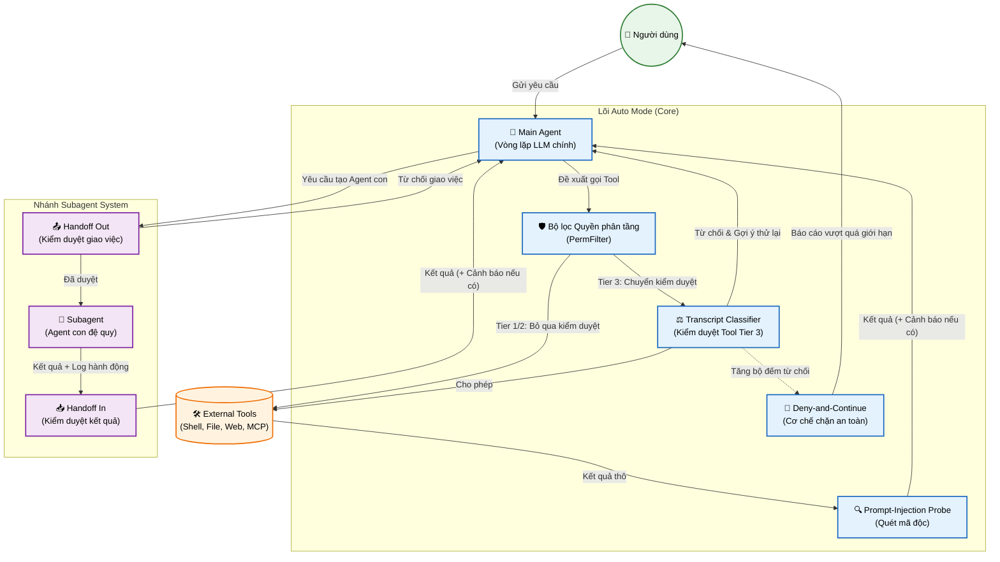

# Claude Code Auto Mode - Logical View & Box and Arrow Diagram

## 1. Box and Arrow Diagram (Sơ đồ Hộp và Mũi tên)

Sơ đồ dưới đây mô tả luồng giao tiếp và các thành phần logic bên trong kiến trúc Auto Mode của Claude Code.

## 2. Logical View (Khung nhìn Logic)

Khung nhìn logic giải thích chi tiết chức năng của từng thành phần (component) và cách chúng tương tác để đảm bảo luồng thực thi tự động (Auto Mode) của Claude Code vừa mạnh mẽ, tự chủ nhưng vẫn duy trì độ an toàn tối đa (Defense-in-Depth).

### 2.1. Thành phần Lõi (Core Auto Mode)
- **Main Agent (Vòng lặp LLM chính)**: Là trung tâm ra quyết định của hệ thống. Nó nhận yêu cầu từ **Người dùng**, suy luận và quyết định công cụ (tool) nào cần gọi hoặc khi nào cần khởi tạo các Agent con (Subagent). Sau khi công cụ hoàn tất, nó tổng hợp kết quả để đưa ra bước tiếp theo hoặc trả lời người dùng.
- **Bộ lọc Quyền phân tầng (PermFilter)**: Thành phần phân loại mức độ rủi ro của lời gọi tool.
  - *Tier 1 & Tier 2*: Các công cụ đã nằm trong allowlist an toàn mặc định hoặc cấu hình cụ thể của repository. Chúng được tin tưởng tuyệt đối và chuyển thẳng tới **ExtTool**.
  - *Tier 3*: Các công cụ có nguy cơ cao hơn (có thể thay đổi hệ thống quan trọng), bắt buộc phải gửi tới **Transcript Classifier** để đánh giá chéo.
- **Transcript Classifier (Bộ kiểm duyệt AI-based)**: Đóng vai trò "cảnh sát" kiểm duyệt cho các lệnh Tier 3. 
  - *Hai giai đoạn*: Đầu tiên đánh giá nhanh (yes/no), sau đó suy luận từng bước. 
  - *Tính chất mù (Blind)*: Để đảm bảo tính khách quan, Classifier bị che đi phần suy nghĩ nội bộ (internal thoughts) của Main Agent, nó chỉ đánh giá dựa trên tin nhắn gốc của người dùng và lời gọi tool. Nếu từ chối, nó sẽ đính kèm một thông điệp "gợi ý thử lại" cho Main Agent.
- **Cơ chế Deny-and-Continue**: Đóng vai trò là bộ đếm an toàn. Để tránh việc Main Agent liên tục thử lại một công cụ gây nguy hiểm (kẹt vòng lặp), hệ thống quy định: Nếu Transcript Classifier từ chối 3 lần liên tiếp hoặc tổng cộng 20 lần trong một phiên, Auto Mode sẽ bị vô hiệu hóa và báo cáo lên **Người dùng** để xử lý thủ công.
- **Prompt-Injection Probe (Rào chắn mã độc)**: Hoạt động phía máy chủ. Mọi kết quả trả về từ môi trường ngoài (ví dụ: nội dung cào từ web, file script) đều được đưa vào Probe quét trước. Nếu phát hiện các câu lệnh thao túng (prompt injection), Probe không xóa dữ liệu mà gắn thêm cờ cảnh báo vào kết quả để Main Agent không bị "đánh lừa".

### 2.2. Nhánh Subagent (Hệ thống chia để trị)
Đây là cơ chế cho phép Claude Code tách các vấn đề lớn thành các task nhỏ hơn và giao cho Agent con (Subagent) xử lý một cách đệ quy.
- **Handoff Out (Classifier đi ra)**: Khi Main Agent quyết định khởi tạo Agent con, Handoff Out sẽ kiểm duyệt xem yêu cầu này có hợp lý không. Nó có quyền **CHO PHÉP** (bắt đầu sinh Subagent) hoặc **TỪ CHỐI** (trả về Main Agent bắt làm cách khác).
- **Subagent**: Bản sao thu nhỏ của Main Agent, chạy trong cùng pipeline để giải quyết tác vụ cụ thể, sau đó trả về kết quả và log hành động.
- **Handoff In (Classifier đi vào)**: Đón nhận kết quả từ Subagent gửi về. Điểm khác biệt là Handoff In **không bao giờ từ chối** kết quả (tránh lãng phí tài nguyên đã chạy), nó chỉ kiểm tra và **CẢNH BÁO** (Warning) cho Main Agent nếu kết quả Subagent gửi về có dấu hiệu không an toàn hoặc rò rỉ dữ liệu.

### 2.3. Các thành phần ngoại vi
- **Người dùng (User)**: Khởi tạo luồng yêu cầu, và đóng vai trò "human-in-the-loop" cuối cùng khi hệ thống tự ngắt thông qua cơ chế Deny.
- **External Tools (ExtTool)**: Các công cụ bên ngoài (Shell, Filesystem, HTTP Fetcher, MCP servers) chuyên làm nhiệm vụ thực thi các câu lệnh từ Core và trả về kết quả thô.
