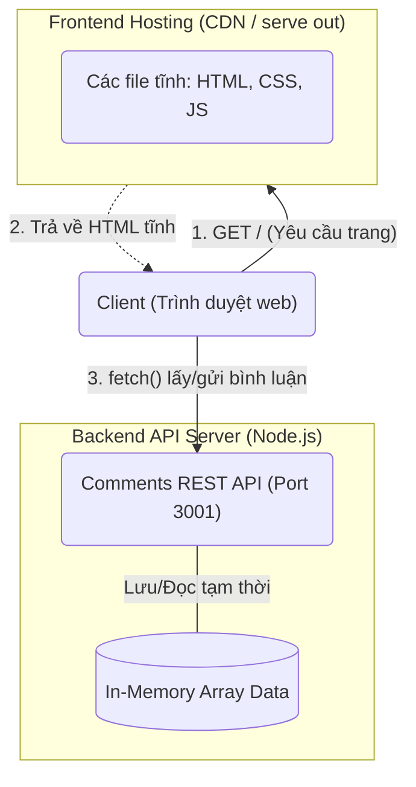

# Báo cáo Kiến trúc JAMstack

## 1. Các đặc tính chất lượng của kiến trúc JAMstack

Dưới đây là các đặc tính chất lượng mong muốn đạt được khi áp dụng kiến trúc JAMstack cho dự án, cùng với yêu cầu và phương pháp kiểm tra (áp dụng cho ứng dụng Next.js kết hợp Node.js API).

Để hiểu rõ hơn tại sao JAMstack lại mang đến những lợi thế này so với kiến trúc truyền thống, dưới đây là phân tích chi tiết từng đặc tính:

### 1.1. Hiệu suất (Performance)
- **Vì sao JAMstack vượt trội:** Thay vì server phải truy vấn Database và render HTML mỗi khi có người dùng truy cập (như mô hình truyền thống), giao diện JAMstack được "sinh ra sẵn" (Pre-rendering/SSG) thành các file tĩnh ngay từ lúc build code. Các file này được phân tán lên mạng lưới CDN toàn cầu, giúp người dùng tải trang ngay lập tức ở bất kỳ đâu.
- **Yêu cầu:** Tốc độ tải trang cực nhanh (Load time < 2s), điểm Lighthouse Performance > 90.
- **Phương pháp kiểm tra:** Sử dụng **Google Lighthouse** (tích hợp trong Chrome DevTools) để đo lường các chỉ số Core Web Vitals (LCP, FID, CLS). Dùng tab **Network** để kiểm tra thời gian tải tài nguyên (TTFB).

### 1.2. Bảo mật (Security)
- **Vì sao JAMstack vượt trội:** Điểm cốt lõi là **thu hẹp tối đa bề mặt tấn công (Reduced Attack Surface)**. Giao diện frontend hoàn toàn là file tĩnh (HTML/CSS/JS) nằm trên CDN, không có máy chủ web (web server) và không có kết nối trực tiếp với Database. Do đó, hacker không thể khai thác các lỗi như SQL Injection hay RCE từ giao diện. Các API backend được tách rời hoàn toàn thành Microservices, giúp chia nhỏ rủi ro bảo mật.
- **Yêu cầu:** Frontend không chứa logic nghiệp vụ mật hoặc secret key. API gọi từ client phải an toàn (có CORS, Rate Limiting).
- **Phương pháp kiểm tra:** Quét lỗ hổng mã tĩnh bằng **SonarQube** / `npm audit`. Kiểm tra độc lập cơ chế xác thực (JWT/OAuth) của API.

### 1.3. Khả năng mở rộng (Scalability)
- **Vì sao JAMstack vượt trội:** CDN sinh ra là để phân phối file tĩnh. Khi lượng truy cập tăng đột biến (ví dụ: sự kiện Black Friday, lên truyền hình), CDN dễ dàng chịu tải hàng triệu request mà không bị nghẽn (vì không phải tính toán hay mở connection vào DB). Đồng thời, Backend API cũng có thể scale độc lập với Frontend.
- **Yêu cầu:** Frontend không bị treo hoặc sập khi traffic tăng vọt.
- **Phương pháp kiểm tra:** Sử dụng công cụ Load Testing như **k6**, **Apache JMeter**, hoặc **Artillery** để giả lập hàng ngàn request đồng thời (Concurrent requests) vào hệ thống CDN và API để đo giới hạn chịu tải.

### 1.4. Khả năng bảo trì (Maintainability)
- **Vì sao JAMstack vượt trội:** Mặc dù các framework SPA (như React/Vue thông thường) cũng làm được việc tách biệt Frontend và Backend, khả năng bảo trì của JAMstack còn vượt trội ở khâu **Vận hành (DevOps)**:
  1. **Triệt tiêu gánh nặng hạ tầng:** Vì toàn bộ giao diện đã pre-build thành file tĩnh, bạn không cần cài đặt, vá lỗi bảo mật (patch), hay bảo trì hệ điều hành và web server (như Nginx/Apache) cho frontend.
  2. **Quy trình Git-centric (Mọi thứ đều qua Git):** Toàn bộ dự án từ mã nguồn đến cấu hình được lưu trên Git. Mỗi lượt *git push* đều kích hoạt một chu trình CI/CD (như Vercel/Netlify), tự động build và phân phối lên CDN mà không cần kỹ năng Server/DevOps phức tạp.
  3. **API Economy:** Dễ dàng "cắm" (plug-in) các dịch vụ bên thứ ba (Headless CMS, Auth0, Stripe) thay vì phải tự viết và bảo trì code backend cho các tác vụ chung.
- **Yêu cầu:** Hệ thống phải hỗ trợ CI/CD tự động 100%. Không có các bước deploy thủ công rườm rà.
- **Phương pháp kiểm tra:** Giả lập thao tác tạo một nhánh (branch) mới, commit tính năng/bài viết, đẩy lên repository, sau đó kiểm tra xem công cụ CI/CD có tự động build và cấp phát URL preview độc lập thành công hay không.

### 1.5. Tính sẵn sàng & Khả năng phục hồi (Availability & Resilience)
- **Vì sao JAMstack vượt trội:** Trong kiến trúc cũ, nếu server database sập, cả website sẽ trắng trang. Với JAMstack, dù backend API có sập hoặc đang bảo trì, website (trên CDN) vẫn hoạt động. Khách hàng vẫn có thể đọc bài viết, xem sản phẩm (chỉ những tính năng động như gửi form, thanh toán mới tạm ngưng). Đây gọi là "Graceful Degradation".
- **Yêu cầu:** Uptime hệ thống cao (ví dụ: 99.9%). Nếu API lỗi, Frontend phải hiện thông báo lỗi thân thiện thay vì sập toàn bộ.
- **Phương pháp kiểm tra:** Giả lập sự cố bằng cách **tắt chủ động API server** (`api/server.js`) và kiểm tra xem trang web tĩnh có hiển thị bình thường và bắt lỗi API mượt mà không. Dùng công cụ monitoring (Pingdom, Uptime Robot) để giám sát uptime.

---

## 2. Sơ đồ góc nhìn Logic của Kiến trúc JAMstack

Dưới đây là sơ đồ kiến trúc logic của hệ thống JAMstack, được ghi chú kèm theo các công cụ/công nghệ sử dụng trong bài thực hành.



**Ghi chú công cụ cài đặt (Dựa trên cấu trúc thư mục thực tế):**
- **Client (Giao diện Frontend):** Giao diện được lập trình bằng **Next.js (React)** (`src/app/page.js`). Mã JavaScript phía trình duyệt (Client-side) dùng hàm `fetch()` trong `useEffect` để tải và hiển thị danh sách bình luận (Dynamic data) trên nền HTML tĩnh.
- **Phân phối Tĩnh (CDN/Hosting):** Ứng dụng Next.js đã được cấu hình `output: 'export'` để biên dịch (build) toàn bộ trang web thành các file HTML/CSS/JS thuần túy đưa vào thư mục `out/`. Thư mục này hiện đang được phục vụ trực tiếp bằng công cụ `serve` (`npx serve out`). Trong thực tế, nó sẽ được đẩy thẳng lên Vercel hoặc Netlify.
- **Backend APIs:** Là một API độc lập (`api/server.js`) viết bằng **Express.js (Node.js)**, chạy riêng biệt tại cổng 3001. Hệ thống đã cấu hình `cors()` để cho phép frontend giao tiếp.
- **Cơ sở dữ liệu (Database):** Để tối giản hóa demo, toàn bộ dữ liệu bình luận không dùng Headless CMS hay MongoDB thực sự, mà được lưu trực tiếp vào bộ nhớ RAM của server (**In-Memory Array**). Khi tắt API server, dữ liệu này sẽ bị reset.

---

## 3. Cây thư mục mã nguồn hệ thống (Directory Tree)

Dưới đây là cây thư mục mã nguồn của dự án (đã bỏ qua các thư mục `node_modules`, `.next`, `.git` để gọn gàng):

```text
jamstack-demo-nextjs/
├── README.md
├── package.json
├── package-lock.json
├── next.config.mjs
├── jsconfig.json
├── api/
│   └── server.js               <-- Backend API Server (Node.js)
├── public/                     <-- Tài nguyên tĩnh công khai
│   ├── favicon.ico
│   ├── file.svg
│   ├── globe.svg
│   ├── next.svg
│   ├── vercel.svg
│   └── window.svg
├── src/                        <-- Mã nguồn Frontend Next.js (React)
│   └── app/
│       ├── favicon.ico
│       ├── globals.css
│       ├── layout.js           <-- Layout chính của ứng dụng
│       ├── page.js             <-- Trang chủ ứng dụng
│       └── page.module.css
└── out/                        <-- Thư mục chứa các file tĩnh đã được build (SSG)
    ├── index.html
    ├── 404.html
    ├── _not-found.html
    ├── _next/
    │   └── static/
    ├── favicon.ico
    └── ... (các file tĩnh và assets khác)
```

## 4. Giao diện hệ thống
*(Sinh viên vui lòng chụp ảnh màn hình trình duyệt (ví dụ http://localhost:3000) chứa giao diện trang chủ Next.js và giao diện khi tương tác với API, sau đó chèn vào file Word hoặc in ra giấy để nộp kèm theo yêu cầu của Giảng viên).*
