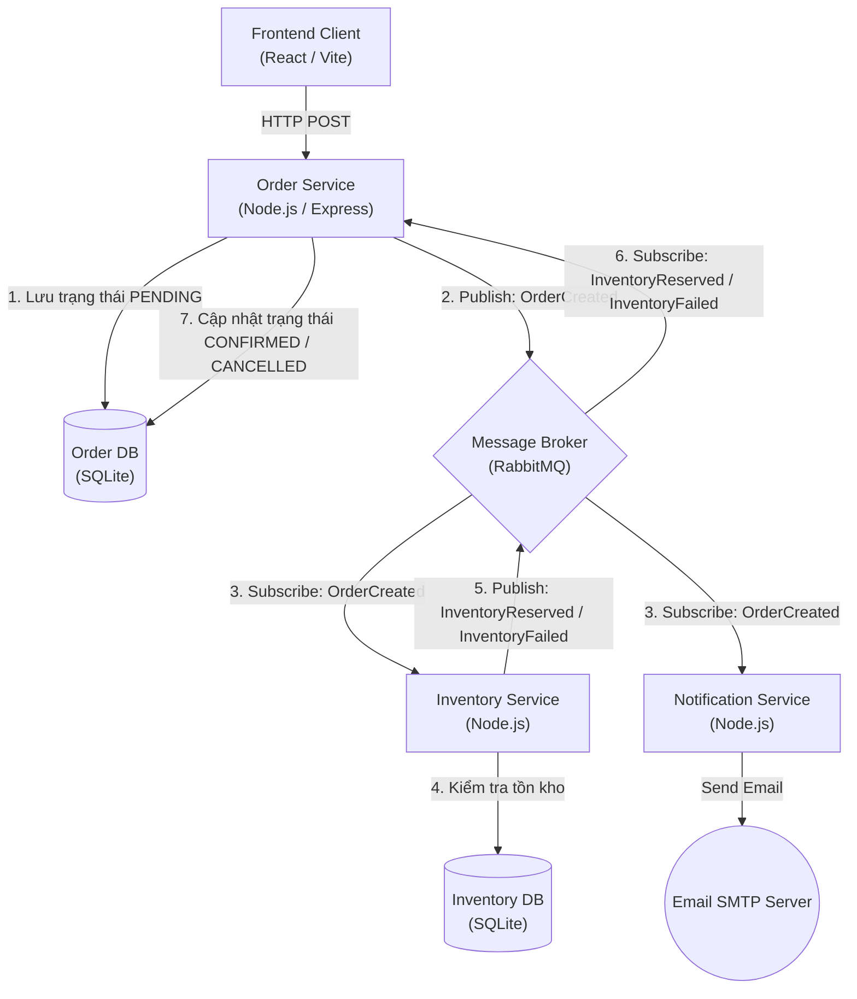
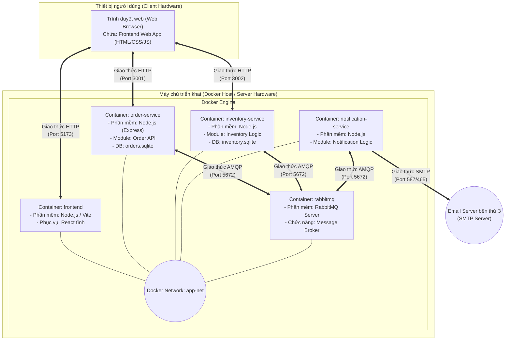
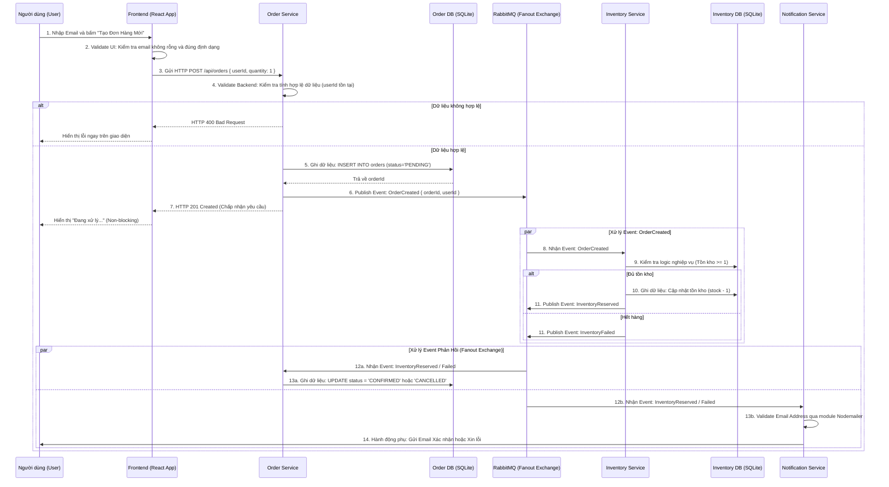
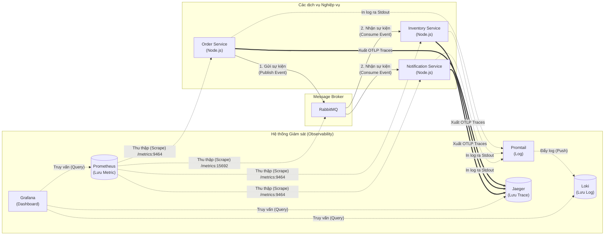

# Bài thực hành Kiến trúc Event-Driven

## 1. Các đặc tính chất lượng mong muốn đạt được với kiến trúc Event-Driven
- **Tính dễ sửa đổi (Modifiability)**: Nhờ sự liên kết lỏng lẻo (loose coupling), các dịch vụ (Order, Inventory, Notification) hoạt động độc lập. Bạn có thể dễ dàng sửa đổi hoặc thêm tính năng vào một dịch vụ mà không làm ảnh hưởng đến các dịch vụ khác.
- **Tính mở rộng (Scalability)**: Dễ dàng mở rộng từng dịch vụ riêng biệt khi tải tăng cao, hoặc thêm nhiều consumer (người tiêu dùng sự kiện) mà không ảnh hưởng đến hệ thống hiện tại.
- **Tính bất đồng bộ (Asynchronicity)**: Xử lý các tác vụ nặng hoặc không cần phản hồi ngay (như gửi email thông báo, cập nhật kho) dưới nền, giúp tăng tốc độ phản hồi cho API và giao diện người dùng (Frontend).
- **Tính tin cậy và sẵn sàng (Reliability / Availability)**: Nếu một dịch vụ (ví dụ: Notification Service) bị sập hoặc bảo trì, các sự kiện vẫn được lưu trữ an toàn trong Message Broker (RabbitMQ) và sẽ được xử lý tiếp khi dịch vụ hoạt động trở lại, đảm bảo hệ thống không bị mất dữ liệu (Reliability) và không gián đoạn toàn bộ dịch vụ (Availability).
- **Tính quan sát được (Observability)**: Trong môi trường phân tán và giao tiếp bất đồng bộ, rất khó để biết một tiến trình đang chạy đến đâu. Hệ thống cần khả năng thu thập log tập trung và truy vết phân tán (distributed tracing) để có thể theo dõi vòng đời của một sự kiện từ đầu đến cuối.

## 2. Phương pháp kiểm tra các đặc tính chất lượng
- **Kiểm tra tính dễ sửa đổi (Modifiability)**: Thử nghiệm thay đổi logic nội bộ của một dịch vụ (ví dụ: Inventory Service) và xác minh xem nó có ảnh hưởng đến mã nguồn hay hoạt động của các dịch vụ khác hay không. Các dịch vụ chỉ cần quan tâm đến cấu trúc (schema) của thông điệp (event payload).
- **Kiểm tra tính mở rộng (Scalability)**: Sử dụng các công cụ như JMeter, K6 hoặc Locust để giả lập lượng lớn yêu cầu tạo đơn hàng (Load Testing). Quan sát khả năng chịu tải và tự động mở rộng (scale) thêm nhiều instance của một service cụ thể.
- **Kiểm tra tính bất đồng bộ (Asynchronicity)**: Đo thời gian phản hồi của Order Service khi Client tạo đơn hàng. Mặc dù hệ thống thực hiện nhiều tác vụ phía sau (kiểm tra tồn kho, gửi mail), thời gian phản hồi của API gốc vẫn phải rất nhanh và không bị block.
- **Kiểm tra tính tin cậy / sẵn sàng (Reliability / Availability)**: Thực hiện Chaos Engineering. Ví dụ, cố tình tắt (stop) container `notification-service`, sau đó tạo nhiều đơn hàng. Kiểm tra xem các sự kiện có được lưu trữ an toàn trong RabbitMQ hay không. Khi bật lại service đó, hệ thống có tự động lấy (consume) và tiếp tục xử lý các thông báo còn tồn đọng một cách bình thường không.
- **Kiểm tra tính quan sát được (Observability)**: Sử dụng RabbitMQ Dashboard (Management UI) để giám sát (monitor) các chỉ số hoạt động. Thông qua Dashboard, ta có thể quan sát số lượng sự kiện (message) đang tồn đọng trong hàng đợi (Queue size), tốc độ gửi/nhận sự kiện, và trạng thái kết nối của các consumers (như Inventory hay Notification service) để phát hiện ngay lập tức nếu có một dịch vụ bị lỗi hoặc quá tải.

## 3. Sơ đồ góc nhìn logic và công cụ cài đặt



**Các công cụ sử dụng cài đặt thành phần kiến trúc:**
- **Giao diện Client (Frontend)**: Cài đặt bằng `React` và `Vite`.
- **Order Service (Publisher)**: Cài đặt bằng ngôn ngữ JavaScript trên nền tảng `Node.js` (sử dụng framework `Express`), cơ sở dữ liệu `SQLite`.
- **Inventory Service & Notification Service (Subscribers)**: Cài đặt bằng `Node.js`, lắng nghe sự kiện từ Message Broker.
- **Message Broker (Event Bus)**: Sử dụng công cụ `RabbitMQ` để trung chuyển và định tuyến sự kiện. Hệ thống áp dụng cơ chế **Fanout Exchange** để triển khai đúng mô hình **Publish/Subscribe (Pub/Sub)**, giúp nhân bản sự kiện đến nhiều hàng đợi (queue) riêng biệt, đảm bảo các dịch vụ không bị cạnh tranh thông điệp (Tránh lỗi Competing Consumers).
- **Triển khai và Đóng gói (Deployment)**: Quản lý bằng `Docker` và định nghĩa kiến trúc tổng thể chạy nhiều dịch vụ thông qua `Docker Compose`.

## 4. Phụ lục bản in

### Bản in cây thư mục mã nguồn hệ thống (Trích xuất thư mục mã nguồn)
```text
demo/
├── docker-compose.yml
├── .env
├── frontend/
│   ├── index.html
│   ├── package.json
│   ├── vite.config.js
│   └── src/
│       ├── App.jsx
│       ├── main.jsx
│       └── index.css
├── inventory-service/
│   ├── index.js
│   ├── package.json
│   └── inventory.sqlite
├── notification-service/
│   ├── index.js
│   └── package.json
└── order-service/
    ├── index.js
    ├── package.json
    └── orders.sqlite
```

### Bản in giao diện nhập dữ liệu
*(Sinh viên thay thế đoạn văn bản này bằng hình ảnh / ảnh chụp màn hình giao diện nhập dữ liệu vào hệ thống khi làm bài thực hành)*

## 5. Sơ đồ góc nhìn triển khai (Deployment View) và Công cụ triển khai



**Mô tả chi tiết các thành phần:**
- **Thiết bị người dùng (Client Hardware)**: Chạy trình duyệt web (phần mềm), tải và thực thi mã nguồn tĩnh của ứng dụng React (sản phẩm biên dịch `HTML/CSS/JS`). Giao tiếp với hệ thống máy chủ thông qua giao thức **HTTP**.
- **Máy chủ triển khai (Server Hardware)**: Máy tính/VM được cài đặt phần mềm Docker Engine. Bên trong mạng nội bộ Docker (`app-net`), hệ thống chạy các container (phần mềm):
  - `frontend`: Chạy máy chủ Vite để phục vụ file mã nguồn giao diện tĩnh.
  - `order-service`, `inventory-service`, `notification-service`: Chạy môi trường Node.js. Chứa các mô đun thực thi API và xử lý logic sự kiện. `order-service` và `inventory-service` có chứa trực tiếp file cơ sở dữ liệu `SQLite` nằm bên trong hệ thống file của container.
  - `rabbitmq`: Chạy Erlang/RabbitMQ đóng vai trò làm Event Bus (Message Broker).
- **Giao thức liên lạc nội bộ**: Các mô đun service backend liên lạc với RabbitMQ thông qua giao thức **AMQP** (Advanced Message Queuing Protocol) ở cổng 5672.
- **Máy chủ Email (Bên thứ 3)**: `notification-service` liên lạc ra bên ngoài tới hệ thống này thông qua giao thức **SMTP** để gửi mail.

## 6. Các bước thực hiện triển khai hệ thống
1. **Chuẩn bị môi trường**: Cài đặt phần mềm Docker và công cụ Docker Compose lên máy chủ (Server Hardware).
2. **Cấu hình biến môi trường**: Sao chép hoặc tạo file `.env` tại thư mục gốc của dự án (ví dụ `demo/.env`) để chứa các cấu hình bảo mật như `SMTP_USER` và `SMTP_PASS` (tài khoản gửi mail).
3. **Đóng gói (Build) và Triển khai (Deploy)**: Khởi chạy lệnh Docker Compose. Công cụ này sẽ đọc file `docker-compose.yml`, đóng gói mã nguồn tại các thư mục thành Docker Image (sản phẩm biên dịch), tạo mạng ảo (network) và chạy chúng dưới dạng các Container độc lập.
4. **Kiểm tra trạng thái**: Theo dõi log hệ thống để đảm bảo các service backend đã thiết lập thành công kết nối AMQP tới container RabbitMQ.

### Bản in câu lệnh triển khai hệ thống (CLI)
```bash
# 1. Di chuyển vào thư mục dự án chứa file docker-compose.yml
cd demo

# 2. Xây dựng image và khởi chạy toàn bộ hệ thống ngầm (detached mode)
docker-compose up --build -d

# 3. Theo dõi log hoạt động để xác minh trạng thái kết nối RabbitMQ
docker-compose logs -f
```

## 7. Sơ đồ góc nhìn tiến trình (Process View) cho chức năng nhập dữ liệu

Sơ đồ dưới đây (Sequence Diagram) mô tả luồng thực thi động từ khi người dùng bắt đầu nhập dữ liệu (Email) cho đến khi hệ thống hoàn tất việc ghi nhận và xử lý theo mô hình Event-Driven (Saga Choreography).



**Giải thích các công cụ và các bước kiểm tra tính hợp lệ & ghi dữ liệu:**

1. **Công cụ Frontend (React/HTML5)**: 
   - *Kiểm tra tính hợp lệ (Validation)*: Ngay tại trình duyệt, thẻ form HTML5 (`type="email"`) và mã JavaScript của React sẽ chặn lại (không cho phép gửi yêu cầu đi) nếu người dùng nhập sai định dạng email hoặc để trống trường thông tin.
2. **Công cụ Backend (Node.js/Express ở Order Service)**:
   - *Kiểm tra tính hợp lệ (Validation)*: Trước khi ghi vào DB, hàm xử lý API của Express.js kiểm tra dữ liệu trong HTTP Body (`req.body`). Nếu không có trường `userId` hoặc định dạng sai, hệ thống lập tức ném lỗi 400 Bad Request để chặn lại (Fail-fast pattern).
   - *Quá trình ghi dữ liệu (Cục bộ)*: Nếu hợp lệ, hệ thống sử dụng thư viện `sqlite3` để thực thi lệnh `INSERT`. Lúc này dữ liệu đơn hàng mới chỉ lưu tạm ở trạng thái `PENDING`.
3. **Công cụ Message Broker (RabbitMQ)**:
   - Thay vì chờ toàn bộ hệ thống lưu xong (Synchronous), Order Service lập tức trả về HTTP 201 cho Frontend, và đẩy công việc kiểm tra tồn kho xuống RabbitMQ dưới dạng Event.
4. **Công cụ Backend (Node.js ở Inventory Service)**:
   - *Kiểm tra tính hợp lệ nghiệp vụ (Business Validation)*: Nhận sự kiện từ Message Broker, nó truy vấn DB SQLite để kiểm tra xem `stock >= quantity` hay không. 
   - *Quá trình ghi dữ liệu (Cục bộ)*: Nếu đủ điều kiện, thực thi lệnh `UPDATE` để trừ tồn kho. Ghi dữ liệu thành công, nó đẩy tiếp Event `InventoryReserved` lên Exchange.
5. **Công cụ Backend (Node.js ở Notification Service)**:
   - *Kiểm tra nghiệp vụ (Nodemailer)*: Nhận dữ liệu từ Event và kiểm tra định dạng email lần cuối trước khi gọi hàm giao tiếp với máy chủ SMTP. Nếu email không có thực (như `abc`), thư viện sẽ bắn ra ngoại lệ (Error: No recipients defined) để bỏ qua tác vụ mà không làm sập hệ thống.

## 8. Kiến trúc Giám sát (Observability) của hệ thống

Dưới đây là sơ đồ kiến trúc các thành phần giám sát được thiết lập cho hệ thống Event-Driven:



### 8.1. Giải thích chi tiết từng luồng dữ liệu trên sơ đồ

Sơ đồ trên được chia thành 3 cụm chính (Microservices, Message Broker, Observability Stack) và 5 luồng dữ liệu (mũi tên):

1. **Nhóm 1: Luồng chạy của Sự kiện gốc (Event Flow)**
   - *Mũi tên nét liền*: Đây là luồng nghiệp vụ gốc. Order Service tạo ra sự kiện và bắn vào RabbitMQ. RabbitMQ sau đó phân phối sự kiện này cho Inventory và Notification xử lý.

2. **Nhóm 2: Luồng thu thập Nhật ký (Log Flow)**
   - *Mũi tên nét đứt (`-.->`)*: Khi code Node.js gọi hàm `console.log`, log được in ra màn hình máy chủ (Stdout). Công cụ **Promtail** (hoạt động như một người gom rác) sẽ âm thầm đi nhặt các dòng chữ đó từ Docker, rồi đóng gói và đẩy (push) sang cho **Loki** lưu trữ tập trung.

3. **Nhóm 3: Luồng Truy vết (Trace Flow)**
   - *Mũi tên nét đôi (`==>`)*: Khi có đơn hàng mới, thư viện OpenTelemetry (OTel) tự động tạo ra các đoạn thời gian (span). Dữ liệu này được bắn liên tục dưới chuẩn OTLP sang kho chứa của **Jaeger** để ráp lại thành 1 hành trình (Gantt chart) liền mạch xuyên suốt 3 service.

4. **Nhóm 4: Luồng Đo lường (Metric Flow)**
   - *Mũi tên nét đứt (`-.->`)*: Khác với Log (dịch vụ tự đẩy đi), Metric hoạt động theo cơ chế kéo (Pull). **Prometheus** đóng vai trò chủ động, cứ mỗi 5 giây nó lại gõ cửa cổng `/metrics` của Node.js (9464) và RabbitMQ (15692) để "cào" (scrape) số liệu về.

5. **Nhóm 5: Giao diện hiển thị (Grafana)**
   - *Mũi tên nét đứt truy vấn*: Người dùng không cần mở trực tiếp Loki, Jaeger hay Prometheus. **Grafana** đóng vai trò là Bảng điều khiển (Dashboard) trung tâm, tự động phóng các truy vấn (Query) xuống 3 kho dữ liệu bên dưới để lấy số liệu và vẽ thành các biểu đồ trực quan.

---

### 8.2. Các bước thực hiện để Log, Trace và Monitor sự kiện
Quá trình giám sát vòng đời của một sự kiện (từ lúc tạo đơn hàng đến khi gửi thông báo) diễn ra tự động thông qua các công cụ sau:

1. **Logging (Lưu vết thông báo lỗi / trạng thái):**
   - Các dịch vụ (Order, Inventory, Notification) chỉ cần in log đơn giản ra màn hình bằng lệnh `console.log()` hoặc các thư viện log (như Winston, Pino).
   - Log này được Docker bắt lại. Công cụ **Promtail** (được gắn vào Docker qua Volume) sẽ tự động thu gom các log này và gửi tập trung về **Grafana Loki**. 
   - *Kết quả:* Có thể xem log tập trung của tất cả các container tại một nơi duy nhất trên Grafana thay vì phải vào từng container gõ lệnh `docker logs`.

2. **Tracing (Truy vết sự kiện phân tán):**
   - Các dịch vụ Node.js được tích hợp **OpenTelemetry (OTel)**. OTel sẽ tự động "bọc" (auto-instrument) các thư viện như Express.js và `amqplib` (RabbitMQ).
   - Khi có request tạo đơn hàng (HTTP), OTel tạo ra một Trace ID. Khi gửi sự kiện `OrderCreated` vào RabbitMQ, OTel tự động nhúng (inject) Trace ID này vào phần Header (siêu dữ liệu) của Message trong RabbitMQ.
   - Khi Inventory và Notification service lấy Message từ RabbitMQ ra để xử lý, chúng đọc được Trace ID từ Header và tiếp tục ghi lại tiến trình xử lý dưới cùng một Trace ID đó. 
   - Toàn bộ dữ liệu này được gửi dưới chuẩn OTLP về **Jaeger**. Jaeger sẽ vẽ ra một biểu đồ Gantt (Gantt Chart) liên kết chuỗi hành động xuyên suốt 3 service.

3. **Monitoring & Metrics (Giám sát chỉ số):**
   - RabbitMQ phơi bày (expose) các chỉ số hoạt động tại cổng `15692` (như số lượng message đang đợi, số lượng kết nối).
   - Các dịch vụ Node.js sử dụng `PrometheusExporter` của OpenTelemetry để tự động đo lường độ trễ (latency), số lượng request và phơi bày tại `/metrics` (cổng `9464`).
   - **Prometheus** đóng vai trò là "Máy kéo" (Pull-based). Cứ mỗi 5 giây, nó sẽ quét (scrape) các cổng `/metrics` này để kéo dữ liệu về lưu trữ vào cơ sở dữ liệu chuỗi thời gian (Time-series DB).

---

### 8.3. Các câu lệnh (Queries) cần thiết để xem kết quả giám sát trên Grafana

Để trực quan hoá dữ liệu, người dùng cần truy cập vào giao diện **Grafana** (`http://localhost:3000`), vào mục **Explore**, chọn Datasource tương ứng và sử dụng các câu truy vấn sau:

#### A. Giám sát bằng Prometheus (Áp dụng tiêu chuẩn RED Metrics)
Trong thực tế (SRE/DevOps), bạn bắt buộc phải biết 3 chỉ số sinh tử gọi là **RED Metrics** (Rate - Errors - Duration) để đánh giá "sức khoẻ" của một hệ thống:

**1. R - Rate (Tần suất / Lưu lượng):**
Hệ thống đang phải chịu tải bao nhiêu Request mỗi giây (RPS)?
```promql
sum(rate(http_server_request_duration_count[5m])) by (job)
```

**2. E - Errors (Tỷ lệ lỗi):**
Có bao nhiêu phần trăm Request bị thất bại (Mã HTTP 5xx)? *(Đây là chỉ số quan trọng nhất để báo động hệ thống đang sập)*
```promql
sum(rate(http_server_request_duration_count{http_response_status_code=~"5.."}[5m])) 
/ 
sum(rate(http_server_request_duration_count[5m]))
```

**3. D - Duration (Độ trễ):**
Tốc độ phản hồi trung bình (Response time) của các dịch vụ là bao nhiêu?
```promql
sum(rate(http_server_request_duration_sum[5m])) by (job) / sum(rate(http_server_request_duration_count[5m])) by (job)
```

**4. Điểm nghẽn cổ chai (Saturation) của Message Broker:**
Có bao nhiêu sự kiện đang bị kẹt trong RabbitMQ mà chưa kịp xử lý? *(Nếu số này tăng liên tục nghĩa là Consumer đã bị quá tải hoặc chết)*
```promql
rabbitmq_queue_messages
```

#### B. Tìm kiếm Log phân tán bằng Loki (LogQL)
- **Truy vấn để xem toàn bộ log của Inventory Service:**
  ```logql
  {container="inventory-service"}
  ```
- **Truy vấn tìm kiếm xem log có chứa một Mã đơn hàng cụ thể (Ví dụ: orderId: 1):**
  ```logql
  {compose_project="demo"} |= "orderId: 1"
  ```
- **Truy vấn thống kê số lượng log lỗi (Error) trong 5 phút qua:**
  ```logql
  count_over_time({compose_project="demo"} |= "error" [5m])
  ```

#### C. Xem hành trình (Tracing) qua Jaeger
*(Lưu ý: Truy vấn Tracing trên Grafana sử dụng giao diện chọn thả (UI Dropdown) thay vì viết code)*
1. Tại ô Datasource, chọn **Jaeger**.
2. Ở mục **Service**, chọn `order-service` (dịch vụ khởi phát sự kiện).
3. Ấn nút **Run Query**. 
4. Bấm vào một kết quả (Trace) trong danh sách để xem biểu đồ Gantt Chart, cho thấy rõ thời gian xử lý sự kiện lan truyền từ Order sang RabbitMQ, rồi đến Inventory và Notification.

---

### Phụ lục: Giao diện hiển thị kết quả
*(Gợi ý cho sinh viên: Bạn hãy chụp ảnh màn hình các kết quả thao tác trong thực tế và dán vào dưới đây)*

1. **Ảnh chụp Grafana (Dashboard) vẽ biểu đồ Metrics từ Prometheus.**
   *(Dán ảnh vào đây)*

2. **Ảnh chụp Grafana (Explore) thể hiện sơ đồ Trace Gantt Chart từ Jaeger.**
   *(Dán ảnh vào đây)*

3. **Ảnh chụp Grafana (Explore) thể hiện màn hình tìm kiếm Log từ Loki.**
   *(Dán ảnh vào đây)*
