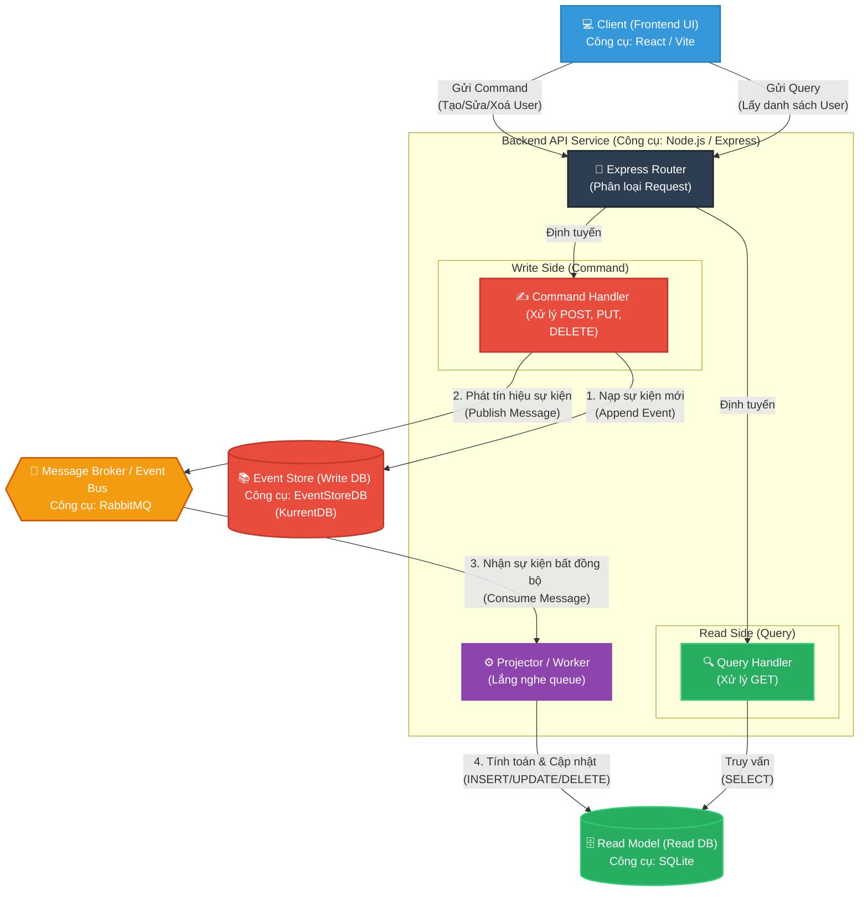
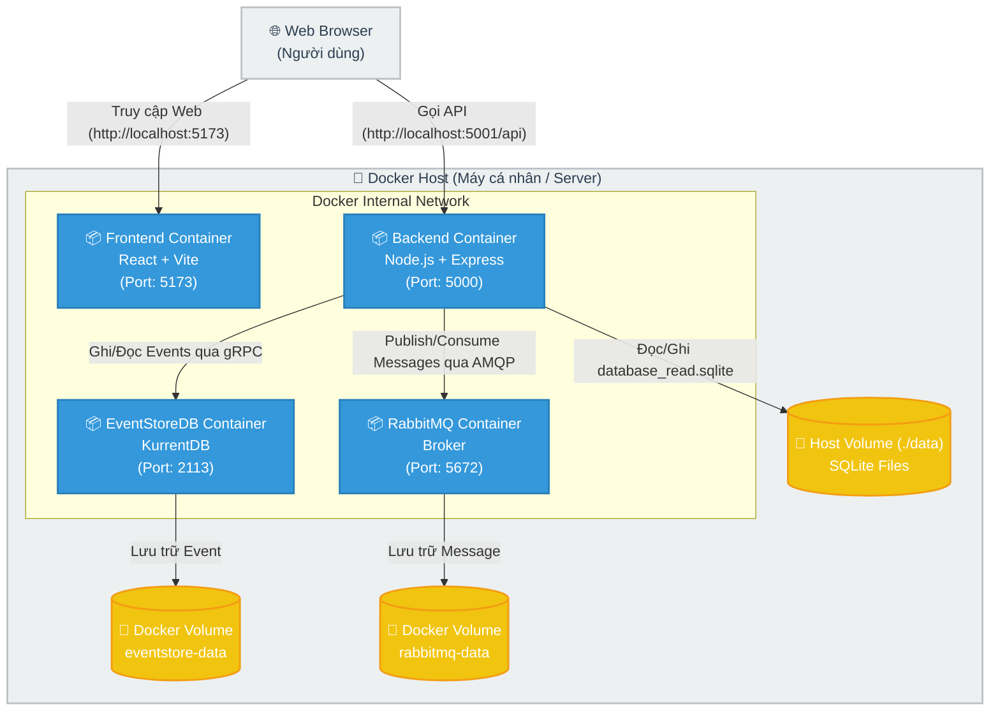
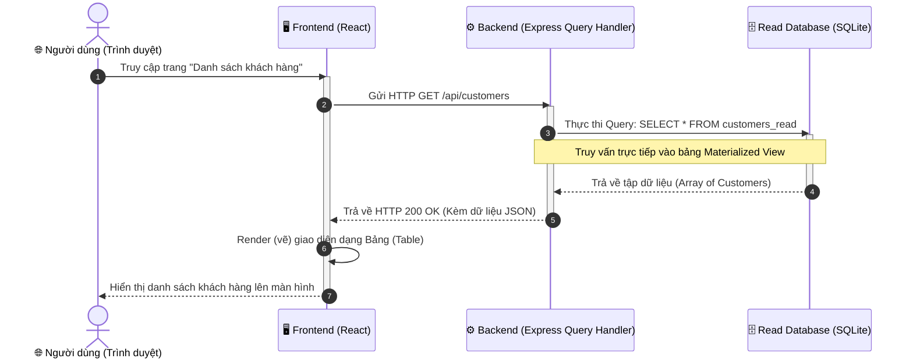
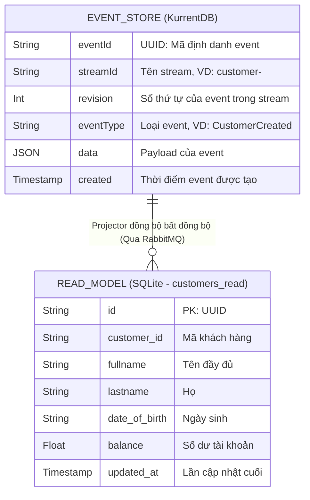
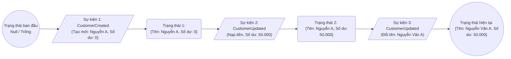

# Sơ đồ góc nhìn Logic Kiến trúc Event Sourcing & CQRS

Dưới đây là sơ đồ góc nhìn logic (Logical View) mô tả luồng hoạt động của thiết kế Event Sourcing kết hợp CQRS trong bài thực hành, kèm theo ghi chú các công cụ (tools/technologies) được sử dụng để cài đặt từng thành phần.



## Chú giải các công cụ sử dụng (Technology Stack):

1. **Client (Frontend)**: 
   - **React (Vite)**: Giao diện người dùng thực hiện các thao tác Command (Thêm/Sửa/Xoá) và Query (Hiển thị danh sách).
2. **Backend API (Node.js & Express)**:
   - Đóng vai trò là Server xử lý nghiệp vụ, nhận các HTTP Request từ Frontend, chia luồng thành Write và Read (CQRS).
3. **Event Store (Write Database)**: 
   - **EventStoreDB (KurrentDB)**: Đóng vai trò là Database lưu trữ chuỗi các sự kiện (Event Sourcing) không thể thay đổi (Immutable). Nó là *Nguồn Sự Thật duy nhất* (Single Source of Truth).
4. **Message Broker (Event Bus)**: 
   - **RabbitMQ**: Đóng vai trò truyền tải thông điệp bất đồng bộ (Asynchronous) từ Write Model sang Read Model, giúp giải phóng API Ghi nhanh chóng mà không cần chờ cập nhật Read Database.
5. **Read Model (Read Database)**:
   - **SQLite**: Database quan hệ lưu trữ dữ liệu dạng bảng (Table), được tối ưu hoá để đọc cực kỳ nhanh bằng các truy vấn `SELECT` đơn giản, không cần tốn thời gian tính toán lại (Replay) từ các Events.
6. **Projector / Event Worker**:
   - Chạy ngầm trong tiến trình Node.js (nhờ amqplib), lắng nghe queue của RabbitMQ và ánh xạ thông tin sự kiện ra các câu SQL (`INSERT`, `UPDATE`, `DELETE`) vào bảng `customers_read` trong SQLite.

## Cây thư mục dự án (Directory Tree)

```text
.
|--- CHANGELOG.md
|--- backend
|   |--- Dockerfile
|   |--- package-lock.json
|   |--- package.json
|   |--- server.js
|--- data
|   |--- database_read.sqlite
|--- docker-compose.yml
|--- frontend
|   |--- Dockerfile
|   |--- README.md
|   |--- index.html
|   |--- package-lock.json
|   |--- package.json
|   |--- public
|   |   |--- favicon.svg
|   |   |--- icons.svg
|   |--- src
|   |   |--- App.css
|   |   |--- App.jsx
|   |   |--- assets
|   |   |   |--- hero.png
|   |   |   |--- react.svg
|   |   |   |--- vite.svg
|   |   |--- index.css
|   |   |--- main.jsx
|   |   |--- pages
|   |   |   |--- CustomerForm.jsx
|   |   |   |--- CustomerList.jsx
|   |   |   |--- GlobalHistory.jsx
|   |--- vite.config.js
```

## Sơ đồ góc nhìn Triển khai (Deployment View)

Dưới đây là sơ đồ mô tả cách hệ thống được đóng gói và chạy trong môi trường thực tế (Sử dụng Docker).



### Các công cụ triển khai:
1. **Docker Engine**: Công cụ ảo hoá mức OS để chạy các container độc lập.
2. **Docker Compose**: Công cụ định nghĩa và quản lý đa container (Multi-container orchestration) thông qua file `docker-compose.yml`. Cho phép khởi chạy Frontend, Backend, RabbitMQ, và EventStoreDB cùng lúc, tự động kết nối chúng vào cùng một mạng (Network) nội bộ.

---

## Hướng dẫn các bước triển khai hệ thống (Deployment Steps)

Để triển khai hệ thống Event Sourcing hoàn chỉnh này lên môi trường local (máy cá nhân), hãy thực hiện các bước sau:

**Bước 1: Chuẩn bị môi trường**
- Cài đặt [Docker Desktop](https://www.docker.com/products/docker-desktop/) (Hỗ trợ Mac, Windows, Linux).
- Đảm bảo Terminal/Command Prompt có thể chạy lệnh `docker` và `docker-compose`.

**Bước 2: Di chuyển vào thư mục dự án**
Mở Terminal và cd vào thư mục chứa mã nguồn:
```bash
cd /Users/ductri0981/Documents/Software_Architecture/event_sourcing/customer_app
```

**Bước 3: Build và khởi chạy toàn bộ hệ thống**
Sử dụng Docker Compose để tự động tải Image, Build mã nguồn, tạo Volume và chạy các Container ngầm (Chế độ detached `-d`):
```bash
docker-compose up -d --build
```
*Lưu ý (Giao diện công cụ trực tuyến): Khi chạy lệnh này, Docker Desktop sẽ tự động hiển thị cụm stack `customer_app` chạy trên giao diện trực quan của nó.*

**Bước 4: Kiểm tra trạng thái hoạt động**
Để đảm bảo tất cả các container đều đã chạy ổn định và backend đã kết nối thành công tới Database & Broker:
```bash
# Xem danh sách các container đang chạy
docker-compose ps

# Xem log của Backend để xác nhận kết nối
docker-compose logs -f backend
```
*Bạn cần nhìn thấy thông báo như sau trong log Backend:*
```text
Connected to EventStoreDB
Connected to RabbitMQ
Server running on port 5000
```

**Bước 5: Trải nghiệm ứng dụng**
- Truy cập Giao diện Web: Mở trình duyệt và vào địa chỉ **[http://localhost:5173](http://localhost:5173)**
- Bảng điều khiển RabbitMQ: Mở **[http://localhost:15672](http://localhost:15672)** (User: `guest`, Pass: `guest`)
- Bảng điều khiển EventStoreDB: Mở **[http://localhost:2113](http://localhost:2113)**

**Bước 6: Tắt hệ thống (Khi không sử dụng)**
Nếu muốn dừng và xoá bỏ các container (nhưng vẫn giữ lại dữ liệu trong Volumes):
```bash
docker-compose down
```

---

## Sơ đồ góc nhìn Tiến trình (Process View)

Dưới đây là sơ đồ góc nhìn tiến trình (thể hiện bằng Sequence Diagram) cho **chức năng xem/xuất danh sách khách hàng** trong hệ thống Event Sourcing kết hợp CQRS.

Điểm đặc biệt của kiến trúc CQRS là khi truy vấn danh sách (Query), hệ thống sẽ **bỏ qua hoàn toàn luồng Event Sourcing** (Không chạm vào EventStoreDB hay RabbitMQ) mà truy vấn trực tiếp vào **Read Model (SQLite)** để lấy dữ liệu với độ phức tạp `O(1)`, đảm bảo tốc độ phản hồi siêu nhanh.



### Hướng dẫn thu thập minh chứng (Theo yêu cầu đề bài):
Để nộp kèm bản in giao diện xem danh sách, bạn hãy thực hiện:
1. Mở trình duyệt và truy cập: `http://localhost:5173`.
2. Bấm vào Tab (hoặc nút) **"Danh sách khách hàng"** (Customer List).
3. Chụp ảnh màn hình giao diện danh sách bảng khách hàng đã hiện ra.
4. Chèn hoặc in ảnh đó đính kèm vào báo cáo của bạn.

---

## Sơ đồ Lưu trữ (Storage View)

Trong mô hình Event Sourcing kết hợp CQRS, dữ liệu được chia làm 2 kho lưu trữ biệt lập phục vụ cho 2 mục đích riêng rẽ (Ghi và Đọc). Dưới đây là sơ đồ lưu trữ mô tả cấu trúc của 2 kho dữ liệu này.



### Công cụ và Các bước cài đặt sơ đồ lưu trữ

**Công cụ sử dụng:**
- **Write Database:** EventStoreDB (KurrentDB) - Database chuyên biệt dành cho Event Sourcing (Lưu trữ dạng Log-append).
- **Read Database:** SQLite - Database quan hệ nhỏ gọn (RDBMS), phù hợp để tạo các Materialized Views.
- **Message Broker:** RabbitMQ - Đóng vai trò cầu nối dữ liệu.

**Các bước cài đặt lưu trữ:**
1. **Thiết lập EventStoreDB:** Sử dụng Docker Compose để khởi chạy EventStoreDB, bật tính năng Insecure mode (cho môi trường dev) và export các port `2113`.
2. **Khởi tạo bảng Read Model:** Trong file `server.js`, chạy câu lệnh `CREATE TABLE IF NOT EXISTS customers_read (...)` để đảm bảo SQLite có sẵn bảng ngay khi backend khởi động.
3. **Cấu hình Projector:** Cài đặt thư viện `amqplib` (RabbitMQ) và `sqlite3` trong Backend. Map (ánh xạ) cấu trúc JSON (`Payload`) từ KurrentDB sang các cột tương ứng trong bảng `customers_read` của SQLite.
4. **Mount Volume bảo toàn dữ liệu:** Cấu hình Docker Volume để file `database_read.sqlite` lưu vĩnh viễn trên ổ cứng máy Host thay vì bị mất khi container tắt.

---

## Sơ đồ Luồng dữ liệu & Cơ chế tái tạo (Event Replay / Rehydration)

Sơ đồ dưới đây mô tả luồng dữ liệu biến đổi từ trạng thái sơ khai (Empty) đến trạng thái cuối cùng (Final State) thông qua việc áp dụng tuần tự các sự kiện (Events) đã xảy ra trong quá khứ.



### Giải thích cơ chế tái tạo lại trạng thái (Event Rehydration)
Trong Event Sourcing, hệ thống **không lưu trạng thái hiện tại** của một đối tượng ở phía Write, mà lưu toàn bộ lịch sử (những gì đã xảy ra). Để biết được trạng thái hiện tại (Ví dụ: tên hiện tại là gì, số dư bao nhiêu), hệ thống sử dụng cơ chế **Tái tạo (Replay/Rehydration)** hay còn gọi là quá trình **Left-Fold**:
1. Khởi tạo một đối tượng khách hàng rỗng (State = Null).
2. Lấy ra toàn bộ sự kiện theo đúng thứ tự thời gian (từ Event đầu tiên đến Event mới nhất) thuộc về Stream của khách hàng đó (VD: `customer-123`).
3. Lặp qua từng sự kiện (Apply event), cập nhật đè (mutate) các thông số lên đối tượng rỗng ở Bước 1.
4. Sau khi duyệt hết sự kiện cuối cùng, trạng thái của đối tượng chính là trạng thái hiện tại chính xác nhất.

### Công cụ và Các bước để tái tạo trạng thái

**Công cụ sử dụng:**
- **Node.js (Backend)**: Đóng vai trò xử lý logic Replay.
- **`@eventstore/db-client` (SDK)**: Cung cấp hàm `readStreamEventsForward` để kéo toàn bộ Event theo thứ tự thời gian.

**Các bước cần thực hiện để tái tạo trạng thái (Replay Events):**
1. **Truy vấn Stream:** Gọi hàm đọc stream từ KurrentDB bằng `esdb.readStreamEventsForward('customer-123', { fromRevision: START })`.
2. **Khởi tạo biến trạng thái:** Tạo một biến rỗng, ví dụ `let currentState = {};`.
3. **Vòng lặp Apply (Giảm dần):** 
   - Dùng vòng lặp `for...of` duyệt qua danh sách events trả về.
   - Nếu `Event = CustomerCreated` -> Cập nhật `currentState` bằng các trường thông tin ban đầu.
   - Nếu `Event = CustomerUpdated` -> Ghi đè (Overwrite) các trường mới (ví dụ: họ tên mới, số dư mới) lên `currentState`.
4. **Đồng bộ vào Read Model (Tuỳ chọn):** Nếu hệ thống bị sập mất file SQLite, ta hoàn toàn có thể viết một đoạn script chạy từ đầu đến cuối cơ chế Replay này cho tất cả khách hàng, sau đó insert hàng loạt `currentState` vừa tính toán được vào bảng `customers_read` để xây dựng lại Read Database từ đầu. Đây là ưu điểm mạnh mẽ nhất của Event Sourcing.
