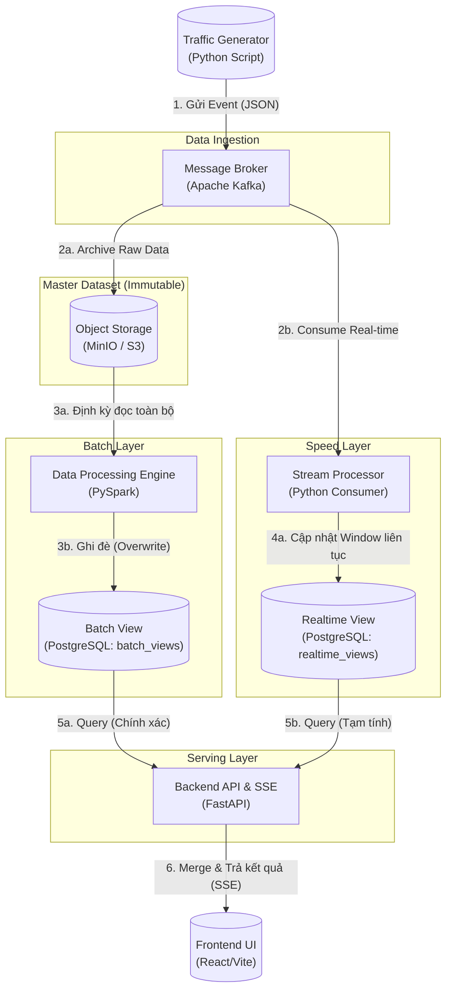
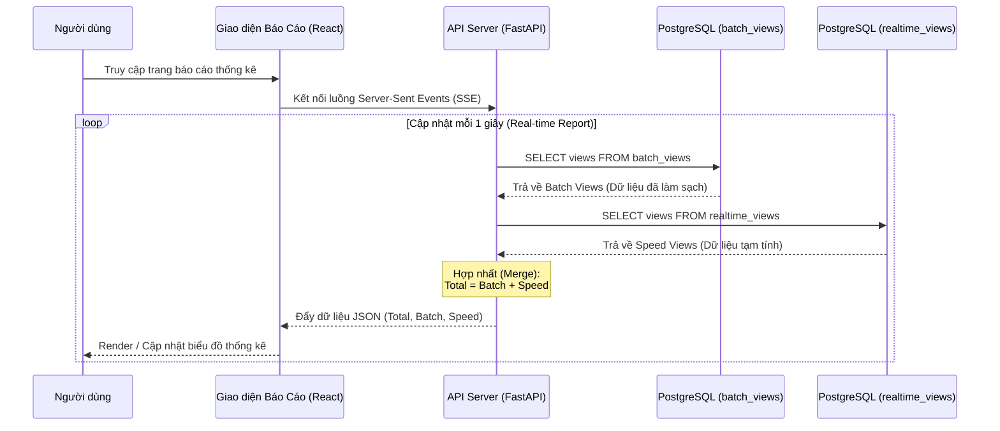

# BÁO CÁO THỰC HÀNH: KIẾN TRÚC LAMBDA

## 1. Các Đặc Tính Chất Lượng Mong Muốn (Quality Attributes)

Hệ thống được thiết kế theo **Kiến trúc Lambda** trong bài thực hành nhằm đạt được các đặc tính chất lượng cốt lõi sau:

1. **Khả năng chịu lỗi & Khả năng phục hồi (Fault Tolerance / Resilience)**:
   - Dữ liệu thô (Master Dataset) được lưu trữ bất biến (append-only) trên S3.
   - Nếu luồng xử lý thời gian thực (Speed Layer) bị sập, quá tải, hoặc có lỗi logic dẫn đến sai sót dữ liệu, Batch Layer luôn có thể tính toán lại toàn bộ từ Master Dataset để khôi phục trạng thái đúng đắn 100%.
2. **Độ trễ thấp (Low Latency / Responsiveness)**:
   - Cung cấp dữ liệu (ví dụ: lượt view) gần như theo thời gian thực cho người dùng nhờ Speed Layer (chạy qua Kafka và xử lý liên tục).
3. **Tính chính xác (Accuracy / Eventual Consistency)**:
   - Dù Speed Layer cung cấp tốc độ nhanh, nhưng có thể bị sai số (do trùng lặp, rớt mạng). Đặc tính chính xác được đảm bảo bởi Batch Layer: vào cuối ngày, Batch Layer sử dụng thuật toán phân tán (PySpark) để quét toàn bộ dữ liệu, lọc trùng lặp và cung cấp kết quả tuyệt đối chính xác để ghi đè (sửa lỗi) cho Speed Layer.
4. **Khả năng mở rộng ngang (Scalability)**:
   - Hệ thống chia tách rõ ràng thành phần đọc, ghi và tính toán. S3 (MinIO), Kafka và Spark đều có khả năng dễ dàng scale out (thêm node) khi lượng dữ liệu phình to.

---

## 2. Các Công Cụ và Các Bước Kiểm Tra Đặc Tính Chất Lượng

### A. Kiểm tra Khả năng chịu lỗi và Tính chính xác
- **Công cụ sử dụng**: Docker Compose, PostgreSQL Client (DBeaver/pgAdmin), k6 (hoặc script Python Simulator có sẵn).
- **Các bước thực hiện (Chaos Testing)**:
  1. Chạy script `user_simulator.py` liên tục để đẩy hàng chục nghìn view.
  2. **Gây lỗi cố ý**: Trong lúc đang đẩy data, dùng lệnh `docker-compose stop postgres` hoặc kill tiến trình `stream_processor.py` để mô phỏng sự cố hệ thống sập.
  3. Khởi động lại các tiến trình. Lúc này Database của Speed Layer sẽ bị hụt mất dữ liệu (sai số).
  4. Bấm chạy **Batch Layer** (PySpark).
  5. **Xác minh**: Chờ Batch Layer đọc toàn bộ dữ liệu thô từ MinIO và quan sát giao diện Serving Layer. Nếu số View được cập nhật lại chính xác tuyệt đối như chưa từng có sự cố, hệ thống đã đạt chuẩn.

### B. Kiểm tra Độ trễ (Low Latency)
- **Công cụ sử dụng**: Chrome Developer Tools (Network Tab), Apache JMeter / k6.
- **Các bước thực hiện**:
  1. Mở giao diện Frontend, mở tab Network trong trình duyệt, filter các kết nối `EventStream` (SSE).
  2. Chạy `user_simulator.py`.
  3. **Xác minh**: Quan sát độ trễ từ lúc Simulator báo "Sent" cho đến lúc Server-Sent Events (SSE) đẩy dữ liệu mới về UI và UI chớp số (Phải đạt mức dưới 5 giây theo cấu hình Sliding Window).

---

## 3. Sơ đồ Góc Nhìn Logic (Logical View Diagram)

Sơ đồ dưới đây thể hiện kiến trúc Lambda và các công cụ thực tế đang được cài đặt trong bài thực hành:



---

## 4. Cây Thư Mục Mã Nguồn Hệ Thống (Source Code Tree)

```text
├── backend
│   ├── main.py
│   └── requirements.txt
├── docker-compose.yml
├── frontend
│   ├── README.md
│   ├── index.html
│   ├── package-lock.json
│   ├── package.json
│   ├── public
│   │   ├── favicon.svg
│   │   └── icons.svg
│   ├── src
│   │   ├── App.css
│   │   ├── App.jsx
│   │   ├── assets
│   │   │   ├── hero.png
│   │   │   ├── react.svg
│   │   │   └── vite.svg
│   │   ├── index.css
│   │   └── main.jsx
│   └── vite.config.js
├── init.sql
└── scripts
    ├── batch_processor.py
    ├── kafka_to_minio.py
    ├── reset_data.py
    ├── stream_processor.py
    └── user_simulator.py
```

> **Lưu ý dành cho Sinh Viên:**
> Theo yêu cầu của giảng viên, bạn cần nộp kèm **bản in giao diện nhập dữ liệu vào hệ thống** (Chụp ảnh màn hình giao diện Web React tại địa chỉ `http://localhost:5173`) và **bản in cây thư mục mã nguồn** (Có thể dùng phần văn bản ở mục số 4 ở trên).

---

## 5. Sơ đồ Góc Nhìn Tiến Trình (Process View)

Dưới đây là sơ đồ thể hiện góc nhìn tiến trình (Sequence Diagram) cho chức năng **Xuất báo cáo thống kê (Serving Layer)**. Trong kiến trúc Lambda, báo cáo là sự kết hợp (merge) giữa kết quả chính xác từ Batch Layer và dữ liệu tạm tính từ Speed Layer.



> **Lưu ý đính kèm ảnh cho mục này:**
> 1. **Giao diện báo cáo:** Chụp ảnh phần "Bảng điều khiển Hệ thống Lambda" trên trình duyệt, nơi hiển thị rõ 3 cột (Batch, Speed, Serving).
> 2. **Giao diện hiển thị dữ liệu thô:** Chụp ảnh màn hình DBeaver / pgAdmin đang query bảng `batch_views` hoặc chụp ảnh giao diện MinIO UI hiển thị các file JSON raw logs.
