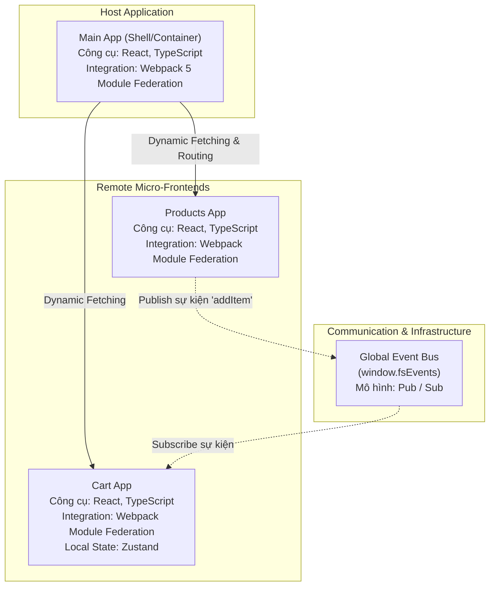

# Phân tích Kiến trúc Micro-Frontends (Cập nhật chuẩn theo mã nguồn)

## 1 & 2. Đặc tính chất lượng mong muốn và phương pháp kiểm tra

| Đặc tính chất lượng | Yêu cầu | Phương pháp kiểm tra |
| :--- | :--- | :--- |
| **Deployability** (Tính triển khai độc lập) | Mỗi micro-frontend có thể build và deploy độc lập. | Thực hiện sửa đổi một đoạn text hoặc màu sắc trong source code của app `products` hoặc `cart`. Deploy riêng app đó. Sau đó, reload lại app `main` (Host) và kiểm tra xem thay đổi đã được cập nhật chưa mà không hề chạm vào quá trình build/deploy của app `main`. |
| **Reliability** (Tính tin cậy / Chịu lỗi) | Nếu một module remote (ví dụ `products`) gặp sự cố hoặc bị sập, nó sẽ không làm sập toàn bộ trang web. | Cố tình thêm đoạn code gây lỗi (ví dụ `throw new Error()`) vào một component bên trong app `products`. Chạy lại ứng dụng Host và kiểm tra xem UI có hiển thị thông báo lỗi cục bộ ở đúng vị trí của `products` hay không, trong khi các phần khác như header, sidebar hoặc app `cart` vẫn hoạt động bình thường. |
| **Maintainability** (Tính dễ bảo trì / sửa đổi) | Việc chia nhỏ thành các module riêng biệt giúp codebase nhỏ hơn, các team có thể làm việc song song bằng cùng một tech stack mà ít bị đụng độ code. | Thay đổi logic hoặc thêm tính năng mới trong một package (ví dụ `products`). Thông qua việc review Pull Request (PR), kiểm tra xem các thay đổi này có bắt buộc phải chỉnh sửa code ở repository/folder của `main` hay `cart` hay không. Nếu không, tính độc lập và dễ bảo trì được đảm bảo. |
| **Performance** (Hiệu suất tải trang) | Mã nguồn của các ứng dụng remote không bị gộp chung vào bundle ban đầu mà được tải một cách lười biếng (Lazy loading) chỉ khi thực sự cần thiết. Khắc phục trùng lặp thư viện. | Mở Chrome DevTools, chuyển sang tab Network. Truy cập vào trang chủ của `main` app và kiểm tra xem các file `.js` của `products` hoặc `cart` có bị tải xuống ngay lập tức không. Chúng chỉ nên được fetch khi người dùng cuộn/chuyển trang tới module đó. |

---

## 3. Sơ đồ góc nhìn logic và công cụ cài đặt

**Ghi chú công cụ cài đặt từng thành phần:**
*   **Giao diện và Logic (View):** Sử dụng `React` và `TypeScript` cho toàn bộ các Host và Remote modules.
*   **Kết hợp/Tích hợp (Integration):** `Webpack 5 (Module Federation)` để chia sẻ và nạp các module ở run-time.
*   **Giao tiếp (Communication):** Sử dụng một Global Event Bus (`window.fsEvents`) gắn ở cấp trình duyệt kết hợp với `Zustand` để lưu trữ trạng thái cục bộ tại từng module.

---

## 4. Cách kết hợp các giao diện trong sơ đồ

Bài thực hành sử dụng phương pháp **Run-time Integration (Kết hợp tại thời điểm chạy)**:

1. **Không gộp code lúc build:** Ứng dụng chính (`main`) không chứa sẵn code của `products` hay `cart`. Nó chỉ lưu đường dẫn URL của các app này.
2. **Tải code khi cần:** Khi trang web chạy và cần hiển thị giỏ hàng hoặc sản phẩm, `main` app mới bắt đầu tải đoạn code tương ứng về thông qua một thẻ `<script>`.
3. **Hiển thị an toàn:** `main` app sử dụng Lazy Loading của React để hiện chữ "Loading..." trong lúc chờ tải code con. Nếu quá trình tải bị lỗi, nó sẽ chỉ báo lỗi ở góc đó (nhờ Error Boundary) chứ không làm sập toàn bộ trang web.

---

## 5. Cách giao tiếp giữa các giao diện trong sơ đồ

Giao tiếp và đồng bộ dữ liệu giữa các thành phần độc lập trong kiến trúc này được thiết kế theo mô hình **Pub/Sub (Publish - Subscribe)** thông qua một **Global Event Bus**:

1.  **Global Event Bus (`window.fsEvents`):** Dự án khởi tạo một kênh giao tiếp chung gắn trực tiếp vào đối tượng `window` của trình duyệt. Kênh này cho phép các ứng dụng phát (publish) và lắng nghe (subscribe) các luồng sự kiện mà không cần phải gọi hàm trực tiếp của nhau.
2.  **Quá trình phát sự kiện (Publish):** Khi người dùng tương tác tại `Products App` (ví dụ bấm "Thêm vào giỏ hàng"), ứng dụng này không hề biết đến sự tồn tại của `Cart App`. Nó chỉ đơn giản là đẩy (publish) một sự kiện có tên `"addItem"` kèm theo dữ liệu mặt hàng lên Event Bus (`window.fsEvents`).
3.  **Quá trình nhận sự kiện (Subscribe) và cập nhật Store:** 
    *   `Cart App` trong lúc khởi chạy đã đăng ký lắng nghe (subscribe) sự kiện `"addItem"` từ Event Bus.
    *   Khi nhận được dữ liệu từ Event Bus, `Cart App` tiến hành gọi hàm để đẩy dữ liệu này vào trong "kho" quản lý trạng thái nội bộ của nó (sử dụng thư viện **Zustand**).
    *   Khi Store của Zustand bên trong `Cart App` được cập nhật, giao diện React của giỏ hàng tự động phản hồi lại (re-render) để hiển thị số lượng mặt hàng mới nhất một cách liền mạch.
