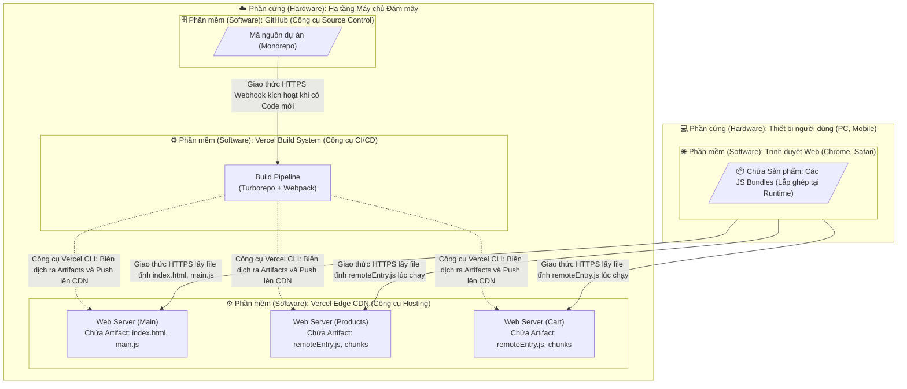
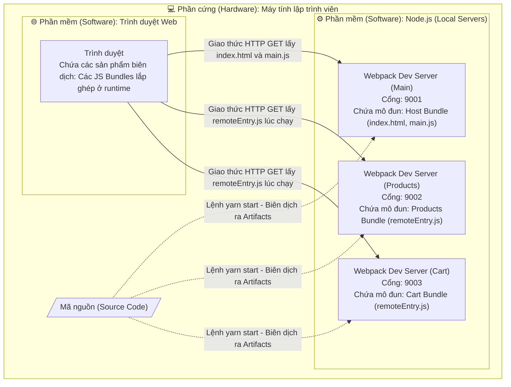

# Phân tích Kiến trúc Micro-Frontends: Góc nhìn Triển khai Thực tế (Production Deployment View)

Theo yêu cầu của đồ án, phần dưới đây sẽ phân tích kiến trúc triển khai ở môi trường Thực tế (Production), ghi chú rõ các công cụ triển khai, và phân định cụ thể Phần cứng/Phần mềm, Sản phẩm biên dịch, cùng Giao thức liên lạc.

## 1. Sơ đồ góc nhìn triển khai và công cụ sử dụng



**Phân tích chi tiết theo yêu cầu:**
*   **Thiết bị người dùng (Client Node):** Là **Phần cứng** (Điện thoại, PC). Chạy phần mềm là **Trình duyệt Web**. Trình duyệt sẽ giao tiếp với các máy chủ đám mây qua giao thức **HTTPS** để tải các **JS Bundles** về và thực thi.
*   **Vercel CDN (Nền tảng Hosting):** Là **Phần mềm** chạy trên cụm máy chủ đám mây. Nó lưu trữ các **Sản phẩm biên dịch (Artifacts)** tĩnh (gồm HTML, JS, CSS) của 3 ứng dụng rời rạc. Trả kết quả cho trình duyệt qua **HTTPS**.
*   **Vercel Build System (Nền tảng CI/CD):** Là **Phần mềm**. Khi nhận được tín hiệu (qua giao thức HTTPS Webhook) từ GitHub, nó sẽ chạy lệnh build để sinh ra các Artifacts.
*   **GitHub (Source Control):** Là **Phần mềm** lưu trữ toàn bộ mã nguồn của hệ thống.

---

## 2. Các bước cần thực hiện để triển khai hệ thống

Sử dụng các công cụ Vercel (Hosting), GitHub (Lưu trữ) và Turborepo (Tối ưu Build), các bước triển khai (deploy) hệ thống diễn ra như sau:

1.  **Cấu hình biến môi trường (Environment Variables):** Thay đổi URL của các remote app trong ứng dụng Host (`main`) từ `localhost` sang các domain thực tế trên Vercel (ví dụ: `products.vercel.app`).
2.  **Đẩy mã nguồn lên công cụ Source Control:** Lập trình viên hoàn tất code và chạy lệnh `git push` lên nhánh chính của **GitHub**.
3.  **Công cụ CI/CD tự động kích hoạt (Trigger Pipeline):** **Vercel** nhận sự kiện Webhook từ GitHub. **Turborepo** phân tích xem lập trình viên vừa sửa code của thư mục nào (main, products, hay cart) để quyết định build.
4.  **Thực thi Build (Tạo Artifacts):** Hệ thống chạy lệnh `yarn build`. Công cụ **Webpack** đóng gói mã React thành các sản phẩm biên dịch tĩnh (JS, HTML). Đối với app Remote, nó tạo ra file hạt nhân `remoteEntry.js`.
5.  **Cập nhật lên công cụ Hosting (Deployment):** Vercel đẩy các Artifacts vừa tạo lên mạng lưới **Vercel Edge CDN**. Lúc này Trình duyệt web có thể tải các file tĩnh mới về qua giao thức **HTTPS**.

---

## 3. Một số câu lệnh cần thiết để triển khai hệ thống

Dưới đây là tập hợp các câu lệnh (CLI) mô phỏng quá trình build và deploy trong môi trường thực tế hoặc trên hệ thống CI/CD.

### Lệnh cài đặt và Build tổng thể (Thường do hệ thống CI tự chạy)
```bash
# 1. Cài đặt toàn bộ thư viện cho các packages trong Monorepo
yarn install

# 2. Build toàn bộ các app đồng thời (Turborepo sẽ lo việc tối ưu)
yarn build
```

### Lệnh Build độc lập từng Micro-Frontend (Triển khai rời rạc)
Nếu bạn chỉ muốn build riêng một app khi có thay đổi (chạy từ thư mục gốc của dự án):
```bash
# Chỉ build app Host (main)
yarn workspace main build

# Chỉ build app Remote (products)
yarn workspace products build

# Chỉ build app Remote (cart)
yarn workspace cart build
```

### Lệnh Deploy thủ công (Sử dụng Vercel CLI)
Nếu không dùng chế độ tự động của GitHub, lập trình viên có thể deploy trực tiếp từ máy tính lên Cloud bằng công cụ Vercel CLI:
```bash
# Đăng nhập vào hệ thống đám mây
vercel login

# Deploy riêng rẽ từng app lên Production
cd main && vercel --prod
cd ../products && vercel --prod
cd ../cart && vercel --prod
```

---

## 4. Phiên bản Triển khai Local (Local Deployment)

Khi sinh viên chạy dự án trực tiếp trên máy tính cá nhân để phát triển hoặc chấm điểm, sơ đồ triển khai sẽ được đơn giản hóa đi rất nhiều (không có hệ thống CI/CD hay máy chủ đám mây). Lúc này, công cụ Webpack Dev Server sẽ đóng vai trò như các máy chủ ảo nội bộ.



**Giải thích chi tiết theo góc nhìn triển khai (Deployment View):**

Sơ đồ trên trình bày góc nhìn triển khai của hệ thống khi chạy ở môi trường Local. Dưới đây là phân tích chi tiết từng thành phần:

**1. Về mặt Phần cứng (Hardware):**
Toàn bộ hệ thống được triển khai trên duy nhất một Node phần cứng là **Máy tính của lập trình viên (Developer Machine)**. Phần cứng này cung cấp môi trường mạng nội bộ (loopback/localhost) để các tiến trình có thể giao tiếp với nhau.

**2. Về mặt Phần mềm (Software) và các Sản phẩm biên dịch (Artifacts / Modules):**
Hệ thống có 4 môi trường phần mềm đang chạy đồng thời:
- **3 tiến trình Node.js (Webpack Dev Servers):** Khi chạy lệnh `yarn start`, mã nguồn (Source Code) sẽ được biên dịch (on-the-fly) và lưu trữ trong 3 máy chủ phần mềm này:
  - **Dev Server Main (Cổng 9001):** Chứa các sản phẩm biên dịch của ứng dụng vỏ (Host), cụ thể là các file `index.html` và `main.js`.
  - **Dev Server Products (Cổng 9002):** Chứa mô-đun biên dịch của tính năng Sản phẩm dưới dạng thư viện độc lập, cụ thể là file `remoteEntry.js`.
  - **Dev Server Cart (Cổng 9003):** Chứa mô-đun biên dịch của tính năng Giỏ hàng, cụ thể là file `remoteEntry.js`.
- **Trình duyệt Web (Client Software):** Đây là phần mềm thứ tư. Nó đóng vai trò là môi trường chứa và thực thi các mô-đun (JS Bundles) nói trên sau khi chúng được tải về và lắp ghép lại với nhau ngay tại thời điểm chạy (runtime).

**3. Về Giao thức liên lạc (Protocols):**
Giữa Trình duyệt web và các Webpack Dev Server giao tiếp với nhau qua **giao thức HTTP**. 
- Khi người dùng truy cập cổng 9001, trình duyệt gửi `HTTP GET` để tải `index.html` và `main.js`.
- Khi ứng dụng Host cần render component Sản phẩm hoặc Giỏ hàng, trình duyệt tiếp tục gửi các request `HTTP GET` sang cổng 9002 và 9003 để tải (fetch) động các file `remoteEntry.js` về và hiển thị lên màn hình.

---

## 3. Các bước cần thực hiện để triển khai (khởi chạy) hệ thống ở Local

Dưới đây là quy trình và các câu lệnh (sử dụng công cụ Yarn và Turborepo) để khởi chạy hệ thống cục bộ trên máy tính lập trình viên. 

**Công cụ chuẩn bị:** 
- Node.js (Môi trường chạy JavaScript)
- Yarn (Công cụ quản lý gói - Package Manager)
- Trình duyệt Web (Chrome/Firefox/Edge)

**Các bước thực hiện:**

1. **Chuẩn bị môi trường & Tải mã nguồn:** 
   - Mở Terminal (Command Prompt / PowerShell) và trỏ vào thư mục gốc của dự án (`micro-frontend-demo`).
2. **Cài đặt thư viện phụ thuộc (Dependencies):**
   - Chạy lệnh `yarn install`.
   - Lệnh này sẽ tải toàn bộ các thư viện cần thiết cho cả 3 ứng dụng (React, Webpack, Material-UI...) lưu vào thư mục `node_modules`. Bước này chỉ cần làm 1 lần khi mới clone code về.
3. **Thực thi lệnh Build & Chạy Server (Khởi động hệ thống):**
   - Chạy lệnh `yarn start`.
   - Dưới sự điều phối của công cụ **Turborepo**, lệnh này sẽ đồng thời kích hoạt 3 tiến trình **Webpack Dev Server** ở 3 cổng khác nhau (9001, 9002, 9003). Webpack sẽ dịch (transpile) mã nguồn React thành các JS Bundles (Artifacts).
4. **Truy cập ứng dụng trên Client:**
   - Mở trình duyệt Web và truy cập vào địa chỉ: `http://localhost:9001/`
   - Trình duyệt sẽ đóng vai trò là nơi lắp ghép (compose) các thành phần lại với nhau để hiển thị giao diện hoàn chỉnh.

**Bản in các câu lệnh cần thiết:**
```bash
# Di chuyển vào thư mục dự án
cd /path/to/micro-frontend-demo

# 1. Cài đặt các gói thư viện
yarn install

# 2. Khởi chạy đồng thời toàn bộ hệ thống (Main, Products, Cart)
yarn start
```
