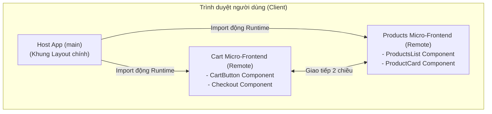
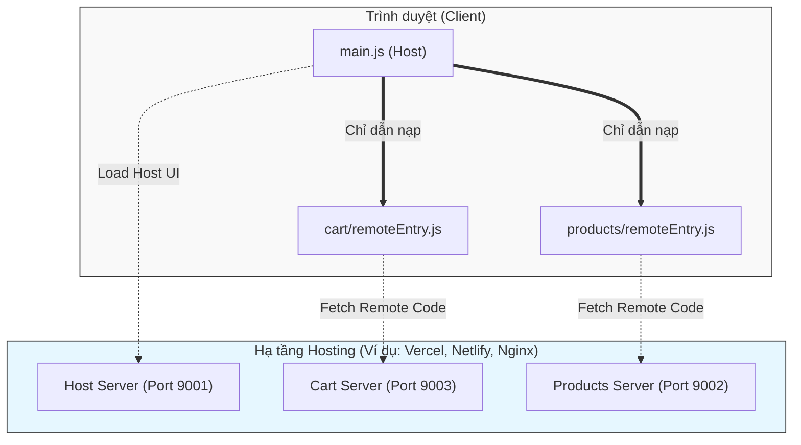

# Micro-Frontend Architecture (Kiến trúc Micro-Frontend)

## 1. Khái niệm (Micro-Frontend là gì?)
**Micro-Frontend** là một mẫu kiến trúc (architecture pattern) thiết kế ứng dụng web, trong đó giao diện người dùng (Frontend) của một ứng dụng lớn được chia nhỏ thành các phần độc lập nhỏ hơn. Các phần nhỏ này được gọi là các "micro-frontend", có thể được phát triển, kiểm thử, và triển khai hoàn toàn độc lập bởi các team (nhóm) khác nhau, sau đó được ráp lại với nhau thành một ứng dụng hoàn chỉnh ở phía người dùng.

Nói cách khác, Micro-Frontend chính là việc mang tư tưởng của **Microservices** áp dụng vào tầng giao diện (Frontend).

## 2. Tại sao lại cần Micro-Frontend? (Vấn đề cần giải quyết)
Trong quá khứ, khi backend chuyển sang Microservices để dễ mở rộng, thì frontend thường vẫn bị giữ lại dưới dạng **Frontend Monolith** (một khối giao diện khổng lồ). Điều này dẫn đến các vấn đề:
*   **Codebase quá lớn:** Càng ngày càng khó bảo trì, thời gian build lâu.
*   **Thắt cổ chai khi Release:** Một team làm tính năng nhỏ nhưng phải đợi cả dự án build và deploy thì mới lên được production.
*   **Khóa chặt công nghệ (Vendor Lock-in):** Khó nâng cấp phiên bản framework (ví dụ từ React 16 lên 18) vì sợ ảnh hưởng toàn bộ hệ thống. Không thể dùng thử công nghệ mới.
*   **Khó mở rộng tổ chức:** Nhiều team cùng sửa chung một kho code frontend rất dễ sinh ra conflict.

## 3. Lợi ích của Micro-Frontend
*   **Triển khai độc lập (Independent Deployments):** Team A làm phần "Giỏ hàng" có thể tự deploy bản cập nhật của họ hàng ngày mà không cần quan tâm team B làm phần "Sản phẩm" đang làm gì.
*   **Phân chia theo Domain (Autonomous Teams):** Các nhóm phát triển (cross-functional teams) sở hữu toàn vẹn từ database, backend api đến frontend ui của một tính năng. (Tương thích tốt với Domain-Driven Design).
*   **Tự do công nghệ (Technology Agnostic):** Team A có thể dùng React, Team B có thể dùng Vue, Team C dùng Angular. Tuy nhiên, trong thực tế, các công ty thường cố định 1 framework (ví dụ đều dùng React) nhưng cho phép độc lập về vòng đời (phiên bản).
*   **Dễ dàng bảo trì và nâng cấp:** Do codebase nhỏ, việc thay thế hoặc viết lại một Micro-Frontend dễ hơn nhiều so với việc đập đi xây lại cả một Frontend Monolith.

## 4. Các phương pháp triển khai (Implementation Approaches)

### A. Tích hợp lúc Build (Build-time integration)
*   **Cách làm:** Xuất bản các micro-frontend thành các NPM packages. Ứng dụng chính (Container) sẽ cài đặt các thư viện này và build ra 1 cục duy nhất.
*   **Ưu điểm:** Dễ cấu hình, tối ưu code tốt.
*   **Nhược điểm:** Phải re-build lại ứng dụng chính mỗi khi bất kỳ micro-frontend nào có sự thay đổi. Mất đi tính "Triển khai độc lập". (Hiện ít được xem là Micro-Frontend đích thực).

### B. Tích hợp lúc Run-time bằng Iframe
*   **Cách làm:** Nhúng các trang web khác nhau vào trang chính thông qua thẻ `<iframe>`.
*   **Ưu điểm:** Cách ly hoàn hảo (CSS, JavaScript, biến toàn cục). Rất an toàn. Dễ làm.
*   **Nhược điểm:** Trải nghiệm người dùng (UX) kém, khó giao tiếp giữa iframe và trang cha, khó làm responsive, routing phức tạp.

### C. Tích hợp lúc Run-time bằng Web Components
*   **Cách làm:** Đóng gói các micro-frontend thành các HTML Custom Elements (Web Components). Ví dụ: `<my-cart></my-cart>`.
*   **Ưu điểm:** Chuẩn của trình duyệt, tương thích với mọi framework.
*   **Nhược điểm:** DOM tree có thể phức tạp, việc chia sẻ thư viện chung (như React) khó khăn hơn.

### D. Tích hợp lúc Run-time bằng Webpack Module Federation (Phổ biến nhất hiện nay)
*   **Cách làm:** Sử dụng tính năng Module Federation của Webpack 5. Cho phép các ứng dụng JavaScript chia sẻ module (components, utils) với nhau ngay trong lúc trình duyệt đang chạy.
*   **Ưu điểm:** Trải nghiệm người dùng mượt mà (như Single Page Application), tối ưu được dung lượng bằng cách chia sẻ thư viện (Shared Dependencies - ví dụ chỉ load React 1 lần), triển khai độc lập thực sự.
*   **Nhược điểm:** Phụ thuộc vào Webpack (hoặc các bundler hỗ trợ Module Federation như Vite-plugin), cấu hình phức tạp.

## 5. Thách thức và Nhược điểm
Kiến trúc nào cũng có giá của nó, Micro-Frontend đem lại một số khó khăn lớn:
*   **Dung lượng tải (Payload Size):** Nếu không cẩn thận, người dùng có thể phải tải về nhiều framework, thư viện bị trùng lặp, làm trang web chậm đi.
*   **Xung đột CSS (CSS Conflicts):** Do các app chạy chung trên 1 trình duyệt, CSS của app này có thể đè lên app kia. Cần dùng CSS Modules, Styled Components, hoặc quy tắc Prefix như BEM.
*   **Chia sẻ trạng thái (State Management):** Việc truyền dữ liệu giữa các Micro-Frontend (ví dụ: User đã đăng nhập hay chưa) phức tạp hơn. Tránh dùng Redux chung cho toàn cục, nên dùng Custom Events hoặc truyền dữ liệu qua URL/Local Storage.
*   **Độ phức tạp vận hành (Operational Complexity):** Cần hệ thống CI/CD tốt để quản lý hàng chục repo/app khác nhau.

## 6. Best Practices (Thực hành tốt)
1.  **Tránh chia sẻ State quá nhiều:** Cố gắng để các Micro-Frontend độc lập nhất có thể. Nếu chúng phải gọi nhau liên tục, có thể ranh giới Domain của bạn đã sai.
2.  **Chia sẻ chung Design System:** Để đảm bảo trang web không bị "chắp vá", mọi Micro-Frontend nên dùng chung một thư viện UI Components (Design System).
3.  **Xử lý lỗi (Error Boundaries):** Đảm bảo nếu một Micro-Frontend bị lỗi (ví dụ phần Giỏ hàng bị sập), các phần khác (như phần xem Sản phẩm) vẫn hoạt động bình thường.
4.  **Cẩn thận với biến toàn cục (Window Object):** Không xả rác vào `window` để tránh xung đột giữa các app.

---

## 7. Phân tích thiết kế hệ thống Micro-Frontend (Bài thực hành)

### 7.1. Các đặc tính chất lượng mong muốn và Phương pháp kiểm tra
Trong dự án thực hành (ví dụ: `micro-frontend-demo` sử dụng Webpack Module Federation), các đặc tính chất lượng (Quality Attributes) quan trọng nhất bao gồm:

1. **Tính độc lập (Modifiability / Independent Deployability):**
   - **Đặc tính:** Sự thay đổi mã nguồn ở một Micro-Frontend (ví dụ: `cart`) không được làm hỏng chức năng hoặc bắt buộc phải build lại toàn bộ ứng dụng chính (`main`) hoặc các Micro-Frontend khác (`products`).
   - **Phương pháp kiểm tra:** Deploy độc lập `cart` với một sửa đổi nhỏ trên UI. Tải lại trang web chính (Host) trên trình duyệt, nếu giao diện `cart` cập nhật mà không cần chạm vào `main`, tính độc lập được đảm bảo.

2. **Hiệu năng (Performance):**
   - **Đặc tính:** Tổng dung lượng file tải về không bị phình to do việc nạp lại nhiều lần cùng một thư viện (ví dụ: React). Quá trình render phải mượt mà.
   - **Phương pháp kiểm tra:** Sử dụng công cụ Chrome DevTools (Network tab). Kiểm tra kích thước gói bundle, đảm bảo `react` và `react-dom` chỉ được tải về một lần (nhờ cấu hình `shared` singleton trong Webpack). Kiểm tra điểm số Lighthouse.

3. **Tính ổn định / Khả năng phục hồi (Reliability / Fault Tolerance):**
   - **Đặc tính:** Nếu một Micro-Frontend (ví dụ: máy chủ chứa `products` bị sập), phần còn lại của trang web vẫn phải load được và hiển thị thông báo lỗi thay vì sập toàn trang.
   - **Phương pháp kiểm tra:** Tắt máy chủ (server) của `products` (ví dụ tắt port 9002), sau đó load lại trang `main`. Nếu trang `main` vẫn hiển thị Header/Footer và UI của `cart`, đồng thời phần `products` hiện lỗi grace degradation (ví dụ thông qua React Error Boundaries), hệ thống đạt yêu cầu.

### 7.2. Sơ đồ góc nhìn Logic (Logical View)
Sơ đồ dưới đây mô tả cách các thành phần nghiệp vụ và giao diện kết hợp với nhau trong kiến trúc Micro-Frontend.

*(Ghi chú: Sơ đồ Logical trên thể hiện cấu trúc Component tree khi render ở trình duyệt)*

*   **Công cụ cài đặt (Implementation Tools):**
    *   **Host App / Main:** Sử dụng **React** làm thư viện UI, **Webpack (Module Federation Plugin)** đóng vai trò là Host.
    *   **Cart Micro-Frontend:** Chứa logic về Giỏ hàng và Thanh toán. Cài đặt bằng **React**. Expose (mở ra) component `CartButton` qua Webpack Module Federation.
    *   **Products Micro-Frontend:** Chứa logic hiển thị danh sách sản phẩm. Cài đặt bằng **React**. Expose component `ProductsList` và `ProductCard`.

*   **Cách kết hợp các giao diện:**
    *   Ứng dụng `main` (Host) đóng vai trò là "vỏ bọc" (shell), cung cấp layout chung như Header, Sidebar. Tại các vùng trống được định nghĩa trước (ví dụ ở góc phải Header), Host app sẽ import động (dynamic import bằng `React.lazy`) component `CartButton` từ Remote `CART`.
    *   Ở thân trang, Host app sẽ import động component `ProductsList` từ Remote `PRODUCTS`. Tại thời điểm chạy (runtime), Webpack sẽ ghép các mảnh giao diện này lại thành một DOM tree duy nhất trên trình duyệt.

*   **Cách giao tiếp giữa các giao diện:**
    *   Trong mô hình này, các Micro-Frontend giao tiếp với nhau chủ yếu qua **Props** (truyền từ Host xuống Remote) hoặc thông qua **Context / Custom Events** của trình duyệt.
    *   Trong bài thực hành, có một điểm đặc biệt: Bản thân `cart` có thể trực tiếp require `products` và ngược lại (Bidirectional integration). Chúng giao tiếp bằng cách gọi trực tiếp các module được exposes thông qua hệ thống module do Webpack quản lý, chia sẻ context chung (do dùng chung phiên bản React Singleton).

### 7.3. Sơ đồ góc nhìn Triển khai (Deployment View)
Sơ đồ Triển khai thể hiện cách các Micro-Frontend được đóng gói và chạy độc lập trên các môi trường máy chủ.

*   **Công cụ triển khai (Deployment Tools):**
    *   Mỗi Micro-Frontend (`main`, `cart`, `products`) được đóng gói (build) bằng **Webpack** sinh ra các file tĩnh (HTML, CSS, JS tĩnh).
    *   Các file tĩnh này có thể được host (lưu trữ) trên bất kỳ máy chủ tĩnh nào như **Vercel**, **AWS S3 + CloudFront**, hoặc dùng **Nginx** triển khai bằng Docker.
    *   **Turborepo** được dùng làm công cụ Build Orchestration (quản lý quá trình build hàng loạt trên CI/CD).
    *   **Yarn Workspaces** để quản lý dependency cho toàn bộ Monorepo.

*   **Các bước cần thực hiện để triển khai hệ thống:**
    1.  **Cấu hình Environment Variables:** Đảm bảo `main` có các biến môi trường trỏ đến đúng domain production của `cart` và `products` (thay vì localhost).
    2.  **Thiết lập CI/CD:** Kết nối repository với công cụ CI (ví dụ: GitHub Actions).
    3.  **Build độc lập (Turborepo):** Khi có code mới, hệ thống CI chạy `yarn turbo run build`. Turbo sẽ quét và chỉ build lại những Micro-Frontend có sự thay đổi code (cache hit/miss).
    4.  **Upload (Deploy) file tĩnh:** Đẩy các thư mục `dist`/`build` sinh ra của từng phần lên các bucket hoặc server tương ứng một cách hoàn toàn song song và độc lập.
    5.  **Runtime Integration:** Sau khi deploy thành công, lần truy cập kế tiếp của người dùng, file `main.js` sẽ tự động fetch file `remoteEntry.js` mới nhất từ các server con để lắp ráp giao diện cập nhật.

*(Lưu ý: Sinh viên tự nộp kèm ảnh chụp màn hình giao diện ứng dụng và các câu lệnh terminal (như `yarn start`, `yarn build`) trong báo cáo).*
