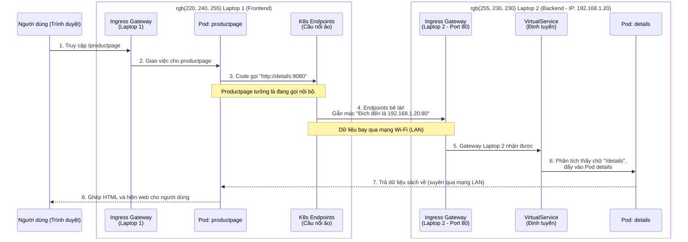

# Hướng Dẫn Triển Khai Bookinfo Lên 2 Máy Tính Khác Nhau (Phân Tán)

Trong thực tế, kiến trúc Microservices sinh ra là để chạy phân tán trên nhiều máy chủ vật lý khác nhau nhằm chia sẻ tải (load) và giảm rủi ro. 

Hướng dẫn cực "chất" này sẽ giúp bạn tách ứng dụng Bookinfo ra chạy trên 2 chiếc Laptop khác nhau (nhưng phải bắt chung một mạng Wi-Fi/LAN).

## 🌍 Mô hình triển khai
- **Laptop 1 (Frontend):** Chỉ chạy mỗi giao diện (`productpage`).
- **Laptop 2 (Backend):** Chạy các cụm xử lý dữ liệu (`details`, `reviews`, và `ratings`).

*Giả sử lúc này:*
- Địa chỉ IP LAN của **Laptop 1** là: `192.168.1.10`
- Địa chỉ IP LAN của **Laptop 2** là: `192.168.1.20` *(Bạn cần chạy lệnh `ipconfig getifaddr en0` trên Laptop 2 để lấy đúng IP thực tế của nó).*

---

## 💻 PHẦN 1: Thao tác trên LAPTOP 2 (Máy Backend)

Nhiệm vụ của Laptop 2 là chạy các dịch vụ lõi và mở một cái "Cổng" (Gateway) ra mạng LAN để Laptop 1 có thể gọi sang.

**Bước 1: Khởi chạy các dịch vụ lõi (details, reviews, ratings)**
- Mở file `platform/kube/bookinfo.yaml`.
- Kéo xuống cuối cùng, **xóa (hoặc comment lại)** toàn bộ đoạn code khởi tạo `productpage` (Bao gồm phần `Service` và `Deployment` của nó).
- Gõ lệnh để chạy:
  ```bash
  kubectl apply -f platform/kube/bookinfo.yaml
  ```

**Bước 2: Mở Cổng đón Request**
Tạo cổng Gateway bằng file mặc định của Istio:
```bash
kubectl apply -f networking/bookinfo-gateway.yaml
```

**Bước 3: Định tuyến (Routing)**
Cần báo cho Gateway biết cách xử lý khi bị gọi. Tạo một file mới tên là `backend-routing.yaml` trên Laptop 2 với nội dung:
```yaml
apiVersion: networking.istio.io/v1
kind: VirtualService
metadata:
  name: backend-routing
spec:
  hosts:
  - "*"
  gateways:
  - bookinfo-gateway
  http:
  - match:
    - uri:
        prefix: /details
    route:
    - destination:
        host: details
        port:
          number: 9080
  - match:
    - uri:
        prefix: /reviews
    route:
    - destination:
        host: reviews
        port:
          number: 9080
```
Chạy file này: `kubectl apply -f backend-routing.yaml`.
*(Vậy là Laptop 2 đã sẵn sàng phục vụ!)*

---

## 💻 PHẦN 2: Thao tác trên LAPTOP 1 (Máy Frontend)

Nhiệm vụ của Laptop 1 là chạy giao diện. Nhưng code của giao diện mặc định sẽ gọi `http://details:9080` ở bên trong máy nó. Ta phải dùng mưu mẹo của Kubernetes để "bẻ lái" luồng đi này sang Laptop 2.

**Bước 1: Chạy Productpage**
- Mở file `platform/kube/bookinfo.yaml`.
- Làm ngược lại với Laptop 2: Lần này bạn **xóa hết** details, reviews, ratings, **CHỈ GIỮ LẠI** phần cấu hình của `productpage`.
- Khởi chạy:
  ```bash
  kubectl apply -f platform/kube/bookinfo.yaml
  ```

**Bước 2: Tạo "Cầu nối ảo" (Endpoints) lừa Productpage**
Đây là bước quan trọng nhất! Bạn tạo một file tên là `bridge-to-laptop2.yaml` trên Laptop 1. K8s sẽ đóng vai trò bẻ lái mọi lời gọi `details` và `reviews` sang thẳng IP của Laptop 2.

```yaml
# Cầu nối bẻ lái cho Details
apiVersion: v1
kind: Service
metadata:
  name: details
spec:
  ports:
    - protocol: TCP
      port: 9080
      targetPort: 80 # Bẻ vào port 80 (cửa Gateway) của Laptop 2
---
apiVersion: v1
kind: Endpoints
metadata:
  name: details
subsets:
  - addresses:
      - ip: 192.168.1.20 # QUAN TRỌNG: Đổi thành IP LAN của Laptop 2
    ports:
      - port: 80
---
# Cầu nối bẻ lái cho Reviews
apiVersion: v1
kind: Service
metadata:
  name: reviews
spec:
  ports:
    - protocol: TCP
      port: 9080
      targetPort: 80 # Bẻ vào port 80 (cửa Gateway) của Laptop 2
---
apiVersion: v1
kind: Endpoints
metadata:
  name: reviews
subsets:
  - addresses:
      - ip: 192.168.1.20 # QUAN TRỌNG: Đổi thành IP LAN của Laptop 2
    ports:
      - port: 80
```
Khởi chạy cầu nối ảo: `kubectl apply -f bridge-to-laptop2.yaml`.

**Bước 3: Mở Cổng Gateway trên Laptop 1**
Để bạn hay thầy cô có thể dùng trình duyệt web truy cập vào giao diện, hãy mở Gateway cho Laptop 1:
```bash
kubectl apply -f networking/bookinfo-gateway.yaml
```

---

## 🚀 BƯỚC CUỐI CÙNG: Hưởng thụ thành quả

Bây giờ, từ điện thoại hoặc một máy tính bất kỳ trong phòng, bạn gõ vào trình duyệt web:
```text
http://<IP_CỦA_LAPTOP_1>/productpage
```

**Sự kỳ diệu đang diễn ra ngầm bên dưới:**
1. Điện thoại truy cập vào Laptop 1. Laptop 1 trả về khung HTML của trang bán sách.
2. Code Backend của Productpage (trên Laptop 1) cần lấy thông tin chi tiết cuốn sách, nó hồn nhiên gọi `http://details:9080`.
3. K8s trên Laptop 1 thấy lệnh gọi này, lập tức áp dụng "Cầu nối ảo", bẻ lái ném request đó qua mạng LAN bay thẳng tới địa chỉ `192.168.1.20:80` (Laptop 2).
4. Laptop 2 nhận được, lục lọi trong Database của nó, ráp thông tin rồi gửi trả kết quả xuyên qua mạng LAN về lại cho Laptop 1.
5. Trang web hiển thị hoàn chỉnh, trơn tru. Không ai biết được rằng dữ liệu đó được xử lý bởi 2 cụm máy chủ đặt ở 2 góc phòng khác nhau!

**👉 Kiến trúc này chứng minh sức mạnh của Microservices:** Frontend và Backend hoàn toàn độc lập, giao tiếp với nhau bằng API qua mạng, có thể scale (nâng cấp máy) cho từng thành phần riêng biệt.

---

## 🔍 Giải thích sâu: Luồng hoạt động của "Cầu nối ảo" (Endpoints)

Nếu bạn vẫn chưa hình dung được vì sao 2 máy lại nói chuyện được với nhau mà không cần sửa dòng code nào của ứng dụng, hãy xem sơ đồ dưới đây:



**Chi tiết luồng chạy:**
1. Khi tạo **Endpoints** ở Laptop 1, ta bảo Kubernetes rằng: *"Này, nếu có ai trong máy gọi tên `details` ở cổng 9080, thì hãy âm thầm bắt gói tin đó lại, và ném thẳng nó qua mạng LAN tới địa chỉ IP `192.168.1.20` ở cổng 80 giúp tao"*.
2. Nhờ đó, thằng `productpage` vẫn cứ đinh ninh là nó đang gọi một service ở ngay kế bên mình. Nó không hề biết gói tin của mình đã bị bốc lên mạng Wi-Fi đẩy sang nhà hàng xóm (Laptop 2).
3. Gói tin băng qua mạng Wi-Fi, đập vào **Gateway (cổng 80)** của Laptop 2.
4. Ở Laptop 2, thằng Gateway nhìn thấy gói tin này có chứa chữ `/details`. Nó liền dò trong sổ tay định tuyến (**VirtualService** mà ta tạo ở Phần 1) và nói: *"À, gói này dành cho Pod `details`"*, rồi ném vào cho Pod xử lý.
5. Sau khi xử lý xong, dữ liệu (cân nặng sách, số trang sách...) được đóng gói lại, bắn ngược qua mạng Wi-Fi trả về cho `productpage` ở Laptop 1.
