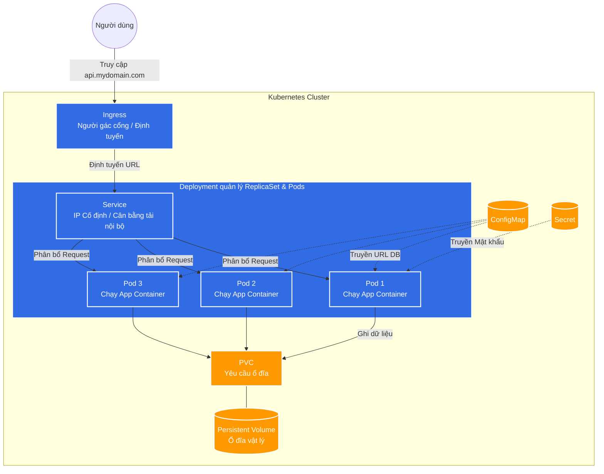

# Các Khái Niệm Cơ Bản Trong Kubernetes (K8s)

Tài liệu này giải thích các khái niệm cốt lõi trong Kubernetes để giúp bạn hiểu cách các ứng dụng vi dịch vụ (microservices) được triển khai và quản lý.

## 1. Cluster và Node (Cụm và Nút)
* **Cluster (Cụm):** Là tập hợp của tất cả các máy móc (vật lý hoặc máy ảo) chạy các ứng dụng được quản lý bởi Kubernetes. Nó giống như toàn bộ trung tâm dữ liệu của bạn.
* **Node (Nút):** Là một máy đơn lẻ (máy tính hoặc máy ảo) bên trong Cluster. Mỗi Node chứa các tài nguyên (CPU, RAM) để chạy các ứng dụng. Có 2 loại Node:
    * **Master Node (Control Plane):** Bộ não của cụm, quyết định cái gì chạy ở đâu, quản lý trạng thái của toàn bộ cụm.
    * **Worker Node:** Nơi thực sự chạy các ứng dụng của bạn.

> **Ví dụ thực tế:** Hãy tưởng tượng Cluster là một nhà máy lớn. Master Node là phòng giám đốc điều hành, còn các Worker Node là các phân xưởng sản xuất thực tế có chứa máy móc (tài nguyên).

## 2. Pod
* **Pod là đơn vị nhỏ nhất và cơ bản nhất** có thể triển khai trong Kubernetes.
* Bạn không triển khai trực tiếp các container (như Docker container) lên K8s, mà bạn bọc chúng trong một Pod.
* Một Pod thường chứa **một container**. Tuy nhiên, nó cũng có thể chứa **nhiều container** chạy cùng nhau, chia sẻ cùng một địa chỉ IP (localhost), cùng không gian mạng và cùng bộ nhớ (volume).
* **Đặc điểm:** Pod rất "mỏng manh" (ephemeral). Nếu một Pod chết, Kubernetes sẽ không cố gắng "chữa bệnh" cho nó, mà sẽ vứt nó đi và tạo ra một Pod mới hoàn toàn để thay thế.

> **Ví dụ - Cấu hình YAML của một Pod:**
```yaml
apiVersion: v1
kind: Pod
metadata:
  name: my-nginx-pod
spec:
  containers:
  - name: nginx-container
    image: nginx:latest
    ports:
    - containerPort: 80
```

## 3. ReplicaSet và Deployment
* **ReplicaSet:** Đảm bảo rằng **luôn có một số lượng Pod nhất định** (replicas) đang chạy tại bất kỳ thời điểm nào. Ví dụ: bạn yêu cầu luôn có 3 Pod của dịch vụ A chạy. Nếu 1 Pod chết, ReplicaSet sẽ tự động tạo 1 Pod mới. Nếu có 4 Pod chạy, nó sẽ giết bớt 1 Pod.
* **Deployment:** Là một lớp quản lý cao hơn nằm trên ReplicaSet. Bạn thường **không tạo trực tiếp Pod hay ReplicaSet**, mà bạn tạo một Deployment.
    * Deployment quản lý ReplicaSet.
    * Nó cho phép bạn **cập nhật phiên bản ứng dụng một cách an toàn** (Rolling Update). Ví dụ: cập nhật từ v1 lên v2 từ từ, không làm gián đoạn dịch vụ (Zero Downtime). Nếu bản v2 bị lỗi, Deployment cho phép bạn quay ngược (Rollback) về v1 dễ dàng.

> **Ví dụ - Cấu hình YAML của một Deployment chạy 3 bản sao:**
```yaml
apiVersion: apps/v1
kind: Deployment
metadata:
  name: frontend-deployment
spec:
  replicas: 3 # Khai báo luôn có 3 Pod chạy đồng thời
  selector:
    matchLabels:
      app: frontend
  template:
    metadata:
      labels:
        app: frontend
    spec:
      containers:
      - name: frontend-app
        image: my-frontend:v1.0 # Khi muốn update, chỉ cần đổi chỗ này thành v1.1
```

## 4. Service (Dịch vụ)
Vì các Pod thường xuyên bị chết đi và tạo mới (địa chỉ IP của chúng thay đổi liên tục), làm sao các ứng dụng khác có thể giao tiếp với chúng? Đó là lúc cần đến Service.
* **Service:** Cung cấp một **địa chỉ IP cố định** (và tên miền nội bộ) để truy cập vào một nhóm các Pod.
* Service hoạt động như một **Load Balancer (Bộ cân bằng tải) nội bộ**. Khi có request gửi đến Service, Service sẽ chia đều request đó cho các Pod đang chạy bên dưới nó.
* **Các loại Service chính:**
    * **ClusterIP (Mặc định):** Chỉ có thể truy cập từ bên trong Cluster K8s. Dùng cho các microservices gọi lẫn nhau.
    * **NodePort:** Mở một cổng (port) cụ thể trên mọi Node. Cho phép truy cập từ bên ngoài vào ứng dụng thông qua `<IP_của_Node>:<NodePort>`.
    * **LoadBalancer:** Sử dụng Load Balancer của các nhà cung cấp đám mây (AWS, GCP, Azure) để cấp một IP Public tĩnh kết nối vào ứng dụng.

> **Ví dụ - Cấu hình YAML của một Service (ClusterIP):**
```yaml
apiVersion: v1
kind: Service
metadata:
  name: frontend-service
spec:
  selector:
    app: frontend # Service này sẽ tìm và trỏ traffic tới các Pod có nhãn (label) 'app: frontend'
  ports:
    - protocol: TCP
      port: 80 # Cổng của Service
      targetPort: 8080 # Cổng ứng dụng đang chạy bên trong Container của Pod
```

## 5. Ingress
* Mặc dù Service (NodePort, LoadBalancer) có thể đưa ứng dụng ra ngoài internet, nhưng nếu bạn có hàng chục microservices, việc tạo hàng chục LoadBalancer sẽ rất tốn kém và khó quản lý.
* **Ingress:** Hoạt động như một "người gác cổng" (API Gateway hoặc Router) thông minh. Nó chỉ dùng **một địa chỉ IP Public duy nhất**, và dựa vào **đường dẫn (URL path) hoặc tên miền (hostname)** để định tuyến luồng truy cập (traffic) đến đúng Service bên trong.

> **Ví dụ - Định tuyến traffic bằng Ingress:**
```yaml
apiVersion: networking.k8s.io/v1
kind: Ingress
metadata:
  name: my-app-ingress
spec:
  rules:
  - host: api.mydomain.com
    http:
      paths:
      - path: /users
        pathType: Prefix
        backend:
          service:
            name: user-service # Trỏ vào Service của microservice User
            port:
              number: 80
      - path: /orders
        pathType: Prefix
        backend:
          service:
            name: order-service # Trỏ vào Service của microservice Order
            port:
              number: 80
```

## 6. ConfigMap và Secret
Để tránh việc phải sửa code và build lại (build image Docker) mỗi khi thay đổi cấu hình, K8s cung cấp:
* **ConfigMap:** Dùng để lưu trữ các cấu hình **không bảo mật** (dưới dạng key-value), ví dụ: URL của database, port chạy ứng dụng, cờ (flags) bật tắt tính năng.
* **Secret:** Tương tự như ConfigMap nhưng dùng để lưu trữ các thông tin **nhạy cảm, cần bảo mật** như: Mật khẩu database, API Keys, SSH keys, chứng chỉ SSL. Thông tin trong Secret được mã hóa base64.

> **Ví dụ - Cấu hình YAML ConfigMap truyền tham số môi trường:**
```yaml
apiVersion: v1
kind: ConfigMap
metadata:
  name: app-config
data:
  DATABASE_URL: "mysql://db-service:3306/mydb"
  LOG_LEVEL: "INFO"
```

## 7. Namespace (Không gian tên)
* Là một cách để **chia nhỏ một Cluster vật lý** thành nhiều Cluster ảo (virtual clusters).
* Giúp tổ chức và cô lập các tài nguyên.
* Ví dụ: Bạn có thể tạo các namespace: `dev` (cho môi trường phát triển), `staging` (cho môi trường kiểm thử), và `prod` (cho môi trường thực tế) trên cùng một Cluster vật lý. Hoặc chia theo các team dự án.

> **Ví dụ - Các lệnh làm việc với Namespace qua Terminal:**
> - Tạo namespace mới: `kubectl create namespace staging`
> - Lấy danh sách pod trong namespace 'dev': `kubectl get pods -n dev`

## 8. Volume và PersistentVolume (PV) / PersistentVolumeClaim (PVC)
Bản chất của container là khi bị xóa, toàn bộ dữ liệu trong đó cũng mất. K8s cung cấp cách lưu trữ dữ liệu vĩnh viễn:
* **Volume:** Một thư mục chứa dữ liệu có thể được truy cập bởi các container trong một Pod.
* **PersistentVolume (PV):** Là một ổ đĩa cứng thực sự được cấp phát bởi quản trị viên (có thể là ổ SSD, NFS, cloud storage). Nó có vòng đời độc lập với Pod.
* **PersistentVolumeClaim (PVC):** Là "tờ giấy xin cấp phép" của Pod để yêu cầu K8s cấp cho nó một PV với dung lượng nhất định. Khi Pod được tạo, K8s sẽ kết nối (mount) PVC vào PV và đưa ổ đĩa đó vào cho Pod sử dụng. Dù Pod có bị xóa, dữ liệu trên PV vẫn an toàn.

> **Ví dụ - Cấu hình YAML xin cấp 5GB đĩa cứng để lưu trữ:**
```yaml
apiVersion: v1
kind: PersistentVolumeClaim
metadata:
  name: my-database-pvc
spec:
  accessModes:
    - ReadWriteOnce
  resources:
    requests:
      storage: 5Gi
```

---
**Tóm tắt luồng hoạt động cơ bản qua ví dụ:**
1. Bạn viết code NodeJS -> Bọc vào Container Image `my-app:v1`.
2. Viết file **Deployment** (kéo image `my-app:v1`, set `replicas: 3`). K8s tự tạo ra 3 **Pod**.
3. Các Pod cần kết nối database, lấy URL từ **ConfigMap**, mật khẩu từ **Secret**. Database lưu dữ liệu thực vào ổ đĩa cấp qua **PVC**.
4. Viết file **Service** tên `my-app-svc` để nhóm 3 Pod kia lại dưới 1 IP nội bộ duy nhất và cân bằng tải request.
5. Viết file **Ingress** quy định ai gõ `api.mydomain.com` thì sẽ được định tuyến thẳng tới `my-app-svc`.

---
### Phân tích luồng Microservices thực tế (Ví dụ E-commerce)

Giả sử hệ thống e-commerce của bạn có 2 microservices: **Product Service** (có 3 Pods) và **Cart Service** (có 2 Pods).

1. **Người dùng A gọi `GET /api/product`**
   - Request đi qua cổng **Ingress**. Ingress dựa vào đường dẫn `/product` để bẻ lái luồng dữ liệu sang **Product Service**.
   - Product Service nhận request, dùng thuật toán cân bằng tải nội bộ để đẩy request vào **Pod 1**.

2. **Người dùng B gọi `GET /api/product`**
   - **Ingress** tiếp tục bẻ lái sang **Product Service**.
   - Product Service sẽ cân bằng tải và đẩy request của B vào **Pod 2** (hoặc Pod 3) để chia sẻ khối lượng công việc.

3. **Người dùng A thêm hàng vào giỏ `POST /api/cart`**
   - Request đi qua **Ingress**, Ingress thấy đường dẫn `/cart`, liền bẻ lái sang **Cart Service**.
   - Cart Service sẽ cân bằng tải và đẩy request vào một trong các Pods của chính nó.

4. **Giao tiếp nội bộ (Internal Communication): Khi Product gọi Cart**
   - Giả sử **Product Service** cần lấy dữ liệu giỏ hàng từ **Cart Service**. Nó sẽ **KHÔNG** đi vòng ra ngoài Internet hay Ingress.
   - Code bên trong Pod của Product Service chỉ cần gửi request HTTP thẳng đến tên nội bộ của Cart: ví dụ `GET http://cart-service:80/...`.
   - **Cart Service (loại ClusterIP)** sẽ tự động đón request này ngay bên trong Cụm K8s, tự động cân bằng tải và đẩy nó vào 1 trong các Pod của Cart. Nhờ vậy, giao tiếp giữa các services diễn ra cực kỳ nhanh và được bảo mật hoàn toàn khỏi thế giới bên ngoài.

**Sức mạnh của kiến trúc này:** Nếu dịch vụ Giỏ hàng (`/cart`) bị lỗi (các Pods của nó bị sập), hệ thống vẫn duy trì được dịch vụ Sản phẩm (`/product`). Người dùng vẫn có thể xem được hàng hóa bình thường mà không bị chết toàn bộ hệ thống.

### Sơ đồ trực quan luồng hoạt động



