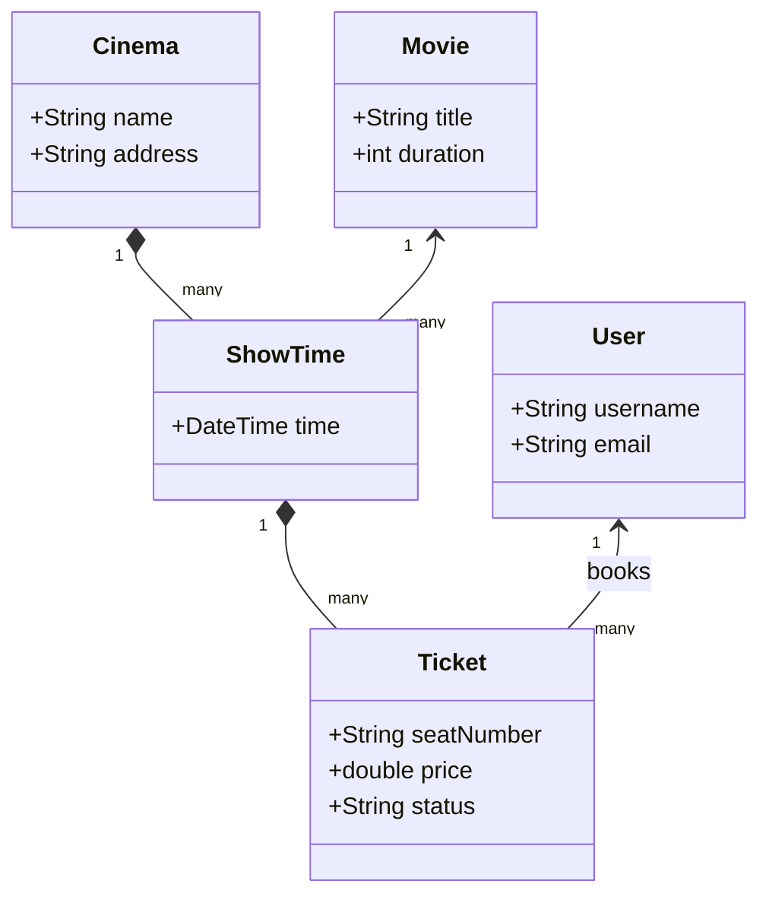
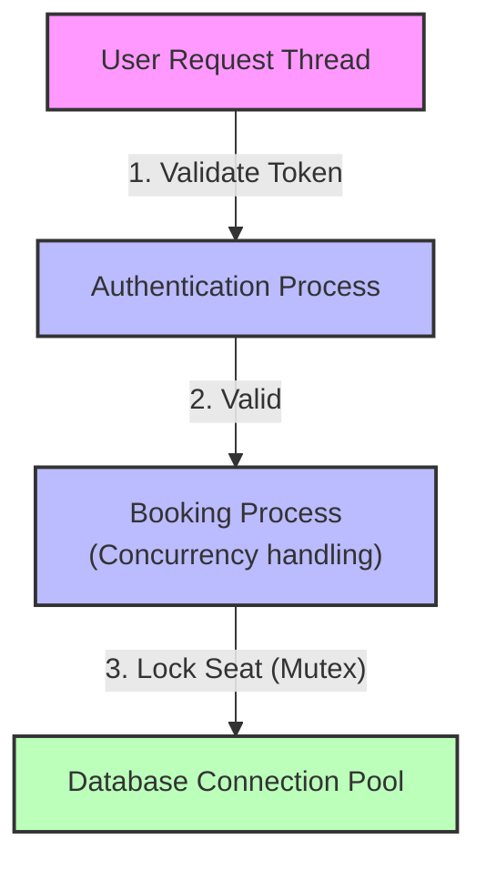
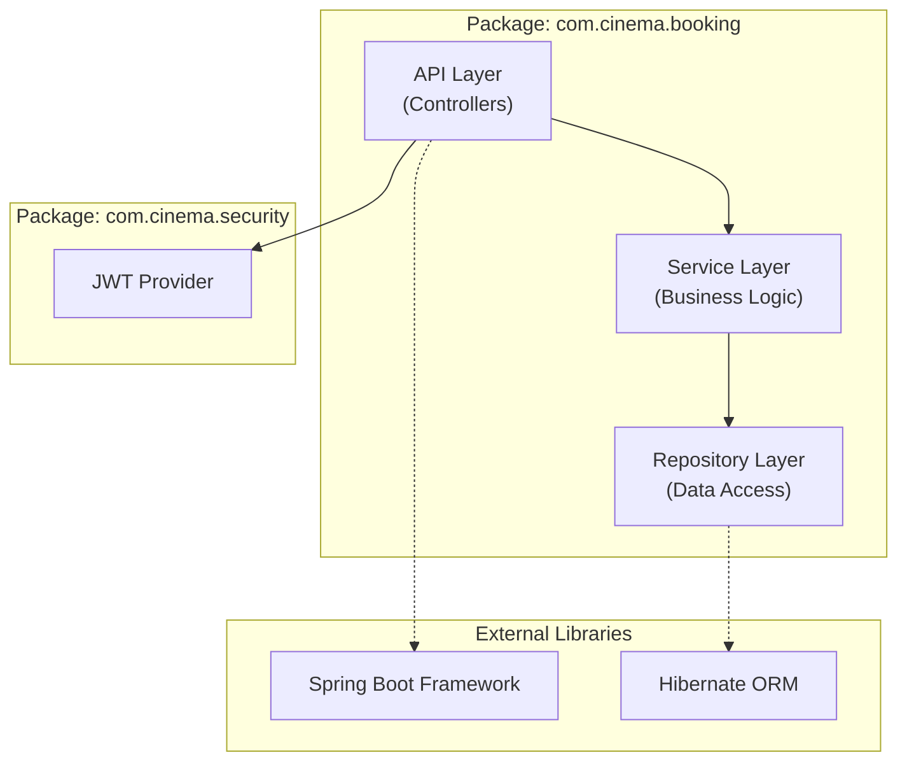
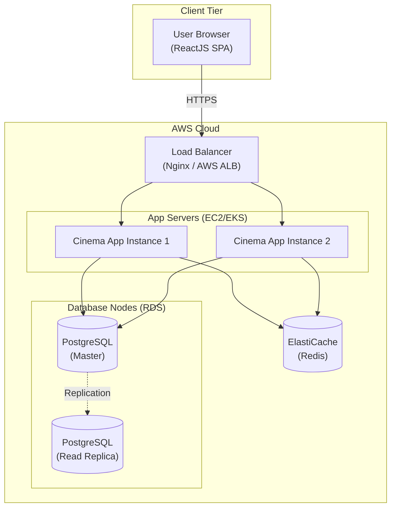
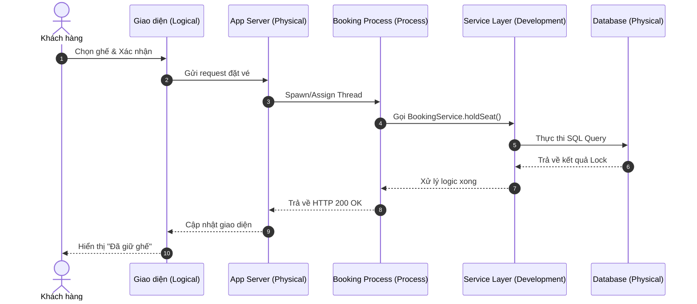

# Mô hình 4+1 View (4+1 Architectural View Model)

Mô hình 4+1 do Philippe Kruchten đề xuất, sử dụng 4 góc nhìn (view) khác nhau để mô tả thiết kế của một hệ thống phần mềm. Tất cả 4 góc nhìn này đều xoay quanh và được minh chứng tính đúng đắn bởi góc nhìn thứ 5 (Kịch bản - Scenarios).

Dưới đây là mô tả và sơ đồ Mermaid minh họa cho từng View, áp dụng cho **Hệ thống Đặt vé xem phim (Cinema Booking System)**. Lưu ý các cú pháp Mermaid đã được xử lý chuẩn để tránh lỗi Parse error.

---

## 💡 Mẹo siêu tốc phân biệt 5 View
Để ghi nhớ nhanh nhất, bạn chỉ cần gán 1 "từ khóa" đại diện cho đối tượng chính mà mỗi View quan tâm tới:
- **Logical View** ➔ **CLASS** (Thực thể/Chức năng)
- **Process View** ➔ **THREAD** (Đồng thời/Luồng chạy)
- **Development View** ➔ **PACKAGE** (Đóng gói/Mã nguồn)
- **Physical View (Deployment View)** ➔ **SERVER** (Hạ tầng/Phần cứng)
- **+1 (Scenarios)** ➔ **USE CASE** (Kịch bản/Nghiệp vụ)

> **"CLASS chạy THREAD, gói trong PACKAGE, cài lên SERVER để phục vụ USE CASE."**

---

### 1. Logical View (Góc nhìn Logic)
**Mục tiêu:** Mô tả cấu trúc tĩnh của hệ thống qua các thực thể kinh doanh (business entities) và mối quan hệ giữa chúng, nhằm đáp ứng các yêu cầu chức năng.  
**Đối tượng:** Lập trình viên, Quản lý hệ thống.

### 2. Process View (Góc nhìn Tiến trình)
**Mục tiêu:** Tập trung vào hành vi động của hệ thống: các luồng xử lý (processes), tính đồng thời (concurrency), hiệu suất, và sự phân tán (distribution).  
**Đối tượng:** Kỹ sư tích hợp hệ thống (System Integrators).

### 3. Development View (Góc nhìn Phát triển)
**Mục tiêu:** Mô tả cách tổ chức mã nguồn, các package, thư viện, framework. Quản lý cấu trúc của project thực tế.  
**Đối tượng:** Lập trình viên (Programmers).

### 4. Physical View (Góc nhìn Vật lý / Deployment View)
**Mục tiêu:** Mô tả việc triển khai phần mềm lên phần cứng (servers, cloud, database nodes, network topology).  
**Đối tượng:** Kỹ sư hệ thống, DevOps, Quản trị mạng (System Engineers).

### 5. "+1" View: Scenarios (Kịch bản / Use Case)
**Mục tiêu:** Kết nối 4 view trên lại với nhau, minh họa cách hệ thống hoạt động thông qua một chuỗi các hành động thực tế.  
**Đối tượng:** Tất cả mọi người (Stakeholders).

