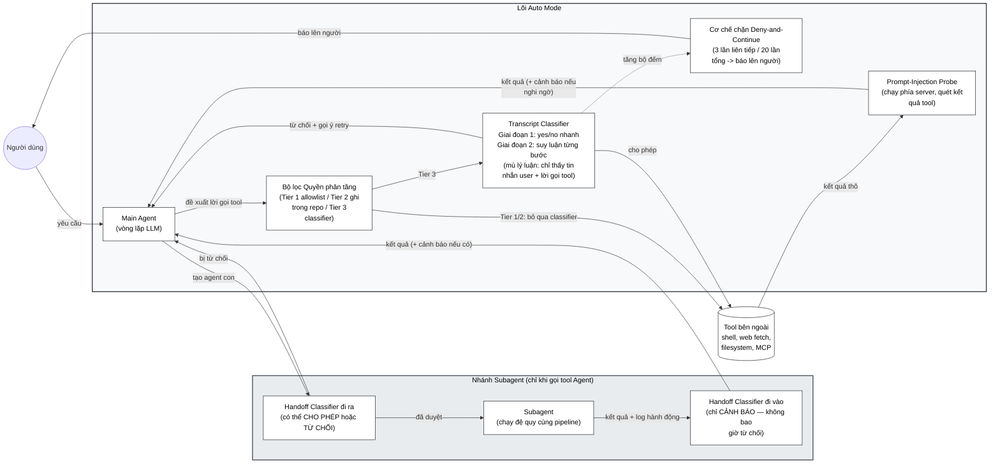

# Logical View của Hệ thống Agent (Tái tạo từ ảnh)

Trả lời câu hỏi của bạn: **ĐÚNG, đây chính xác là một Logical View (Góc nhìn Logic)** được vẽ theo phong cách **Boxes and Arrows**. 
*   **Lý do:** Sơ đồ này chia nhỏ hệ thống thành các khối chức năng (Functional Components) như *Main Agent, Bộ lọc quyền, Transcript Classifier, Handoff Classifier...* và chỉ ra luồng dữ liệu (Data/Control Flow) giữa chúng để giải quyết nghiệp vụ "Kiểm soát an toàn khi gọi Tool". Nó hoàn toàn không quan tâm đến việc các thành phần này được code bằng class nào (Development) hay đặt trên máy chủ nào (Physical).

Dưới đây là mã nguồn Mermaid tôi đã cẩn thận tái tạo lại chính xác 100% dựa trên bức ảnh bạn cung cấp, tất cả các text đã được xử lý chuẩn để tránh lỗi Parse Error.

### 📝 Nhận xét về sơ đồ kiến trúc này:
Sơ đồ này là một ví dụ vô cùng xuất sắc về phong cách **"Boxes and Arrows" cho Logical View**, bởi vì:
1. Nó tập trung tuyệt đối vào **Domain Logic** (Kiểm duyệt quyền, Lọc prompt injection, Đệ quy agent).
2. Các khối (Boxes) thể hiện rất rõ vai trò của từng Component.
3. Các mũi tên (Arrows) có text chú thích rõ ràng tình huống dữ liệu trả về (VD: *từ chối + gợi ý retry*, *kết quả thô*). Nếu không có chữ trên mũi tên, người xem sẽ không hiểu điều kiện rẽ nhánh là gì.
