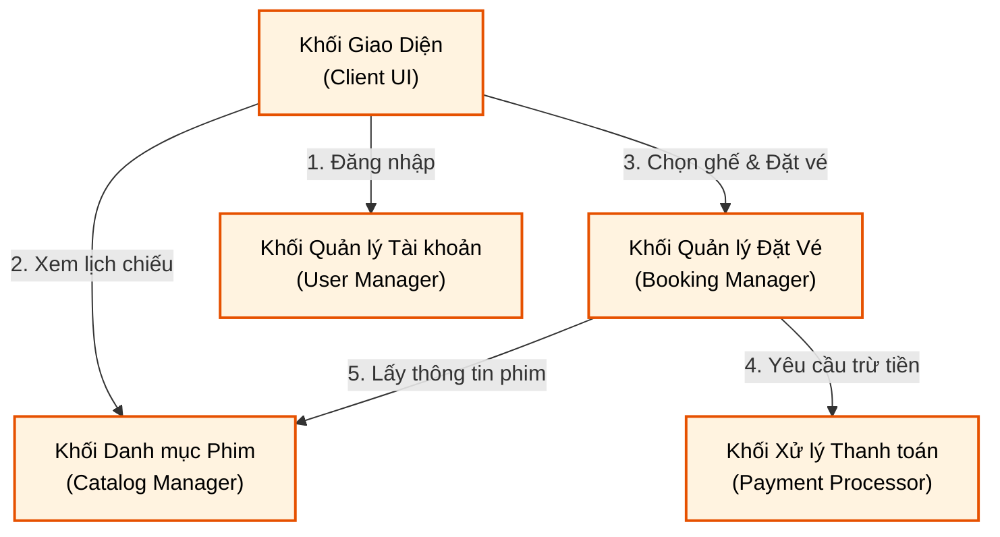
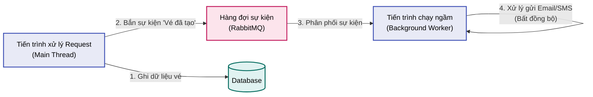
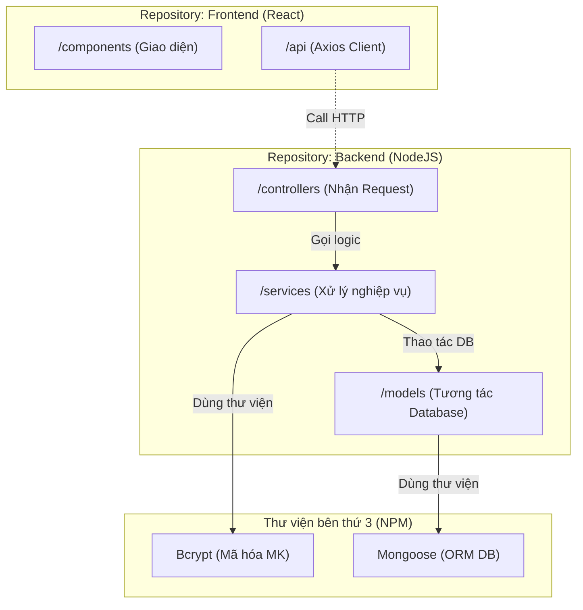
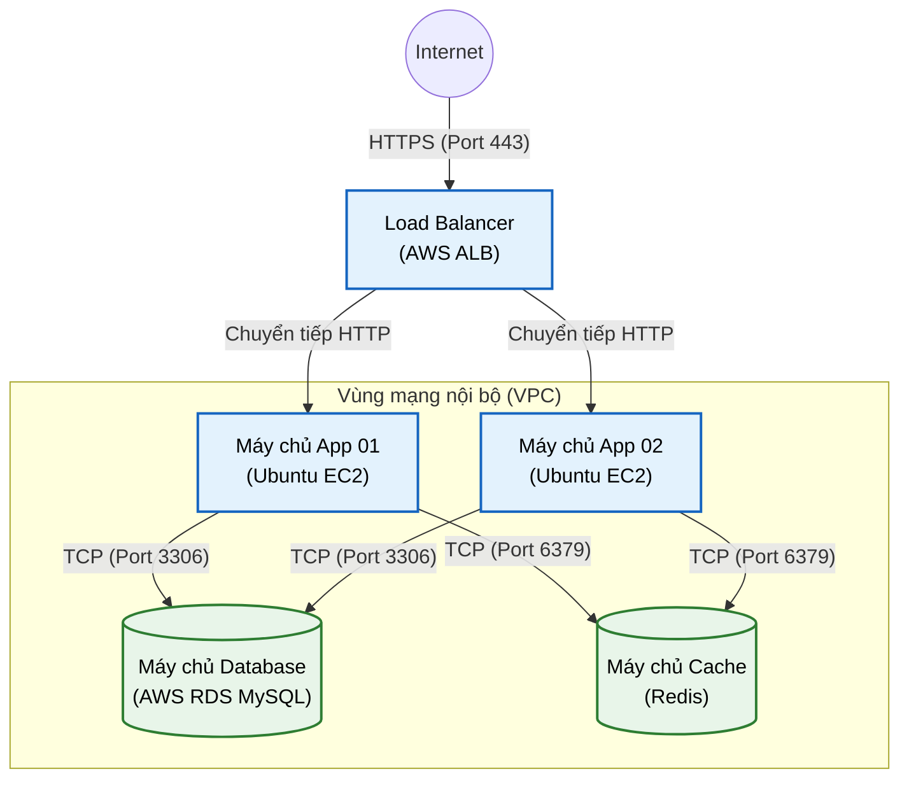
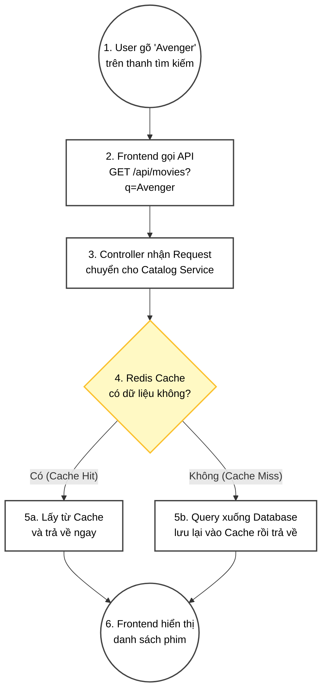

# Trình bày: Boxes and Arrows + 4+1 View Model

Tài liệu này trình bày **toàn bộ 5 Views** của mô hình 4+1, nhưng thay vì dùng các biểu đồ UML phức tạp, chúng ta sẽ áp dụng triệt để phong cách **"Boxes and Arrows" (Khối hộp và Mũi tên)**. Phong cách này mang tính trực quan cao, tự do, tập trung vào việc truyền đạt luồng thông tin và cấu trúc mà không bị gò bó bởi các quy tắc nét đứt/nét liền hay hình khối 3D của UML.

*Ví dụ áp dụng: Hệ thống Đặt vé xem phim (Cinema Booking System)*

---
## 💡 Mẹo siêu tốc: Nhìn vào "Hộp" (Box) là biết View gì!
Vì chúng ta dùng chung một phong cách (Boxes and Arrows) cho tất cả các View, nên cách nhanh nhất để phân biệt là tự hỏi: **"Cái hộp này đại diện cho cái gì?"**

1. **Logical View** ➔ Hộp là **CHỨC NĂNG (Khối nghiệp vụ)**. *(VD: Khối Đặt vé, Khối Thanh toán)*
2. **Process View** ➔ Hộp là **TIẾN TRÌNH (Luồng chạy/Queue)**. *(VD: Background Worker, RabbitMQ)*
3. **Development View** ➔ Hộp là **THƯ MỤC (Code/Thư viện)**. *(VD: Folder Frontend, NPM Package)*
4. **Physical View (Deployment View)** ➔ Hộp là **MÁY CHỦ (Phần cứng/Network)**. *(VD: Ubuntu Server, AWS RDS)*
5. **+1 (Scenarios)** ➔ Hộp là **BƯỚC CHẠY (Hành động)**. *(VD: Bước 1 User Click, Bước 2 Lưu DB)*

---

## 1. Logical View (Góc nhìn Logic)
*   **Mục tiêu:** Thể hiện các cụm chức năng (khối nghiệp vụ) chính của hệ thống và sự tương tác giữa chúng. Không đi sâu vào code hay class.

**📝 Giải thích sơ đồ:**
*   Hệ thống được chia thành 4 khối chức năng chính nằm dưới Backend.
*   `UI` gọi `UserMgmt` để xác thực người dùng.
*   Khi người dùng đặt vé, `Booking` sẽ tương tác với `Payment` để thanh toán và đọc dữ liệu phim từ `Catalog`.

---

## 2. Process View (Góc nhìn Tiến trình)
*   **Mục tiêu:** Thể hiện hệ thống khi đang chạy (Runtime). Tập trung vào các luồng (Thread), tiến trình (Process), hàng đợi (Queue) và các tác vụ chạy ngầm.

**📝 Giải thích sơ đồ:**
*   Hệ thống áp dụng xử lý bất đồng bộ (Asynchronous) để tối ưu hiệu năng.
*   `Main Thread` chỉ lo việc ghi vé vào Database rồi nhanh chóng trả phản hồi cho người dùng.
*   Việc gửi Email/SMS tốn thời gian được đẩy vào `RabbitMQ`. Một `Background Worker` chạy độc lập sẽ lấy sự kiện ra để gửi Email, giúp luồng chính không bị nghẽn (blocking).

---

## 3. Development View (Góc nhìn Phát triển)
*   **Mục tiêu:** Thể hiện cách tổ chức mã nguồn, chia thư mục, gói (package) và sự phụ thuộc thư viện của dự án.

**📝 Giải thích sơ đồ:**
*   Dự án được chia làm 2 kho lưu trữ (Repo) riêng biệt cho Frontend và Backend.
*   Backend tổ chức code theo kiến trúc 3 lớp: Controllers -> Services -> Models. Lớp trên chỉ được gọi lớp ngay dưới nó.
*   Các thư viện bên ngoài (NPM) được quản lý riêng và được gọi vào khi cần thiết (Mongoose cho Database, Bcrypt để bảo mật).

---

## 4. Physical View (Góc nhìn Vật lý / Deployment View)
*   **Mục tiêu:** Thể hiện cách phần mềm được cài đặt lên các máy chủ phần cứng / cloud cụ thể và mạng lưới kết nối.

**📝 Giải thích sơ đồ:**
*   Người dùng từ Internet kết nối vào hệ thống qua `Load Balancer` thông qua HTTPS.
*   LB phân tải đều cho 2 máy chủ chạy Ứng dụng (`App 01` và `App 02`) nằm trong mạng riêng (Private VPC) để bảo mật.
*   Cả 2 App server đều kết nối chung vào 1 máy chủ Database (MySQL) để lưu dữ liệu lâu dài và 1 máy chủ Redis để lưu Cache tăng tốc độ tải.

---

## 5. "+1" View: Scenarios (Góc nhìn Kịch bản)
*   **Mục tiêu:** Trong phong cách "Boxes & Arrows", thay vì dùng Sequence Diagram phức tạp, ta có thể dùng Flowchart biểu diễn từng bước đi (step-by-step) của 1 luồng công việc nối kết các khối ở 4 View trên lại với nhau.

**Kịch bản: Khách hàng tìm kiếm phim và xem chi tiết**

**📝 Giải thích sơ đồ:**
*   Kịch bản chứng minh cách dữ liệu chảy từ Client (Development View) qua Controller (Logical View), tương tác với Redis Cache (Physical View & Process View) để tăng tốc độ truy vấn, sau đó trả ngược kết quả về cho người dùng. Mọi View đều được gắn kết hoàn hảo.
