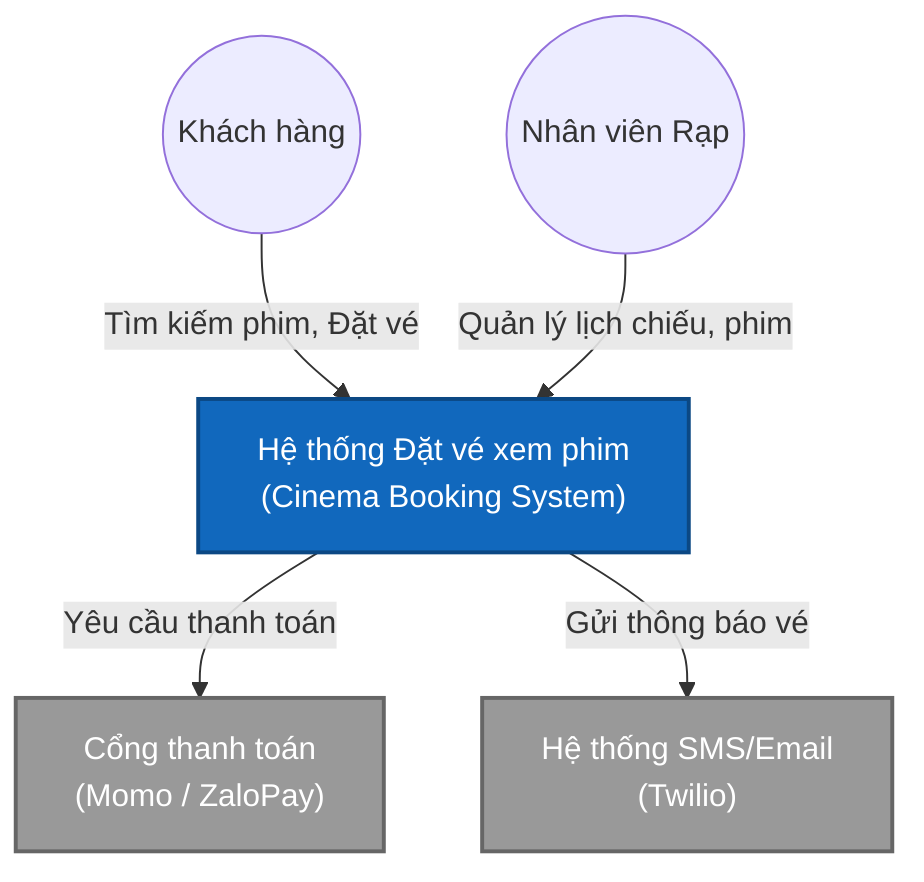
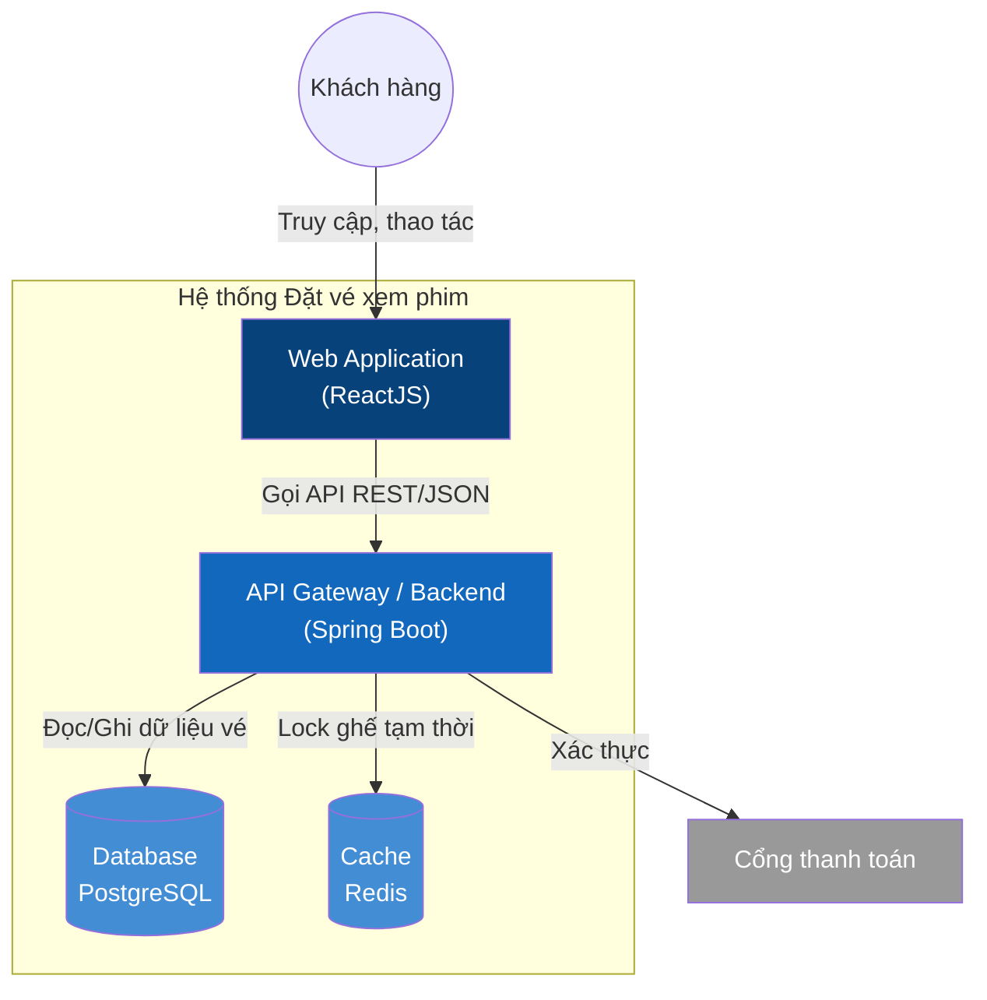
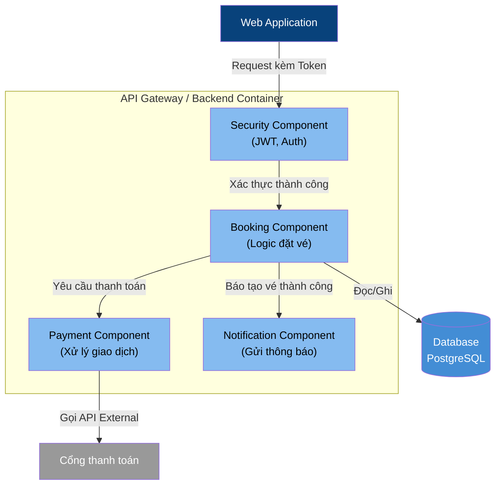
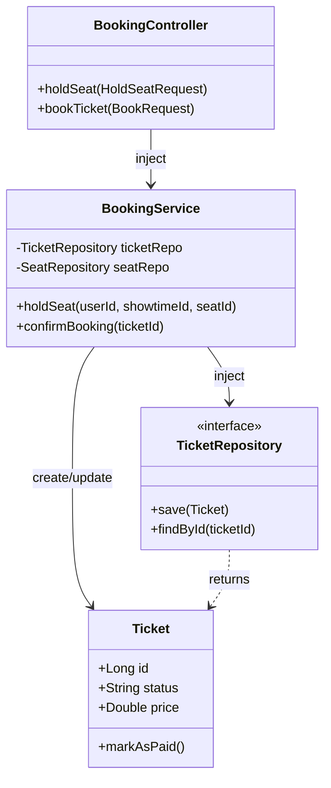
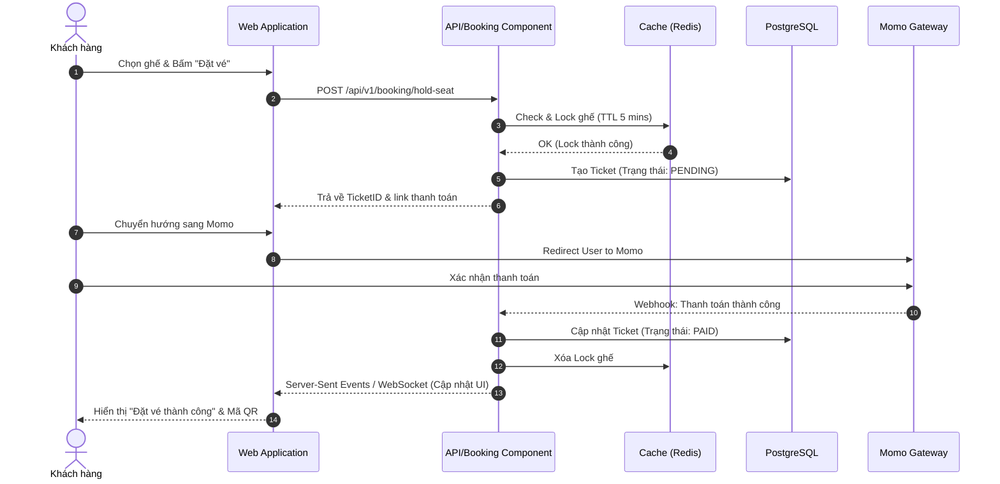

# Lý thuyết về C4 + 1 View trong Thiết kế Hệ thống

Thuật ngữ **"C4 + 1 view"** thường được hiểu là sự kết hợp thực tế giữa 2 mô hình thiết kế kiến trúc phần mềm nổi tiếng:
1. **Mô hình C4 (C4 Model):** Quản lý cấu trúc tĩnh theo 4 mức độ (Context, Container, Component, Code).
2. **Mô hình 4+1 (4+1 Architectural View Model):** Lấy góc nhìn "+1" là **Scenarios/Use Case** (Kịch bản/Luồng nghiệp vụ) để làm rõ hành vi động của hệ thống.

Sự kết hợp này mang lại một bộ tài liệu kiến trúc toàn diện: **C4** giúp mọi người hiểu hệ thống được cấu tạo như thế nào, còn **+1 (Scenarios)** giúp chứng minh hệ thống hoạt động ra sao.

---

## Ví dụ cụ thể: Hệ thống Đặt vé xem phim (Cinema Booking System)

Dưới đây là các sơ đồ minh họa cho từng View dựa trên phương pháp tiếp cận **C4 + 1**.

### 1. Context View (C4 - Level 1)
**Mục tiêu:** Cho thấy bức tranh toàn cảnh. Hệ thống của chúng ta tương tác với người dùng nào và các hệ thống bên ngoài nào.

### 2. Container View (C4 - Level 2)
**Mục tiêu:** Phóng to "Hệ thống Đặt vé xem phim". Hệ thống được chia thành các ứng dụng (App/Container), dịch vụ và database nào?

### 3. Component View (C4 - Level 3)
**Mục tiêu:** Phóng to "Backend (Spring Boot)". Nó chứa các module/component (khối xử lý logic) nào bên trong?

### 4. Code View (C4 - Level 4)
**Mục tiêu:** Phóng to "Booking Component". Xem cấu trúc các Class, Interface bên trong mã nguồn. *(Thường dùng UML Class Diagram)*

### 5. "+1" View: Scenarios / Use Case View (Luồng nghiệp vụ)
**Mục tiêu:** 4 góc nhìn trên chỉ thể hiện "tính tĩnh" (Cấu trúc). Góc nhìn thứ 5 này thể hiện "tính động" (Hành vi) bằng cách chứng minh luồng chạy của một Use Case qua các hệ thống. *(Thường dùng Sequence Diagram)*

**Kịch bản: Khách hàng Đặt vé và Thanh toán**

