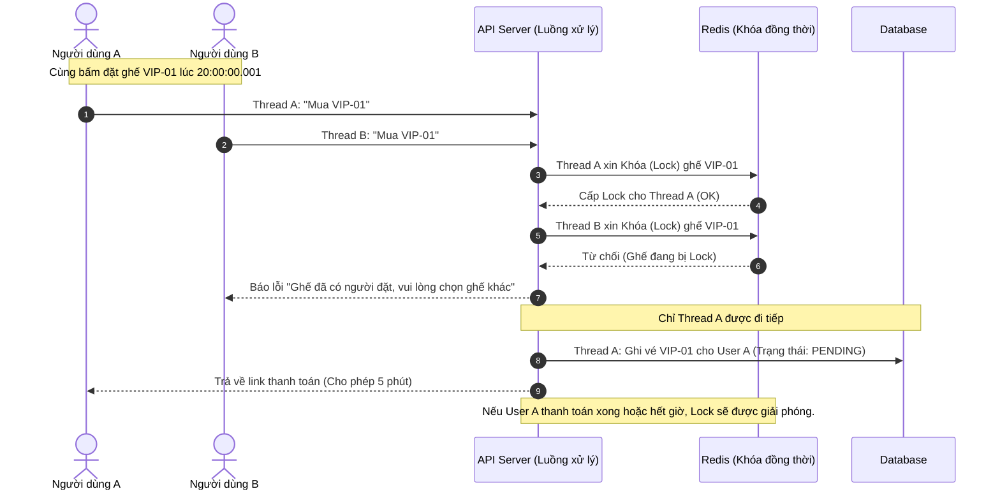
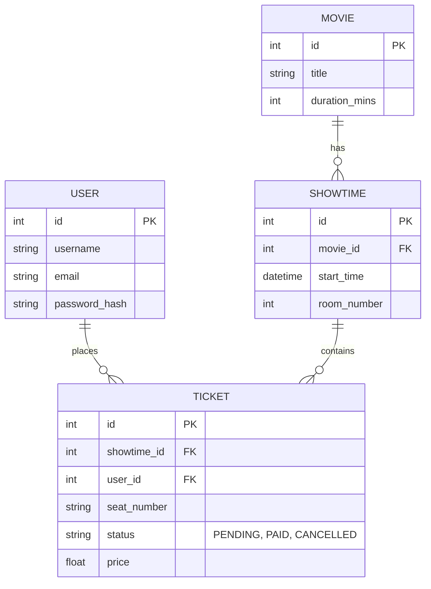

# 🛡️ Các View Mở Rộng & Cơ Sở Dữ Liệu (Ví dụ chi tiết)

Để được điểm tối đa và thuyết phục được Ban quản lý (theo tiêu chí Quality Attributes), dưới đây là ví dụ chi tiết kèm biểu đồ cho **Security View**, **Concurrency View** và **Database Schema**, tiếp tục sử dụng ví dụ **Hệ thống Đặt vé xem phim (Cinema Booking System)**.

> **💡 Nhắc lại Quy tắc vàng:** Mọi biểu đồ đều phải có văn bản giải thích đi kèm!

---

## 1. Security View (Góc nhìn Bảo mật)

**Mối quan tâm (Quality Attribute):** Đảm bảo chỉ người dùng hợp lệ mới được đặt vé, chỉ Admin mới được thêm phim. Mật khẩu và thông tin thanh toán phải được bảo vệ. Ngăn chặn tấn công từ bên ngoài mạng (Public Network).

### Biểu đồ: Phân vùng bảo mật (Trust Boundaries & Data Flow)
Sơ đồ dưới đây thể hiện các vùng tin cậy (Trust Zones). Dữ liệu đi từ vùng kém tin cậy sang vùng tin cậy cao hơn bắt buộc phải qua các chốt chặn xác thực (Firewall, API Gateway).

```mermaid
flowchart TD
    subgraph PublicZone ["Vùng công cộng (Internet - Không tin cậy)"]
        User["Người dùng (Web/Mobile)"]
        Hacker["Hacker / Kẻ tấn công"]
    end

    subgraph DMZ ["Vùng DMZ (Biên giới)"]
        WAF["Web Application Firewall (WAF)"]
        Gateway["API Gateway<br/>(Xác thực Token JWT)"]
    end

    subgraph PrivateZone ["Vùng bảo mật nội bộ (Private Network)"]
        App["Cinema Application Service"]
    end

    subgraph CriticalZone ["Vùng dữ liệu trọng yếu (Highly Secured)"]
        DB[("Database (PostgreSQL)<br/>(Dữ liệu mã hóa At-Rest)")]
    end

    User -->|"1. HTTPS Request"| WAF
    Hacker -.->|"SQL Injection / DDoS"| WAF
    WAF --|"Chặn mã độc"|x Hacker
    
    WAF -->|"2. Lọc an toàn"| Gateway
    Gateway -->|"3. Cấp/Kiểm tra JWT"| App
    App -->|"4. Truy vấn an toàn"| DB

    %% Styles
    classDef public fill:#ffcccc,stroke:#ff0000;
    classDef dmz fill:#ffffcc,stroke:#ffcc00;
    classDef private fill:#ccffcc,stroke:#009900;
    classDef critical fill:#ccccff,stroke:#0000ff;

    class PublicZone public;
    class DMZ dmz;
    class PrivateZone private;
    class CriticalZone critical;
```

**📝 Giải thích sơ đồ Security View:**
1. **Public Zone:** Nơi người dùng và rủi ro (Hacker) tồn tại. Mọi kết nối bắt buộc dùng giao thức `HTTPS` để chống nghe lén (Man-in-the-middle).
2. **DMZ Zone:** Sử dụng WAF để chặn các tấn công cơ bản (DDoS, SQL Injection). `API Gateway` đảm nhiệm việc kiểm tra Token (JWT) xem người dùng đã đăng nhập chưa trước khi cho phép gọi vào bên trong.
3. **Private Zone:** Backend xử lý nghiệp vụ, nằm ẩn trong mạng nội bộ, không thể bị truy cập trực tiếp từ Internet.
4. **Critical Zone:** Database chứa thông tin khách hàng. Dữ liệu nhạy cảm (Mật khẩu) được băm (Hash - Bcrypt), dữ liệu thẻ thanh toán được mã hóa (Encryption).

---

## 2. Concurrency View (Góc nhìn Đồng thời / Hiệu năng)

**Mối quan tâm (Quality Attribute):** Xử lý tranh chấp dữ liệu (Race Condition). Điều gì xảy ra nếu có sự kiện phim "Bom tấn" (Avengers, Spider-Man) và 2 người dùng (Thread A và Thread B) cùng bấm đặt CHÍNH XÁC cùng 1 cái ghế (Ghế VIP-01) ở cùng 1 phần nghìn giây?

### Biểu đồ: Cơ chế khóa phân tán (Distributed Locking)
Sơ đồ tuần tự này minh họa cách hệ thống xử lý đồng thời bằng Redis Lock (Mutex) để đảm bảo không ai bị trùng ghế.



**📝 Giải thích sơ đồ Concurrency View:**
1. Khi **Thread A** và **Thread B** cùng gửi request tại một thời điểm, hệ thống không gọi thẳng vào Database vì có nguy cơ ghi đè dữ liệu.
2. Hệ thống sử dụng một Cache tập trung (Redis) đóng vai trò là "Người giữ cửa".
3. Lệnh `SETNX` (Set if Not eXists) của Redis được gọi. Ai đến trước tính bằng mili-giây (Thread A) sẽ giành được quyền khóa ghế.
4. Thread B bị chặn lại ngay ở vòng gửi xe (fail-fast) giúp tiết kiệm tài nguyên hệ thống và đảm bảo tính nhất quán (Consistency).

---

## 3. Database Schema (Lược đồ CSDL tối thiểu)

Như thầy giáo nhắc, Database Schema là một View thiết yếu để ban quản lý và developer hiểu cấu trúc lưu trữ.

### Biểu đồ: Entity Relationship Diagram (ERD)



**📝 Giải thích sơ đồ Database Schema:**
*   **USER:** Lưu thông tin tài khoản đăng nhập. `password_hash` thể hiện việc không lưu mật khẩu thô.
*   **MOVIE:** Chứa thông tin gốc của bộ phim (Tên, thời lượng).
*   **SHOWTIME (Suất chiếu):** 1 bộ phim có thể chiếu nhiều suất, ở nhiều phòng khác nhau. Liên kết 1-nhiều (`1:N`) với bảng MOVIE.
*   **TICKET (Vé):** Bảng trọng tâm. Mỗi vé thuộc về 1 suất chiếu cụ thể (`showtime_id`), được mua bởi 1 User cụ thể (`user_id`). Cột `status` dùng để quản lý luồng trạng thái khi thanh toán (Concurrency View).
