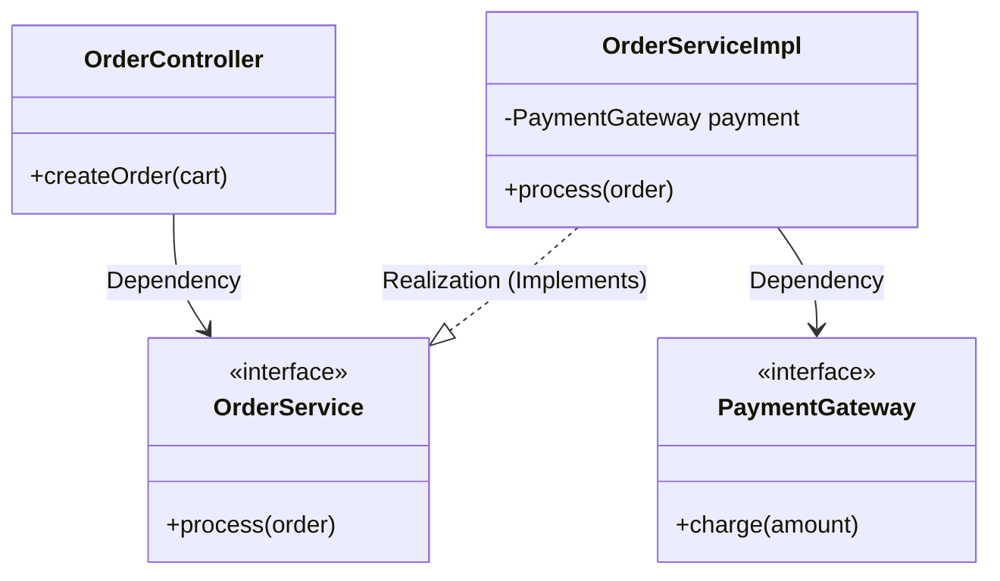
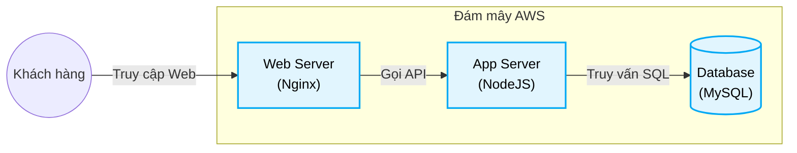
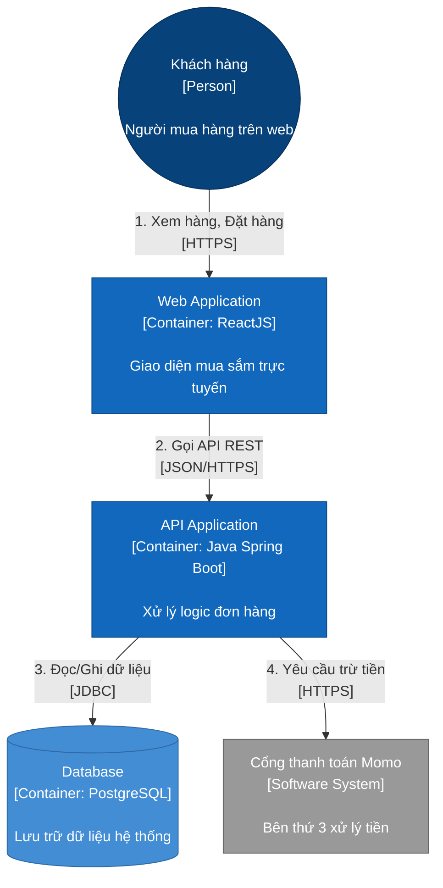

# So sánh 3 Phong cách Biểu diễn Kiến trúc

Giảng viên của bạn đã đưa ra 3 lựa chọn về cách trình bày đồ án/bài thi:
1. **UML + Views**
2. **Boxes and Arrows + Views**
3. **Boxes and Arrows + C4 Models**

Điểm cốt lõi ở đây là sự kết hợp (mix & match) giữa **Ký hiệu (Notation)** và **Bộ khung (Framework/Model)**.
- **Ký hiệu:** Bạn dùng bộ quy tắc nào để vẽ? (Dùng luật UML khắt khe hay dùng Khối hộp & Mũi tên tự do).
- **Bộ khung:** Bạn dùng danh sách các View nào? (Dùng nhóm 4+1 View hay dùng nhóm 4 Level của C4 Model).

Dưới đây là ví dụ minh họa sự khác biệt của cả 3 phong cách, cùng áp dụng cho một **Hệ thống xử lý Đơn hàng (Order System)** để bạn dễ so sánh bằng mắt thường.

---

## 1. Phong cách "UML + Views"
*   **Ký hiệu:** UML (Unified Modeling Language). Khi đã chọn UML, bạn **phải tuân thủ chuẩn ký hiệu quốc tế**. Class có 3 ngăn, Interface dùng đường đứt nét với mũi tên rỗng (Realization), Component phải có icon đặc trưng... Nếu vẽ bừa sẽ bị chấm là "vẽ sai UML".
*   **Bộ khung:** 4+1 Views (Ví dụ dưới đây là **Logical View** sử dụng UML Class Diagram).

*Nhận xét:* Nhìn rất học thuật, chuẩn xác tới từng hàm/biến, nhưng đôi khi khô khan và khó hiểu với người không biết code (Ví dụ: Giám đốc kinh doanh).

---

## 2. Phong cách "Boxes and Arrows + Views"
*   **Ký hiệu:** Boxes and Arrows (Khối hộp và Mũi tên). Vẽ tự do, linh hoạt. Miễn là có hộp (box) đại diện cho một cụm xử lý, và mũi tên (arrow) đại diện cho chiều luồng dữ liệu. Không ai được quyền bắt bẻ bạn vẽ sai luật!
*   **Bộ khung:** 4+1 Views (Ví dụ dưới đây là **Physical View** - Góc nhìn Vật lý).

*Nhận xét:* Dễ vẽ, cực kỳ dễ hiểu. Dùng cho slide thuyết trình rất tốt.

---

## 3. Phong cách "Boxes and Arrows + C4 Models"
*   **Ký hiệu:** Khối hộp và Mũi tên tự do (tương tự số 2).
*   **Bộ khung:** C4 Model (Context, Container, Component, Code). Bộ khung C4 ép buộc một tiêu chuẩn trình bày chữ bên trong hộp rất khoa học: **[Tên] + [Loại / Công nghệ] + [Mô tả ngắn]**, và mũi tên phải ghi rõ **Giao thức**.

Ví dụ dưới đây là **Container View (Level 2 của C4)**:

*Nhận xét:* Đây là phong cách được ưa chuộng nhất hiện nay trong công nghiệp phần mềm (Agile/Microservices). Nó kết hợp sự thân thiện của "Khối hộp tự do" và tính kỷ luật tuyệt vời của "C4 Model" (chỉ cần nhìn vào 1 cái hộp là biết ngay công nghệ gì, làm nhiệm vụ gì).

---
## 💡 Lời khuyên khi làm bài thi
- Nếu thầy/cô bạn khắt khe về tính hàn lâm, học thuật: Hãy chọn **Số 1**.
- Nếu bạn muốn vẽ nhanh, không sợ bị bắt bẻ sai nét đứt/nét liền: Hãy chọn **Số 2**.
- Nếu bạn muốn bản thiết kế nhìn siêu chuyên nghiệp, sát với chuẩn các công ty công nghệ lớn đang làm, được đánh giá cao: Khuyên dùng **Số 3**.
